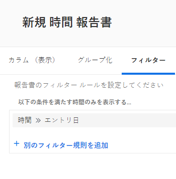

# 時間枠によるレポートのフィルタリング

オブジェクトに存在する日付の時間枠でレポートをフィルタリングできます。例えば、時間レポートでは、時間が入力された特定の時間枠をフィルタリングできます。

## アクセス要件

この記事の手順を実行するには、次のアクセス権が必要です。

<table style="table-layout:auto"> 
 <col> 
 <col> 
 <tbody> 
  <tr> 
   <td role="rowheader">Adobe Workfront プラン*</td> 
   <td> 
任意
 </td> 
  </tr> 
  <tr> 
   <td role="rowheader">Adobe Workfront ライセンス*</td> 
   <td> 
プラン 
 </td> 
  </tr> 
  <tr> 
   <td role="rowheader">アクセスレベル設定*</td> 
   <td> 
レポート、ダッシュボード、カレンダーへのアクセスの編集
 
フィルター、ビュー、グループ化へのアクセスの編集
 
メモ：まだアクセス権がない場合は、アクセスレベルに追加の制限が設定されていないかどうか Workfront 管理者にお問い合わせください。Workfront 管理者がアクセスレベルを変更する方法について詳しくは、<a href="../../../administration-and-setup/add-users/configure-and-grant-access/create-modify-access-levels.md" class="MCXref xref">カスタムアクセスレベルの作成または変更</a>を参照してください。
 </td> 
  </tr> 
  <tr> 
   <td role="rowheader">オブジェクト権限</td> 
   <td> 
レポートに対する権限を管理します。
 
追加のアクセス権のリクエストについて詳しくは、<a href="../../../workfront-basics/grant-and-request-access-to-objects/request-access.md" class="MCXref xref">オブジェクトへのアクセス権のリクエスト</a>を参照してください。
 </td> 
  </tr> 
 </tbody> 
</table>

&#42;保有するプラン、ライセンスタイプ、アクセス権を確認するには、Workfront 管理者に問い合わせてください。

## 前提条件

結果をフィルタリングする前に、レポートを作成する必要があります。

レポートの作成について詳しくは、[レポートの作成](../../../reports-and-dashboards/reports/creating-and-managing-reports/create-report.md)を参照してください。

## 日付の時間枠でレポートをフィルタリング {#filter-a-report-by-the-time-frame-of-a-date}

1. **メインメニュー**&#x200B;アイコン  をクリックし、「**レポート**」をクリックします。

1. 「**新規レポート**」をクリックして、目的のレポートのタイプを選択します。\
   例えば、「**時間レポート**」を選択します。

1. 「**フィルター**」タブを選択します。
1. 「**フィルタールールを追加**」をクリックし、「**時間エントリ日**」を選択します。\
   

1. 次のドロップダウンメニューで、次のいずれかのオプションを選択します。

   <table style="table-layout:auto"> 
    <col> 
    <col> 
    <tbody> 
     <tr> 
      <td role="rowheader">が次に等しい</td> 
      <td>この修飾子を選択した後、時間が入力された日付を指定します。</td> 
     </tr> 
     <tr> 
      <td role="rowheader">等しくない</td> 
      <td>この修飾子を選択した後、時間が入力された日付を指定して、この日付をレポートから除外します。レポートには、指定した日付を除くすべての日付にログインした時間が表示されます。</td> 
     </tr> 
     <tr> 
      <td role="rowheader">NULL</td> 
      <td>この修飾子を選択すると、「エントリ日」がない時間のみが表示されます。</td> 
     </tr> 
     <tr> 
      <td role="rowheader">NULL でない</td> 
      <td>この修飾子を選択すると、エントリ日に値が設定されている時間のみが表示されます。</td> 
     </tr> 
     <tr> 
      <td role="rowheader">間</td> 
      <td>この修飾子を選択した後、時間が入力された日付範囲を指定します。レポートには、指定した日付の間に入力された時間が表示されます。</td> 
     </tr> 
     <tr> 
      <td role="rowheader">より小さい</td> 
      <td>この修飾子を選択した後、時間が入力された前日の日付を指定します。レポートには、指定した日付（指定した日付を含まない）より前に入力された時間が表示されます。</td> 
     </tr> 
     <tr> 
      <td role="rowheader">が次よりも小さいか等しい</td> 
      <td>この修飾子を選択した後、時間が入力された前日の日付を指定します。レポートには、指定した日付（指定した日付を含む）以前に入力された時間が表示されます。</td> 
     </tr> 
     <tr> 
      <td role="rowheader">より大きい</td> 
      <td>この修飾子を選択した後、時間を入力した後の日付を指定します。レポートには、指定した日付（指定した日付を含まない）の後に入力された時間が表示されます。</td> 
     </tr> 
     <tr> 
      <td role="rowheader">が次よりも大きいか等しい</td> 
      <td> 
この修飾子を選択した後、時間を入力した後の日付を指定します。レポートには、指定した日付（指定した日付を含む）以降に入力された時間が表示されます。
 
組み込みの時間枠修飾子を選択します。詳しくは、<a href="#built-in-time-frame-modifiers" class="MCXref xref">組み込みの時間枠修飾子</a>を参照してください。
 </td> 
     </tr> 
    </tbody> 
   </table>

1. これらの修飾子は、フィルター内の任意の日付フィールドまたは任意のレポート内のプロンプトに対して使用できます。
1. 「**保存して閉じる**」をクリックします。

## 組み込みの時間枠修飾子 {#built-in-time-frame-modifiers}

Adobe Workfront には、特定の日付を定義せずに使用できる、組み込みの時間枠修飾子があります。 

これらの修飾子は、フィルター内の任意の日付フィールドまたは任意のレポート内のプロンプトに対して使用できます。 

日付に関連付けられた時間枠でレポートをフィルタリングする方法について詳しくは、[日付の時間枠でレポートをフィルタリング](#filter-a-report-by-the-time-frame-of-a-date)を参照してください。

例えば、時間レポートを作成していて、特定の時間枠に入力された時間を表示する場合、次の組み込み時間枠フィルターオプションから選択できます。

<table style="table-layout:auto"> 
 <col> 
 <col> 
 <tbody> 
  <tr> 
   <td role="rowheader">今日</td> 
   <td>エントリ日が今日の時間を表示します。</td> 
  </tr> 
  <tr> 
   <td role="rowheader">今週</td> 
   <td>エントリ日が現在の週の日付である時間を表示します（週の始まりは日曜日、終わりは土曜日）。</td> 
  </tr> 
  <tr> 
   <td role="rowheader">翌週</td> 
   <td>エントリ日が現在の週の次の週の日付である時間を表示します（週の始まりは日曜日、終わりは土曜日）。 </td> 
  </tr> 
  <tr> 
   <td role="rowheader">先週</td> 
   <td>エントリ日が現在の週の前の週の日付である時間を表示します（週の始まりは日曜日、終わりは土曜日）。 </td> 
  </tr> 
  <tr> 
   <td role="rowheader">今月</td> 
   <td>エントリ日が現在の月の日付である時間を表示します。</td> 
  </tr> 
  <tr> 
   <td role="rowheader">翌月</td> 
   <td>エントリ日が現在の月の翌月の日付である時間を表示します。</td> 
  </tr> 
  <tr> 
   <td role="rowheader">先月</td> 
   <td>エントリ日が現在の月の前月の日付である時間を表示します。</td> 
  </tr> 
  <tr> 
   <td role="rowheader">現在の四半期</td> 
   <td> 
エントリ日が現在の四半期の日付である時間を表示します。四半期は次のように定義されます。
 
    <ul> 
     <li>第 1 四半期：1月1日～ 3月30日</li> 
     <li>第 2 四半期：4月1日～ 6月30日</li> 
     <li>第 3 四半期：7月1日～ 9月30日</li> 
     <li>第 4 四半期：10月1日～ 12月31日</li> 
    </ul> </td> 
  </tr> 
  <tr> 
   <td role="rowheader">次の四半期</td> 
   <td>入力日が現在の四半期の次の四半期の日付である時間を表示します。四半期は前述のように定義されます。</td> 
  </tr> 
  <tr> 
   <td role="rowheader">前の四半期</td> 
   <td> 
入力日が現在の四半期の前の四半期の日付である時間を表示します。四半期は前述のように定義されます。
 
注意：Workfront 管理者がシステムのカスタム四半期を有効にして定義している場合、組み込みの四半期のフィルターはカスタム四半期情報に置き換えられます。カスタム四半期の有効化について詳しくは、<a href="../../../administration-and-setup/set-up-workfront/configure-system-defaults/enable-custom-quarters-projects.md" class="MCXref xref">プロジェクトのカスタム四半期の有効化</a>を参照してください。
 </td> 
  </tr> 
  <tr> 
   <td role="rowheader">今年</td> 
   <td>入力日が現在の年の日付である時間を表示します。今年は1月1日に始まり12月31日に終わります。</td> 
  </tr> 
  <tr> 
   <td role="rowheader">過去 1 年</td> 
   <td>入力日が過去 1 年間の日付である時間を表示します。過去 1 年間は現在の日付の12カ月前から始まります。</td> 
  </tr> 
  <tr> 
   <td role="rowheader">昨年</td> 
   <td> 
入力日が昨年の日付である時間を表示します。昨年は今年の前年の1月1日に始まり、12月31日に終わります。
 
メモ：会計年度には組み込みの期間はありません。レポートを作成し、組織で定義されている会計年度の日付範囲のカスタム修飾子を使用して、日付で情報をフィルタリングすることができます。会計年度の期間をその場で選択する場合は、フィルターの代わりにプロンプトを使用する必要があります。 
 </td> 
  </tr> 
 </tbody> 
</table>
