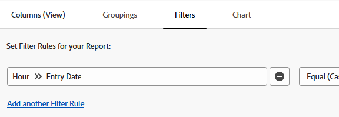

# 期間別のレポートのフィルタリング

<!-- Audited: 4/2025 -->

レポートは、オブジェクトに存在する日付の時間枠でフィルタリングできます。 例えば、時間が入力された特定の期間の時間レポートをフィルタリングできます。

## アクセス要件

+++ 展開すると、この記事の機能のアクセス要件が表示されます。

<table style="table-layout:auto"> 
 <col> 
 <col> 
 <tbody> 
  <tr> 
   <td role="rowheader">Adobe Workfront パッケージ</td> 
   <td> 
任意
 </td> 
  </tr> 
  <tr> 
   <td role="rowheader">Adobe Workfront プラン</td> 
   <td> 
      
標準

      
プラン

   </td>
  </tr> 
  <tr> 
   <td role="rowheader">アクセスレベル設定</td> 
   <td> 
レポート、ダッシュボード、カレンダーへのアクセス権を編集
 
フィルター、ビュー、グループへのアクセスを編集
</td> 
  </tr> 
  <tr> 
   <td role="rowheader">オブジェクト権限</td> 
   <td> 
レポートに対する権限を管理します。
</td> 
  </tr> 
 </tbody> 
</table>

この表の情報について詳しくは、[Workfront ドキュメントのアクセス要件](/help/quicksilver/administration-and-setup/add-users/access-levels-and-object-permissions/access-level-requirements-in-documentation.md)を参照してください。

+++

## 前提条件

結果をフィルタリングするには、レポートを作成する必要があります。

レポートの作成について詳しくは、[レポートの作成](../../../reports-and-dashboards/reports/creating-and-managing-reports/create-report.md)を参照してください。

## 日付の時間枠でレポートをフィルタリング {#filter-a-report-by-the-timeframe-of-a-date}

{{step1-to-reports}}

1. 左上隅の「**新規レポート**」をクリックし、作成するレポートのタイプを選択します。

1. **新規レポート** ページで、「**フィルター**」タブを選択します。

1. 「**フィルタールールを追加**」をクリックし、**フィールドを選択**&#x200B;します。

1. **フィールドを選択** ダイアログボックスで、**時間**、次に&#x200B;**エントリ日**&#x200B;を選択します。
   

1. 表示されるドロップダウンで、次のいずれかのオプションを選択します。

   <table style="table-layout:auto"> 
    <col> 
    <col> 
    <tbody> 
     <tr> 
      <td role="rowheader">が次に等しい</td> 
      <td>この修飾子を選択した後、時間が入力された日付を指定します。</td> 
     </tr>

   <tr> 
      <td role="rowheader">等しくない</td> 
      <td>この修飾子を選択した後、時間が入力された日付を指定して、この日付をレポートから除外します。 レポートには、指定した日付を除くすべての日付にログインした時間が表示されます。</td> 
     </tr>

   <tr> 
      <td role="rowheader">より小さい</td> 
      <td>この修飾子を選択した後、時間が入力される前の日付を指定します。 レポートには、指定された日付を含まない、指定された日付より前に入力された時間が表示されます。</td> 
     </tr>

   <tr> 
      <td role="rowheader">が次よりも小さいか等しい</td> 
      <td>この修飾子を選択した後、時間が入力される前の日付を指定します。 レポートには、指定した日付（指定した日付を含む）以前に入力された時間が表示されます。</td> 
     </tr>

   <tr> 
      <td role="rowheader">より大きい</td> 
      <td>この修飾子を選択した後、時間を入力した日付を指定します。 レポートには、指定された日付を含まない、指定された日付の後に入力された時間が表示されます。</td> 
     </tr>

   <tr> 
      <td role="rowheader">が次よりも大きいか等しい</td> 
      <td> この修飾子を選択した後、時間を入力した日付を指定します。 レポートには、指定された日付を含む、指定された日付の後に入力された時間が表示されます。 </td> 
     </tr>

   <tr> 
      <td role="rowheader">間</td> 
      <td>この修飾子を選択した後、時間が入力された日付範囲を指定します。レポートには、指定した日付の間に入力された時間が表示されます。</td> 
     </tr>

   <tr> 
      <td role="rowheader">NULL</td> 
      <td>エントリ日が欠落している時間のみを表示するには、この修飾子を選択します。</td> 
     </tr>

   <tr> 
      <td role="rowheader">NULL でない</td> 
      <td>この修飾子を選択すると、入力日に値が含まれる時間のみが表示されます。</td> 
     </tr>

   </tbody> 
   </table>

1. 「**保存して閉じる**」をクリックします。

## 組み込みの時間枠修飾子 {#built-in-timeframe-modifiers}

Adobe Workfrontには、特定の日付を定義せずに使用できるタイムフレーム修飾子が組み込まれています。 これらの修飾子は、フィルター内の任意の日付フィールドまたは任意のレポート内のプロンプトに対して使用できます。

例えば、時間レポートを作成する場合、特定の時間枠で入力された時間を表示するには、次の組み込み時間枠フィルターオプションから選択できます。

<table style="table-layout:auto"> 
 <col> 
 <col> 
 <tbody> 
  <tr> 
   <td role="rowheader">今日</td> 
   <td>エントリ日が今日の時間を表示します。</td> 
  </tr> 
  <tr> 
   <td role="rowheader">今週</td> 
   <td>エントリ日が現在の週の日付である時間を表示します。週は日曜日に始まり、土曜日に終わります。</td> 
  </tr> 
  <tr> 
   <td role="rowheader">翌週</td> 
   <td>開始日が現在の週の翌週の日付で、週が日曜日に始まり、土曜日に終わる時間を表示します。 </td> 
  </tr> 
  <tr> 
   <td role="rowheader">先週</td> 
   <td>エントリ日が現在の週の前の週の日付である時間を表示します。週は日曜日に始まり、土曜日に終わります。 </td> 
  </tr> 
  <tr> 
   <td role="rowheader">今月</td> 
   <td>エントリ日が現在の月の日付である時間を表示します。</td> 
  </tr> 
  <tr> 
   <td role="rowheader">翌月</td> 
   <td>エントリ日が現在の月の翌月の日付である時間を表示します。</td> 
  </tr> 
  <tr> 
   <td role="rowheader">先月</td> 
   <td>入力日が当月の前月の日付である時間を表示します</td> 
  </tr> 
  <tr> 
   <td role="rowheader">現在の四半期</td> 
   <td> 
エントリ日が現在の四半期の日付である時間を表示します。四半期は次のように定義されます。
 
    <ul> 
     <li>第 1 四半期：1月1日～ 3月30日</li> 
     <li>第 2 四半期：4月1日～ 6月30日</li> 
     <li>第 3 四半期：7月1日～ 9月30日</li> 
     <li>第 4 四半期：10月1日～ 12月31日</li> 
    </ul> </td> 
  </tr> 
  <tr> 
   <td role="rowheader">次の四半期</td> 
   <td>入力日が現在の四半期の次の四半期の日付である時間を表示します。四半期は前述のように定義されます。</td> 
  </tr> 
  <tr> 
   <td role="rowheader">前の四半期</td> 
   <td> 
エントリ日が現在の四半期の前の四半期の日付である時間を表示します。この四半期は上記で定義されています。
 
<b>メモ</b>
  Workfront管理者がシステムのカスタム四半期を有効にして定義している場合、四半期の組み込みフィルターはカスタム四半期の情報に置き換えられます。 カスタム四半期の有効化について詳しくは、<a href="../../../administration-and-setup/set-up-workfront/configure-system-defaults/enable-custom-quarters-projects.md" class="MCXref xref"> カスタム四半期の有効化</a>を参照してください。
 </td> 
  </tr> 
  <tr> 
   <td role="rowheader">今年</td> 
   <td>エントリ日が現在の年の日付である時間を表示します。現在の年は1月1日に始まり、12月31日に終わります。</td> 
  </tr> 
  <tr> 
   <td role="rowheader">過去 1 年</td> 
   <td>エントリ日が過去1年間の日付で、過去1年間が現在の日付の12か月前から始まる時間を表示します。</td> 
  </tr> 
  <tr> 
   <td role="rowheader">昨年</td> 
   <td> 
エントリ日が最後の年の日付で、最後の年が1月1日に始まり、現在の年の前の年の12月31日に終わる時間を表示します。
 
メモ：会計年度にはビルトインの期間はありません。レポートを作成し、組織で定義されているように、会計年度の日付範囲のカスタム修飾子を使用して日付別に情報をフィルタリングできます。 その場で会計年度の期間を選択する場合は、フィルターの代わりにプロンプトを使用する必要があります。 
 </td> 
  </tr> 
 </tbody> 
</table>
