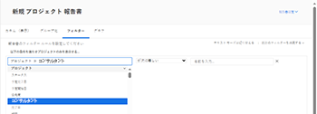
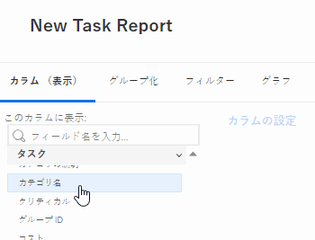
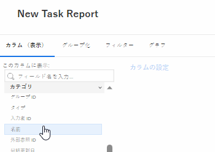
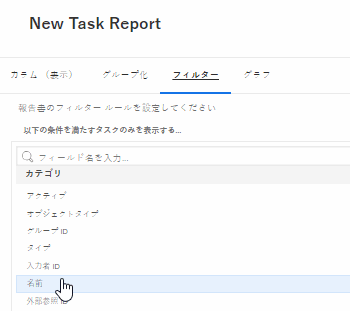
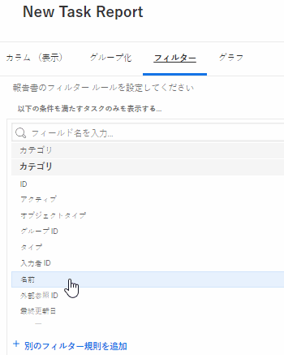
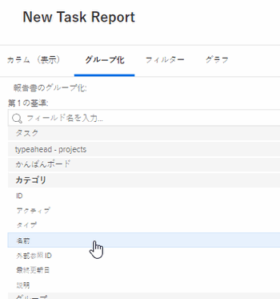

# レポートでのカスタムフォームの参照

オブジェクトのカスタムフォームは、そのオブジェクトのレポートのビュー、フィルター、グループで参照できます。

カスタムフォームの内容を参照してレポートに含めることも、カスタムフォーム自体に関する情報を参照してレポートに含めることもできます。

## アクセス要件

この記事の手順を実行するには、次のアクセス権が必要です。

<table style="table-layout:auto"> 
 <col> 
 <col> 
 <tbody> 
  <tr> 
   <td role="rowheader">Adobe Workfront plan*</td> 
   <td> 
任意
 </td> 
  </tr> 
  <tr> 
   <td role="rowheader">Adobe Workfront license*</td> 
   <td> 
計画 
 </td> 
  </tr> 
  <tr> 
   <td role="rowheader">アクセスレベル設定*</td> 
   <td> 
レポート、ダッシュボード、カレンダーへのアクセスを編集
 
フィルター、ビュー、グループへのアクセスを編集
 
注意：まだアクセス権がない場合は、Workfront管理者に、アクセスレベルに追加の制限を設定しているかどうかを問い合わせてください。 Workfront管理者がアクセスレベルを変更する方法について詳しくは、 <a href="../../../administration-and-setup/add-users/configure-and-grant-access/create-modify-access-levels.md" class="MCXref xref">カスタムアクセスレベルの作成または変更</a>.
 </td> 
  </tr> 
  <tr> 
   <td role="rowheader">オブジェクト権限</td> 
   <td> 
レポートに対する権限の管理
 
追加のアクセス権のリクエストについて詳しくは、 <a href="../../../workfront-basics/grant-and-request-access-to-objects/request-access.md" class="MCXref xref">オブジェクトへのアクセスのリクエスト </a>.
 </td> 
  </tr> 
 </tbody> 
</table>

&#42;保有しているプラン、ライセンスの種類、アクセス権を確認するには、Workfront管理者に問い合わせてください。

## 前提条件

カスタムフォームをレポートで参照するには、その前にカスタムフォームが存在する必要があります。

カスタムフォームの作成について詳しくは、 [カスタムフォームの作成または編集](../../../administration-and-setup/customize-workfront/create-manage-custom-forms/create-or-edit-a-custom-form.md).

## カスタムフォームのコンテンツの参照

カスタムフォーム内のフィールドを参照できます。 カスタムフォームをオブジェクトに適用すると、そのカスタムフォームに関連付けられているすべてのフィールドを、そのオブジェクト上の他のフィールドと同様に、レポートで参照できるようになります。

>[!NOTE]
>
>複数のオプションを持つフィールドの場合、非表示のフィールドも含め、レポートのフィルターとプロンプトですべてのオプションを使用できます。\
>複数のオプションを使用してカスタムフィールドから選択肢を非表示にする方法については、「 [カスタムフォームの作成または編集](../../../administration-and-setup/customize-workfront/create-manage-custom-forms/create-or-edit-a-custom-form.md).

レポートを作成する場合は、フォームのオブジェクトタイプをフィールドソースとして使用し、カスタムフィールドの名前をフィールド名として使用します。

例えば、カスタムフィールドを含むすべてのプロジェクトにカスタムフォームを適用する場合があります **コンサルタント**. Olivia Kim がコンサルタントであるプロジェクトをすべてリストするレポートを作成するには、 **プロジェクト** オブジェクトタイプをフィールドソースとして使用し、 **コンサルタント** をフィールド名として使用します。 フィルタ修飾子をに設定します。 **次と等しい**&#x200B;オリビア・キムと入力します。

レポートの作成について詳しくは、 [カスタムレポートの作成](../../../reports-and-dashboards/reports/creating-and-managing-reports/create-custom-report.md).

## カスタムフォームに関するリファレンス情報

カスタムフォームに関する情報（オブジェクトに関連付けられているカスタムフォームの名前など）を参照できます。

&#x200B;要素（表示、フィルター、グループ化）に応じて、次のいずれかを参照できます。

* オブジェクトに適用される主なカスタムフォームは次のとおりです。

   これは、オブジェクトの詳細ページで最初に表示されるフォームです。

* すべてのカスタムフォーム（1 つのオブジェクトに複数のカスタムフォームが適用されている場合）

ビュー、フィルターおよびグループに関するカスタムフォームを参照できます。

* [レポートビューでのカスタムフォームの参照（列）](#reference-custom-forms-in-a-report-view-column)
* [レポートフィルターでのカスタムフォームの参照](#reference-custom-forms-in-a-report-filter)
* [レポートグループ内のカスタムフォームの参照](#reference-custom-forms-in-a-report-grouping)

### レポートビューでのカスタムフォームの参照（列） {#reference-custom-forms-in-a-report-view-column}

オブジェクトに関連付けられているすべてのカスタムフォームを表示するには：

1. 記事の説明に従って、レポートの作成を開始します。 [カスタムレポートの作成](../../../reports-and-dashboards/reports/creating-and-managing-reports/create-custom-report.md).
1. の **列** タブで、参照するカスタムフォームが適用されるオブジェクトの種類を展開し、 **カテゴリ名**.\
   例えば、タスクに関連付けられているすべてのカスタムフォームを表示するには、 **タスク** フィールドソースで、 **カテゴリ名** フィールド名。\
   

オブジェクトに関連付けられた主なカスタムフォームのみを表示するには：

1. 記事の説明に従って、レポートの作成を開始します。 [カスタムレポートの作成](../../../reports-and-dashboards/reports/creating-and-managing-reports/create-custom-report.md).
1. の **列** タブ、展開 **カテゴリ** フィールドソースで、 **名前** フィールド名。\
   

### レポートフィルターでのカスタムフォームの参照 {#reference-custom-forms-in-a-report-filter}

オブジェクトタイプに関連付けられているすべてのカスタムフォームをフィルタリングするには：

1. 記事の説明に従って、レポートの作成を開始します。 [カスタムレポートの作成](../../../reports-and-dashboards/reports/creating-and-managing-reports/create-custom-report.md).
1. の **フィルター** タブ、展開 **カテゴリ**&#x200B;を選択し、「 **名前**.\
   

1. 使用する条件修飾子を選択します。

   * ブランク
   * ブランクでない
   * 含む
   * 含まない (大文字と小文字を区別しない)
   * 等しい (大文字と小文字を区別しない)
   * 等しくない (大文字と小文字を区別しない)

   各修飾子の詳細については、「 [フィルターおよび条件修飾子](../../../reports-and-dashboards/reports/reporting-elements/filter-condition-modifiers.md).

   >[!NOTE]
   >
   >フィルターしようとしているフィールドに複数のオプションがあり、 **等しくない** または **次を含まない** クオリファイアを使用すると、指定した選択肢のみを含む結果が除外されます。 フィールドに、指定したオプションを含むその他のオプションが含まれている場合、その結果はレポートからフィルタリングされません。 これには、同じオブジェクトに関連付けられている複数のカスタムFormsのフィルタリングも含まれます。

1. フィルターするカスタムフォームの名前を入力し始め、ドロップダウンリストに表示されたら名前をクリックします。
1. （オプション）「 **別のフィルタールールを追加**&#x200B;次に、手順 2～4 を繰り返して、追加のフィルタールールを作成します。
1. クリック **保存して閉じる**.

オブジェクトタイプに関連付けられた主なカスタムフォームのみをフィルタリングするには：

1. 記事の説明に従って、レポートの作成を開始します。 [カスタムレポートの作成](../../../reports-and-dashboards/reports/creating-and-managing-reports/create-custom-report.md).
1. の **フィルター** タブ、展開 **カテゴリ** フィールドソースで、 **名前** フィールド名。\
   

1. 使用する条件修飾子を選択します。

   * ブランク
   * ブランクでない
   * 含む
   * 含まない (大文字と小文字を区別しない)
   * 等しい (大文字と小文字を区別しない)
   * 等しくない (大文字と小文字を区別しない)

   各修飾子の詳細については、「 [フィルターおよび条件修飾子](../../../reports-and-dashboards/reports/reporting-elements/filter-condition-modifiers.md).

1. フィルターするカスタムフォームの名前を入力し始め、ドロップダウンリストに表示されたら名前をクリックします。
1. （オプション）「 **別のフィルタールールを追加**&#x200B;次に、手順 2～4 を繰り返して、追加のフィルタールールを作成します。
1. クリック **保存して閉じる**.

### レポートグループ内のカスタムフォームの参照 {#reference-custom-forms-in-a-report-grouping}

>[!NOTE]
>
>項目は、オブジェクトに関連付けられた主なカスタムフォームによってのみグループ化できます。オブジェクトに関連付けられているすべてのフォームで項目をグループ化することはできません。

1. 記事の説明に従って、レポートの作成を開始します。 [カスタムレポートの作成](../../../reports-and-dashboards/reports/creating-and-managing-reports/create-custom-report.md).
1. の **グループ化** タブ、展開 **カテゴリ**&#x200B;を選択し、「 **名前**.\
   
