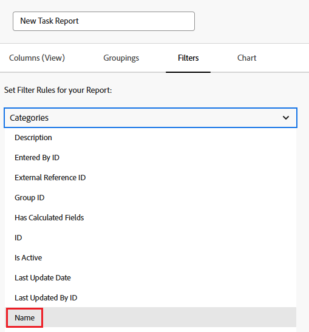

# レポート内のカスタムフォームの参照

オブジェクトのカスタムフォームは、そのオブジェクトのレポートのビュー、フィルター、グループ化で参照できます。

カスタムフォームの内容を参照してレポートに含めることや、カスタムフォーム自体に関する情報を参照してレポートに含めることができます。

## アクセス要件

この記事の手順を実行するには、次のアクセス権が必要です。

<table style="table-layout:auto"> 
 <col> 
 <col> 
 <tbody> 
  <tr> 
   <td role="rowheader">Adobe Workfront プラン*</td> 
   <td> 
任意
 </td> 
  </tr> 
  <tr> 
   <td role="rowheader">Adobe Workfront ライセンス*</td> 
   <td> 
プラン 
 </td> 
  </tr> 
  <tr> 
   <td role="rowheader">アクセスレベル設定*</td> 
   <td> 
レポート、ダッシュボード、カレンダーへのアクセスの編集
 
フィルター、ビュー、グループ化へのアクセスの編集
 
メモ：まだアクセス権がない場合は、アクセスレベルに追加の制限が設定されていないかどうか Workfront 管理者にお問い合わせください。Workfront 管理者がアクセスレベルを変更する方法について詳しくは、<a href="../../../administration-and-setup/add-users/configure-and-grant-access/create-modify-access-levels.md" class="MCXref xref">カスタムアクセスレベルの作成または変更</a>を参照してください。
 </td> 
  </tr> 
  <tr> 
   <td role="rowheader">オブジェクト権限</td> 
   <td> 
レポートに対する権限を管理します。
 
追加のアクセス権のリクエストについて詳しくは、<a href="../../../workfront-basics/grant-and-request-access-to-objects/request-access.md" class="MCXref xref">オブジェクトへのアクセス権のリクエスト</a>を参照してください。
 </td> 
  </tr> 
 </tbody> 
</table>

&#42;保有するプラン、ライセンスタイプ、アクセス権を確認するには、Workfront 管理者に問い合わせてください。

## 前提条件

カスタムフォームをレポートで参照するには、その前にカスタムフォームが存在する必要があります。

カスタムフォームの作成について詳しくは、[カスタムフォームの作成または編集](../../../administration-and-setup/customize-workfront/create-manage-custom-forms/create-or-edit-a-custom-form.md)を参照してください。

## カスタムフォームのコンテンツの参照

カスタムフォーム内のフィールドを参照できます。カスタムフォームをオブジェクトに適用すると、そのカスタムフォームに関連付けられているすべてのフィールドが、そのオブジェクト上の他のフィールドと同様に、レポートで参照可能になります。

>[!NOTE]
>
>複数のオプションを持つフィールドの場合、非表示のものも含め、レポートのフィルターとプロンプトですべてのオプションを使用できます。\
>複数のオプションを持つカスタムフィールドから選択肢を非表示にする方法について詳しくは、[カスタムフォームの作成または編集](../../../administration-and-setup/customize-workfront/create-manage-custom-forms/create-or-edit-a-custom-form.md)を参照してください。

レポートを作成する場合は、フォームのオブジェクトタイプをフィールドソースとして使用し、カスタムフィールドの名前をフィールド名として使用します。

例えば、**コンサルタント**&#x200B;というカスタムフィールドを含むすべてのプロジェクトにカスタムフォームを適用するとします。Olivia Kim がコンサルタントであるプロジェクトをすべてリストするレポートを作成するには、**プロジェクト**&#x200B;のオブジェクトタイプをフィールドソースとして使用し、**コンサルタント**&#x200B;をフィールド名として使用します。フィルタ修飾子を「**次に等しい**」に設定し、Olivia Kim と入力します。

レポートの作成について詳しくは、[カスタムレポートの作成](../../../reports-and-dashboards/reports/creating-and-managing-reports/create-custom-report.md)を参照してください。

## カスタムフォームに関する情報の参照

カスタムフォームに関する情報（オブジェクトに関連付けられているカスタムフォームの名前など）を参照できます。

要素（ビュー、フィルター、グループ化）に応じて、次のいずれかを参照できます。

* オブジェクトに適用される主要なカスタムフォーム：

  これは、オブジェクトの詳細ページで最初に表示されるフォームです。

* すべてのカスタムフォーム（1 つのオブジェクトに複数のカスタムフォームが適用されている場合）

ビュー、フィルターおよびグループ化に関するカスタムフォームを参照できます。

* [ビュー（列）レポートでのカスタムフォームの参照](#reference-custom-forms-in-a-report-view-column)
* [フィルターレポートでのカスタムフォームの参照](#reference-custom-forms-in-a-report-filter)
* [グループ化レポートでのカスタムフォームの参照](#reference-custom-forms-in-a-report-grouping)

### ビュー（列）レポートでのカスタムフォームの参照 {#reference-custom-forms-in-a-report-view-column}

オブジェクトに関連付けられているすべてのカスタムフォームを表示するには：

1. [カスタムレポートの作成](../../../reports-and-dashboards/reports/creating-and-managing-reports/create-custom-report.md)の記事の説明に従って、レポートの作成を開始します。
1. 「**列**」タブで、参照するカスタムフォームの適用先となるオブジェクトタイプを展開し、「**カテゴリ名**」をクリックします。\
   例えば、タスクに関連付けられているすべてのカスタムフォームを表示するには、「**タスク**」フィールドソースを展開して、「**カテゴリ名**」フィールド名をクリックします。\
   

オブジェクトに関連付けられている主要なカスタムフォームのみを表示するには：

1. [カスタムレポートを作成](../../../reports-and-dashboards/reports/creating-and-managing-reports/create-custom-report.md)の記事の説明に従って、レポートの作成を開始します。
1. 「**列**」タブで、「**カテゴリ**」フィールドソースを展開し、「**名前**」フィールド名をクリックします。\
   

### レポートフィルターでカスタムフォームを参照する {#reference-custom-forms-in-a-report-filter}

オブジェクトタイプに関連付けられているすべてのカスタムフォームをフィルタリングするには、次の手順に従います。

1. [カスタムレポートを作成](../../../reports-and-dashboards/reports/creating-and-managing-reports/create-custom-report.md)の記事の説明に従って、レポートの作成を開始します。
1. 「**フィルター**」タブで、「**カテゴリ**」を展開し、「**名前**」をクリックします。\
   

1. 使用する条件修飾子を選択します。

   * が空白
   * が空白でない
   * が次を含む
   * が次を含まない
   * が次に等しい
   * が次と等しくない

   各修飾子について詳しくは、[フィルターおよび条件修飾子](../../../reports-and-dashboards/reports/reporting-elements/filter-condition-modifiers.md)の記事を参照してください。

   >[!NOTE]
   >
   >フィルタリングしようとしているフィールドに複数のオプションがあり、**Not Equal** または **Does Not Contain** 修飾子を使用すると、指定した選択肢のみを含む結果が除外されます。フィールドに指定されたオプションを含む追加のオプションが含まれている場合、それらの結果はレポートからフィルタリングされません。これには、複数のカスタムフォームが同じオブジェクトに添付されている場合、これらのフィルタリングが含まれます。

1. フィルタリングするカスタムフォームの名前の入力を開始し、ドロップダウンリストに表示されたら名前をクリックします。
1. （オプション）「**別のフィルタールールを追加**」をクリックし、手順 2～4 を繰り返して追加のフィルタールールを作成します。
1. 「**保存して閉じる**」をクリックします。

オブジェクトタイプに関連付けられた主なカスタムフォームのみをフィルタリングするには、次の手順を実行します。

1. [カスタムレポートを作成](../../../reports-and-dashboards/reports/creating-and-managing-reports/create-custom-report.md)の記事の説明に従って、レポートの作成を開始します。
1. 「**フィルター**」タブで、「**カテゴリ**」フィールドソースを展開し、「**名前**」フィールド名をクリックします。\
   

1. 使用する条件修飾子を選択します。

   * が空白
   * が空白でない
   * が次を含む
   * が次を含まない
   * が次に等しい
   * が次と等しくない

   各修飾子について詳しくは、[フィルターおよび条件修飾子](../../../reports-and-dashboards/reports/reporting-elements/filter-condition-modifiers.md)の記事を参照してください。

1. フィルタリングするカスタムフォームの名前の入力を開始し、ドロップダウンリストに表示されたら名前をクリックします。
1. （オプション）「**別のフィルタールールを追加**」をクリックし、手順 2～4 を繰り返して追加のフィルタールールを作成します。
1. 「**保存して閉じる**」をクリックします。

### グループ化レポートでのカスタムフォームの参照 {#reference-custom-forms-in-a-report-grouping}

>[!NOTE]
>
>項目をグループ化できるのは、オブジェクトに関連付けられた主なカスタムフォームのみです。オブジェクトに関連付けられたすべてのフォームで項目をグループ化することはできません。

1. [カスタムレポートを作成](../../../reports-and-dashboards/reports/creating-and-managing-reports/create-custom-report.md)の記事の説明に従って、レポートの作成を開始します。
1. 「**グループ化**」タブで、「**カテゴリ**」を展開し、「**名前**」をクリックします。\
   
