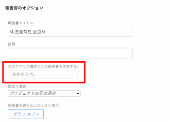
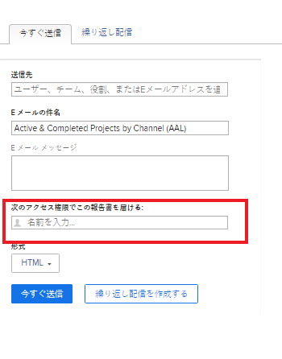

# 別のユーザーのアクセス権を持つレポートの実行と配信

デフォルトでは、ユーザーは、表示権限を持つレポート内のオブジェクトのみを表示できます。

レポート内のオブジェクトのアクセスレベルや権限レベルに関係なく、すべてのユーザーが別のユーザーと同じ結果をレポートに表示できるようにします。

アクセス権の高い別のユーザーのアクセス権 (Adobe Workfront管理者のアクセス権など ) でレポートを実行すると、そのレポートの表示権限を持つすべてのユーザーは、その情報を Report Builder で指定したユーザーとして表示できます。 これは、Workfrontインターフェイスでユーザーが見つけたレポートに対しても、電子メールの添付ファイルとしてユーザーに配信されるレポートに対しても設定できます。

>[!TIP]
>
>次の **このレポートを実行する際のアクセス権は次のとおりです。** フィールドをアクティブユーザーと共に使用する必要があります。 たとえば、Plan-license ユーザーまたは System Administrator が作成したレポートのすべての項目を表示する権限が、Planner または System Administrator のアクセス権を持つレポートに表示されない限り、Work-license ユーザーにはない場合があります。\
レポートが、 **このレポートを実行する際のアクセス権は次のとおりです。** フィールドに値を入力しない場合は、このフィールドを空白のままにすることができます。

## アクセス要件

この記事の手順を実行するには、次のアクセス権が必要です。

<table style="table-layout:auto"> 
 <col> 
 <col> 
 <tbody> 
  <tr> 
   <td role="rowheader">Adobe Workfront plan*</td> 
   <td> 
任意
 </td> 
  </tr> 
  <tr> 
   <td role="rowheader">Adobe Workfront license*</td> 
   <td> 
計画 
 </td> 
  </tr> 
  <tr> 
   <td role="rowheader">アクセスレベル設定*</td> 
   <td> 
レポート、ダッシュボード、カレンダーへのアクセスを編集
 
フィルター、ビュー、グループへのアクセスを編集
 
注意：まだアクセス権がない場合は、Workfront管理者に、アクセスレベルに追加の制限が設定されているかどうかを問い合わせてください。 Workfront管理者がアクセスレベルを変更する方法について詳しくは、 <a href="../../../administration-and-setup/add-users/configure-and-grant-access/create-modify-access-levels.md" class="MCXref xref">カスタムアクセスレベルの作成または変更</a>.
 </td> 
  </tr> 
  <tr> 
   <td role="rowheader">オブジェクトの権限</td> 
   <td> 
レポートに対する権限の表示（配信されたレポートを表示）
 
レポートに対する権限の管理（レポートを実行するため）
 
追加のアクセス権のリクエストについて詳しくは、 <a href="../../../workfront-basics/grant-and-request-access-to-objects/request-access.md" class="MCXref xref">オブジェクトへのアクセスのリクエスト </a>.
 </td> 
  </tr> 
 </tbody> 
</table>

&#42;保有するプラン、ライセンスの種類、アクセス権を確認するには、Workfront管理者に問い合わせてください。

## 別のユーザーのアクセス権を持つレポートを表示する

の生成 **このレポートを実行する権限は次のとおりです。** フィールドを選択すると、どのユーザーがレポートにアクセスしているかに関係なく、レポートに同じデータが含まれます。 レポートは、指定したユーザーに対して同様に表示されます。

レポートにアクセスするユーザーがレポートを表示するには、少なくともレポートの表示権限が必要です。 ユーザーが **このレポートを実行する権限は次のとおりです。** 「 」フィールドが非アクティブになっている場合、レポートの共有先となる他のユーザーに関するレポートは表示されなくなります。

別のユーザーのアクセス権を持つレポートを実行するには：

1. 次をクリック： **メインメニュー** アイコン  Workfrontの右上隅で、 **レポート**.

1. 別のユーザーのアクセス権を持つレポートを選択します。
1. クリック **レポートのアクション**&#x200B;を選択し、次に **編集**.

1. クリック **レポート設定**.

1. Adobe Analytics の **このレポートを実行する際のアクセス権は次のとおりです。** 「 」フィールドに、レポートを表示するユーザーの名前を入力し、リストに表示されたら選択します。\
   

   >[!NOTE]
   >
   レポートの作成が許可されているアクセスレベルが低いユーザーは、自分以外のユーザーを **このレポートを実行する権限は次のとおりです。** フィールドに入力します。

1. クリック **完了**.
1. 「**保存して閉じる**」をクリックします。\
   レポートが、共有されているすべてのユーザーに対して、「 **このレポートを実行する際のアクセス権は次のとおりです。** フィールドに入力します。

>[!IMPORTANT]
>
ログインユーザー以外のユーザーを **このレポートを実行する際のアクセス権は次のとおりです。** フィールドは、ログインしているユーザーをワイルドカードで参照するフィルターがレポートに含まれている場合に、レポートに表示される情報に影響します。 レポートは、 **このレポートを実行する際のアクセス権は次のとおりです。** フィールドの値を指定します。
>
ユーザーフィールドのワイルドカードについて詳しくは、 [ワイルドカードフィルター変数の概要](../../../reports-and-dashboards/reports/reporting-elements/understand-wildcard-filter-variables.md).

## 別のユーザーのアクセス権を持つレポートの配信

レポートを電子メールに添付ファイルとして配信するように設定できます。 これらの配信済みレポートは、より高いアクセスレベルのユーザーに対して表示されるように設定し、すべてのユーザーが配信済みレポートで同じ情報を閲覧できるようにします。 E メールで配信されるレポートを表示するユーザーは、レポート配信内の受信者の「送信先」リストに追加されている必要があります。 配信するレポートの設定について詳しくは、 [レポート配信の概要](../../../reports-and-dashboards/reports/creating-and-managing-reports/set-up-report-deliveries.md).

別のユーザーのアクセス権を持つレポートを配信するには：

1. 次をクリック： **メインメニュー** アイコン  Workfrontの右上隅で、 **レポート**.

1. 別のユーザーのアクセス権で配信するレポートを選択します。
1. レポートの名前をクリックして選択します。
1. クリック **レポートのアクション**.
1. クリック **レポートの送信**.

1. Adobe Analytics の **このレポートを次のアクセス権で配信します。** 「 」フィールドで、レポートを電子メールで配信する際に表示するユーザーの名前を入力し、リストに表示される際に選択します。 デフォルトでは、レポートを作成するユーザーの名前です。\
   

   >[!NOTE]
   >
   レポートの作成が許可されているアクセスレベルが低いユーザーは、自分以外のユーザーを **このレポートを次のアクセス権で配信：** フィールドに入力します。

1. を選択します。 **形式** レポートを電子メールに表示する場合：

   * HTML
   * PDF
   * MS Excel
   * MS Excel (.xlsx)
   * TSV

1. クリック **今すぐ送信** すぐに送信する\
   または\
   クリック **繰り返し配信を作成** ：レポートの繰り返し配信をスケジュールします。\
   レポート配信について詳しくは、 [レポート配信の概要](../../../reports-and-dashboards/reports/creating-and-managing-reports/set-up-report-deliveries.md).

## ソース列を持つレポートの制限

次のレポートには、親オブジェクトに関する情報を表示できる「ソース」列が表示されます。

* 問題レポート
* 時間レポート
* ドキュメントレポート

問題、時間、ドキュメントの親オブジェクトに対する権限をユーザーが持っていない場合、レポートが表示するように設定されている場合や、別のユーザーのアクセス権を持って配信される場合でも、レポートの「ソース」列には空白が表示されます。

レポートに親オブジェクトに関する情報を表示するには、親オブジェクトに列を追加して、親の名前を表示することをお勧めします。

例えば、次のいずれかをソース列を含むレポートに追加できます。

* プロジェクト名、タスク名、または問題名の列をドキュメントまたは時間レポートに適用します。
* [ プロジェクト名 ] 列または [ タスク名 ] 列を発行レポートに追加します。
* 3 つのオブジェクトをすべて参照するテキストモード式を使用する列。 次に、時間レポートの例を示します。

  `displayname=Custom Source`

  `linkedname=opTask`

  `namekey=view.relatedcolumn`

  `namekeyargkey.0=opTask`

  `namekeyargkey.1=name`

  `textmode=true`

  `valueexpression=IF(!ISBLANK({opTaskID}),{opTask}.{name},IF(!ISBLANK({taskID}),{task}.{name},IF(!ISBLANK({projectID}),{project}.{name},IF(!ISBLANK({timesheetID}),CONCAT({owner}.{name}," ",{timesheet}.{startDate}," - ",{timesheet}.{endDate}),""))))`

  `valueformat=HTML`

  テキストモードの表示について詳しくは、 [テキストモードを使用したビューの編集](../text-mode/edit-text-mode-in-view.md).