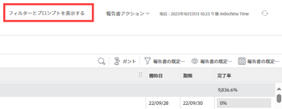

# レポートを実行する

表示するアクセス権のあるすべてのレポートを実行できます。

<!--
NOTE: ***Linked to Getting Started with Reporting.***This information is obsolete, because asynchronous timeline is not enabled for all customers (used to be included in the "Viewing a Cached Report" section): Some reports in Workfront can take a significant time to load. If your report takes longer than 30 seconds to load, your report is cached after it is finished loading, and a message is displayed in the upper-right corner of the page indicating that the report being viewed is a saved report from a specific time.

After a report is cached, it is available for the next 12 hours. Any user who runs the report (as described in "Running a Report") sees the cached report.)
-->

## アクセス要件

この記事の手順を実行するには、次のアクセス権が必要です。

<table style="table-layout:auto"> 
 <col> 
 </col> 
 <col> 
 </col> 
 <tbody> 
  <tr> 
   <td role="rowheader">Adobe Workfront プラン*</td> 
   <td> 
任意
 </td> 
  </tr> 
  <tr> 
   <td role="rowheader">Adobe Workfront ライセンス*</td> 
   <td> 
プラン 
 </td> 
  </tr> 
  <tr> 
   <td role="rowheader">アクセスレベル設定*</td> 
   <td> 
レポート、ダッシュボード、カレンダーの表示アクセス権
 
メモ：まだアクセス権がない場合は、アクセスレベルに追加の制限が設定されていないかどうか Workfront 管理者にお問い合わせください。Workfront 管理者がアクセスレベルを変更する方法について詳しくは、<a href="../../../administration-and-setup/add-users/configure-and-grant-access/create-modify-access-levels.md" class="MCXref xref">カスタムアクセスレベルの作成または変更</a>を参照してください。
 </td> 
  </tr> 
  <tr> 
   <td role="rowheader">オブジェクト権限</td> 
   <td> 
レポートに対する権限を表示
 
追加のアクセス権のリクエストについて詳しくは、<a href="../../../workfront-basics/grant-and-request-access-to-objects/request-access.md" class="MCXref xref">オブジェクトへのアクセス権のリクエスト</a>を参照してください。
 </td> 
  </tr> 
 </tbody> 
</table>

&#42;保有するプラン、ライセンスタイプ、アクセス権を確認するには、Workfront 管理者に問い合わせてください。

## レポートを実行する

1. Adobe Workfront の右上にある&#x200B;**メインメニュー**&#x200B;アイコン（）をクリックし、次に「**レポート**」をクリックします。

1. 次のオプションから選択します。

   * **マイレポート：**&#x200B;作成したレポート。
   * **自分と共有：**&#x200B;他のユーザーが自分と共有したレポート。
   * **すべてのレポート：**&#x200B;システム内のアクセスできるすべてのレポート。

1. 実行するレポートの名前をクリックします。\
   または\
   プロンプトを使用してレポートを作成した場合は、ドロップダウンメニューから適切な情報を選択し、「**レポートを実行**」をクリックします。\
   プロンプトについて詳しくは、[レポートへのプロンプトの追加](../../../reports-and-dashboards/reports/creating-and-managing-reports/add-prompt-report.md)を参照してください。\
   レポートの内容は、右上隅のタイムスタンプとともに表示されます。このタイムスタンプには、レポートを実行したユーザーのコンテキストにある、レポートを実行した日時とタイムゾーンが含まれます。

1. （オプション）**再読み込みアイコン**  をクリックすると、レポートがしばらくの間ブラウザーに表示されている場合に、レポートの結果を更新します。

1. （条件付き）レポートでフィルターまたはプロンプトを使用する場合は、「**フィルターとプロンプトを表示**」をクリックして、表示中のレポートで使用されているフィルターとプロンプトのリストを表示します。レポートにフィルターのみが含まれる場合、またはプロンプトのみが含まれる場合は、「**フィルターを表示**」または「**プロンプトを表示**」が表示されます。

   

   情報は、ページの左側のレポート名の下に表示されます。プロンプトの場合は、手順 4 に従ってレポートの実行時に選択したプロンプトに関する情報が表示されます。

1. カスタムプロンプトを使用している場合は、表示されません。システムプロンプトのみが表示されます。カスタムフィルターは常に表示されます。

## キャッシュされたレポートを表示

しばらくの間ブラウザーに表示しているレポートがキャッシュされる場合があります。キャッシュされたレポートを強制的に再読み込みするには、次のいずれかの操作を実行します。

* レポート設定を編集し、レポートを保存します。
* ビュー、グループまたはフィルターを変更します。
* **再読み込みアイコン**をクリックします。
このオプションは、レポートが保存された時間を示すメッセージボックス内でページの右上隅に表示されます。または、レポートが配置されているダッシュボードの右上隅に表示されます。ダッシュボードの再読み込みについて詳しくは、[ダッシュボードの概要](../../../reports-and-dashboards/dashboards/understanding-dashboards/get-started-dashboards.md)の記事の「ダッシュボードを表示」の節を参照してください。

* 「概要」タブ、「マトリックス」タブまたは「グラフ」タブに移動して、最初のページ以外のレポートのページにアクセスします。
