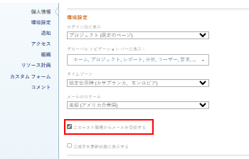

# The projects are imported as new initiatives.プレビューサンドボックス環境でのレポートの送信

このページでは、プレビューおよびカスタム更新サンドボックス環境でのみ使用できる機能について説明します。 この機能は実稼動環境では使用できません。

Adobe Workfront テスト環境で「レポート配信」オプションを設定できます。

<!--

For information about the Workfront test environments, see the "Workfront Testing Environments" section. (NOTE:&nbsp;drafted - link this section)

-->

テスト環境は、実稼動環境にできるだけ近く機能するように設計していますが、一部の機能は実稼動環境とは異なります。

テスト環境でレポートをスケジューリングできますが、レポートの配信方法は実稼動環境での配信方法とは異なります。

実稼動環境での配信レポートのスケジュールについて詳しくは、[レポート配信の概要](../../../reports-and-dashboards/reports/creating-and-managing-reports/set-up-report-deliveries.md)を参照してください。

レポートをスケジューリングする場所に応じて、プレビューサンドボックスとカスタム更新サンドボックスで配信機能は異なります。

## アクセス要件

この記事の手順を実行するには、次のアクセス権が必要です。

<table style="table-layout:auto"> 
 <col> 
 <col> 
 <tbody> 
  <tr> 
   <td role="rowheader">Adobe Workfront プラン*</td> 
   <td> 
任意
 </td> 
  </tr> 
  <tr> 
   <td role="rowheader">Adobe Workfront ライセンス*</td> 
   <td> 
プラン 
 </td> 
  </tr> 
  <tr> 
   <td role="rowheader">アクセスレベル設定*</td> 
   <td> 
レポート、ダッシュボード、カレンダーへのアクセスの編集
 
フィルター、ビュー、グループ化へのアクセスの編集
 
メモ：まだアクセス権がない場合は、アクセスレベルに追加の制限が設定されていないかどうか Workfront 管理者にお問い合わせください。Workfront 管理者がアクセスレベルを変更する方法について詳しくは、<a href="../../../administration-and-setup/add-users/configure-and-grant-access/create-modify-access-levels.md" class="MCXref xref">カスタムアクセスレベルの作成または変更</a>を参照してください。
 </td> 
  </tr> 
  <tr> 
   <td role="rowheader">オブジェクト権限</td> 
   <td> 
レポートに対する権限を管理します。
 
追加のアクセス権のリクエストについて詳しくは、<a href="../../../workfront-basics/grant-and-request-access-to-objects/request-access.md" class="MCXref xref">オブジェクトへのアクセス権のリクエスト</a>を参照してください。
 </td> 
  </tr> 
 </tbody> 
</table>

&#42;保有するプラン、ライセンスタイプ、アクセス権を確認するには、Workfront 管理者に問い合わせてください。

## プレビュー環境でレポートをスケジューリング

* [プレビュー環境でレポートをスケジューリング](#schedule-reports-in-the-preview-environment)

### プレビュー環境でレポートをスケジューリング

配信されたレポートがプレビュー環境で生成されるかどうかは、「**このテスト環境からEメールを受信する**」が有効になっているかどうかに依存します。

サンドボックス環境からのメールの有効化について詳しくは、[プレビューサンドボックス環境からのメール配信を有効にする](../../../workfront-basics/using-notifications/enable-delivery-emails-from-preview-sandbox-environment.md)を参照してください。

プレビュー環境でのレポートの配信スケジュール設定は、実稼動環境でのレポートのスケジュール設定と同じです。レポートの配信スケジュールについて詳しくは、[レポート配信の概要](../../../reports-and-dashboards/reports/creating-and-managing-reports/set-up-report-deliveries.md)を参照してください。

プレビュー環境でレポートの配信をスケジューリングする場合、次のシナリオが考えられます。

* レポートを受信するユーザーに対して「**このテスト環境からEメールを受信する**」が無効になっている場合、レポートの配信をスケジューリングする際にファイルは生成されません。
* レポートを受信するユーザーに対して「**このテスト環境からEメールを受信する**」を有効にすると、レポートの配信をスケジューリングする際に生成されたファイルがユーザーの「ドキュメント」タブに追加されます。

## カスタム更新サンドボックス環境でレポートをスケジューリング

配信されたレポートがカスタム更新サンドボックスで生成されるかどうかは、「このテスト環境からEメールを受信する」設定が有効になっているかどうかで異なります。

プレビュー環境からの E メールの有効化について詳しくは、「 [電子メール通知設定を表示および変更する](../../../workfront-basics/using-notifications/activate-or-deactivate-your-own-event-notifications.md#view) 記事内 [独自の電子メール通知を変更する](../../../workfront-basics/using-notifications/activate-or-deactivate-your-own-event-notifications.md).

カスタム更新サンドボックス環境でのレポートの配信スケジュール設定は、実稼動環境でのレポートのスケジュール設定と同じです。レポートの配信スケジュールについて詳しくは、[レポート配信の概要](../../../reports-and-dashboards/reports/creating-and-managing-reports/set-up-report-deliveries.md)を参照してください。

カスタム更新サンドボックス環境でレポートの配信をスケジューリングする場合、次のシナリオが考えられます。

* レポートを受信するユーザーに対して「このテスト環境からEメールを受信する」が無効になっている場合、レポートの配信をスケジューリングする際にファイルは生成されません。
* レポートを受信するユーザーに対して「このテスト環境からEメールを受信する」を有効にすると、レポートはユーザーに関連付けられたメールアドレスに添付ファイルとしてメールで送信されます。

## 外部ユーザーへの通知方法

外部ユーザーは、Workfront テスト環境から送信されたレポートを受信せず、メール通知も受信しません。

外部ユーザーは、実稼動環境から配信された場合にのみ、メールでレポートを受け取ります。
