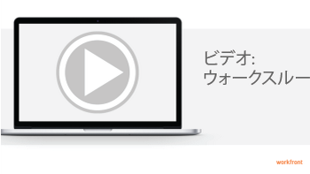

# 自動レポート配信のスケジュール設定

<!--

(NOTE: If this stays, fix links which now go to the reference article)

-->

レポートをスケジュールして、定義したスケジュールに従ってユーザーに自動的に配信したり、1 回限りに手動でレポートを送信したりできます。 Adobe Workfrontからレポートを送信すると、そのユーザーは、別の添付ファイルでWorkfrontレポートが記載された電子メールを受け取ります。

レポートの配信に影響を及ぼす可能性のあるサイズ制限などについて詳しくは、 [レポート配信の概要](../../../reports-and-dashboards/reports/creating-and-managing-reports/set-up-report-deliveries.md).

## アクセス要件

この記事の手順を実行するには、次のアクセス権が必要です。

<table style="table-layout:auto"> 
 <col> 
 <col> 
 <tbody> 
  <tr> 
   <td role="rowheader">Adobe Workfront plan*</td> 
   <td> 
任意
 </td> 
  </tr> 
  <tr> 
   <td role="rowheader">Adobe Workfront license*</td> 
   <td> 
計画 
 </td> 
  </tr> 
  <tr> 
   <td role="rowheader">アクセスレベル設定*</td> 
   <td> 
レポート、ダッシュボード、カレンダーへのアクセスを編集
 
フィルター、ビュー、グループへのアクセスを編集
 
注意：まだアクセス権がない場合は、Workfront管理者に、アクセスレベルに追加の制限を設定しているかどうかを問い合わせてください。 Workfront管理者がアクセスレベルを変更する方法について詳しくは、 <a href="../../../administration-and-setup/add-users/configure-and-grant-access/create-modify-access-levels.md" class="MCXref xref">カスタムアクセスレベルの作成または変更</a>.
 </td> 
  </tr> 
  <tr> 
   <td role="rowheader">オブジェクト権限</td> 
   <td> 
レポートに対する権限の管理
 
追加のアクセス権のリクエストについて詳しくは、 <a href="../../../workfront-basics/grant-and-request-access-to-objects/request-access.md" class="MCXref xref">オブジェクトへのアクセスのリクエスト </a>.
 </td> 
  </tr> 
 </tbody> 
</table>

&#42;保有しているプラン、ライセンスの種類、アクセス権を確認するには、Workfront管理者に問い合わせてください。

## 前提条件

開始する前に、レポートを作成する必要があります。 レポートの作成について詳しくは、 [カスタムレポートの作成](../../../reports-and-dashboards/reports/creating-and-managing-reports/create-custom-report.md).

## レポートの配信スケジュールの設定

レポートの自動配信スケジュールを設定したり、既存のレポート配信を編集または削除するには、次の手順に従いま&#x200B;す。

1. 配信のスケジュールを設定するレポートに移動します。

   >[!NOTE]
   >
   >レポート配信にプロンプトは含まれていません。 レポート配信のデータを制限する場合は、送信するレポートにフィルターを適用することをお勧めします。

1. クリック **レポートのアクション**&#x200B;を、 **レポートの送信**.

   この **レポートの送信** ダイアログボックスが表示されます。

   >[!TIP]
   >
   >任意の時点でレポートを手動で送信するには、レポートに移動し、 **レポートのアクション** > **レポートの送信** > **今すぐ送信**.

1. を選択します。 **配信の繰り返し** タブをクリックします。
1. （条件付き）既存の繰り返しレポートの配信を変更するには、 **配信の繰り返し** 」セクションに入力します。
1. 次の情報を指定します。

   <table style="table-layout:auto"> 
    <col> 
    <col> 
    <tbody> 
     <tr> 
      <td role="rowheader"> 
送信先
 </td> 
      <td> 
レポートの送信先となるユーザー、グループ、チーム、または役割の名前を入力し、ドロップダウンリストに表示されたら名前をクリックします。
 
または
 
レポートにアクセスするWorkfrontシステム外のユーザーの電子メールアドレスを指定します。
 
この手順を繰り返して、複数のユーザー、グループ、チームまたは役割にレポートを送信します。
 
メモ:  
レポート配信の受信者を追加する際は、次の点を考慮してください。
 
        <ul> 
         <li>組織でWorkfront通知が特定の電子メールドメインに制限されている場合は、電子メールドメインに一覧表示されている電子メールアドレスにのみレポートを送信でき許可リストます。
Workfront管理者が E メール管理を更新する方法について詳しくは、「 許可リスト <a href="../../../administration-and-setup/get-started-wf-administration/configure-your-email-allowlist.md#configur" class="MCXref xref">電子メールの設定を許可リスト行う</a>.
</li> 
         <li> 
多数のユーザーを受信者として追加すると、配信が失敗する可能性があります。 配信に失敗した場合は、小さなユーザーグループと共に複数のレポート配信をスケジュールできます。
 </li> 
        </ul> 
 </td> 
     </tr> 
     <tr> 
      <td role="rowheader"> 
E メールの件名
 </td> 
      <td> 
電子メール通知の件名を指定します。
 
デフォルトでは、電子メールの件名は次のようになります。
 
<em>Workfrontレポート：[ レポート名 ] [ 日付 ]</em> 
 </td> 
     </tr> 
     <tr> 
      <td role="rowheader"> 
E メール メッセージ
 </td> 
      <td> 
電子メールに含めるメッセージを指定します。
 
デフォルトでは、電子メールメッセージは次のようになります。
 
<em>[Date] にWorkfrontが生成した [report frequency] report [Name of the report] が添付されています。</em> 
 
注意：レポートが Excel ファイルとしてのみ配信される場合は、次のメッセージも電子メールに追加されます。「MS Excel (XLS) ファイルタイプでは、これらのファイルタイプがサポートするハイパーリンクの数に制限 (65,530) があることに注意してください。 これらの制限を超えると、ファイルは開かれず、ハイパーリンクなしで再送信することをお勧めします。 レポートスケジューラに戻って、ハイパーリンクを削除してレポートを再送信してください。 「レポートスケジューラに戻ってください」というフレーズは、レポートに戻るリンクです。
 </td> 
     </tr> 
     <tr> 
      <td role="rowheader"> 
次のアクセス権限でこの報告書を届ける
 </td> 
      <td> 
レポートにアクセスできるユーザーの名前を入力し始め、ドロップダウンリストに表示されたら名前をクリックします。 レポートを受け取るユーザーには、ここで指定するユーザーと同じレベルのレポートへのアクセス権が付与されます。  詳しくは、 <a href="../../../reports-and-dashboards/reports/creating-and-managing-reports/run-deliver-report-access-rights-another-user.md" class="MCXref xref">別のユーザーのアクセス権を持つレポートの実行と配信</a>.
 
注意：このフィールドではワイルドカードを使用できません。 例えば、ワイルドカード$$User.ID を使用しても、レポートを受け取ったユーザーのアクセス権を持つレポートは実行されません。
 </td> 
     </tr> 
     <tr> 
      <td role="rowheader"> 
形式
 </td> 
      <td> 
配信されるレポートの形式を選択します。
 
       <ul> 
        <li> 
HTML
 </li> 
        <li> 
PDF
 
これを選択した場合、 <strong>用紙サイズ</strong> および <strong>向き</strong> 表示されるオプション。
 </li> 
        <li> 
MS Excel (.xlsx)
 </li> 
        <li> 
TSV
 </li> 
       </ul> </td> 
     </tr> 
     <tr> 
      <td role="rowheader"> 
リンクを含める
 </td> 
      <td> 
このオプションは、 <strong>MS Excel</strong> が <strong>形式</strong> ドロップダウンメニュー。 このオプションを有効にすると、書き出された Excel ドキュメントにハイパーリンクが含まれます。
 
65,530 個を超えるリンクを含むドキュメントは開くことができません。 書き出すドキュメントに 65,530 個を超えるリンクが含まれている場合は、このオプションの選択を解除します。
 
このオプションは、デフォルトで有効になっています。
 </td> 
     </tr> 
     <tr> 
      <td role="rowheader"> 
概要
 </td> 
      <td> 
配信を繰り返すタイミングの概要を表示します。
 </td> 
     </tr> 
     <tr> 
      <td role="rowheader"> 
繰り返し
 </td> 
      <td> 
レポートを毎日、毎週、毎月、毎年のどれで配信するかを選択します。
 </td> 
     </tr> 
     <tr> 
      <td role="rowheader"> 
繰り返す間隔
 </td> 
      <td> 
配信の繰り返し頻度を選択します。 このオプションで選択する値は、 <strong>繰り返し</strong> 」ドロップダウンリストから選択できます。
 </td> 
     </tr> 
     <tr> 
      <td role="rowheader"> 
時間
 </td> 
      <td> 
配信を送信する時刻を選択します。
 
ヒント：システムの負荷はレポートの配信時間に影響を与える可能性があるので、予定時間と実際の配信時間の間に遅延が生じる場合があります。 特定の時間までに配信するレポートが必要な場合は、必要な時間に配信をスケジュールすることをお勧めします。 例えば、配信のスケジュールを必要な日付の前に設定することをお勧めします。
 </td> 
     </tr> 
     <tr> 
      <td role="rowheader"> 
曜日
 </td> 
      <td> 
このオプションは、 <strong>繰り返し</strong> オプションは次のいずれかに設定されます。 <strong>毎週</strong> または <strong>毎月</strong>:
 
       <ul> 
        <li> 
次の場合に <strong>繰り返し</strong> オプションが <strong>毎週</strong>:配信を送信する曜日を選択します。
 </li> 
        <li> 
次の場合に <strong>繰り返し</strong> オプションが <strong>毎月</strong>:配信を月の当日、曜日、または月の最終日のどちらに送信するかを選択します ( これらのオプションでは <strong>開始日</strong> フィールド ) に書き込まれます。
 </li> 
       </ul> </td> 
     </tr> 
     <tr> 
      <td role="rowheader"> 
開始日
 </td> 
      <td>スケジュールされた配信を開始する日付を選択します。</td> 
     </tr> 
     <tr> 
      <td role="rowheader"> 
終了日
 </td> 
      <td>スケジュールされた配信が終了する日付を選択します。</td> 
     </tr> 
     <tr> 
      <td role="rowheader"> 
実行しない
 </td> 
      <td>選択 <strong>なし</strong> スケジュールされた配信を無期限に継続する場合。</td> 
     </tr> 
    </tbody> 
   </table>

1. クリック **保存** をクリックして、レポート配信を保存します。

   レポートが **配信の繰り返し** セクション ( **レポートの送信** ダイアログボックスに表示されます )。スケジュールされた時刻に送信されます。

   レポートの配信に影響を与える可能性のあるサイズ制限について詳しくは、 [レポートの配信制限](../../../reports-and-dashboards/reports/creating-and-managing-reports/set-up-report-deliveries.md#understanding-export-limits) および [書き出し制限](../../../reports-and-dashboards/reports/creating-and-managing-reports/set-up-report-deliveries.md#export).

1. （オプション）予定されている配信を削除するには：

   1. 内 **配信の繰り返し** パネルで、予定されている配信をクリックしてから、 **削除**.
   1. クリック **削除** をクリックして確定します。

## ビデオウォークスルー

レポート配信のスケジュール方法については、次のビデオをご覧ください。 このビデオはWorkfront Classic で録画されました。 ただし、内容は新しいWorkfrontエクスペリエンスにも適用されます。

<!--
<h2 data-mc-conditions="QuicksilverOrClassic.Draft mode">Additional information</h2>
-->

<!--

See also:

-->

<!--
  <li data-mc-conditions="QuicksilverOrClassic.Draft mode"><a href="https://one.workfront.com/s/learningpath2/workfront-reporting-20Y0z000000blhLEAQ" target="_blank">Learning Path for reports and dashboards</a> </li>
  -->

<!--
  
<a href="https://one.workfront.com/s/basic-report-creation-program">Basic Report Creation Program for the new Workfront experience</a> 

  -->
