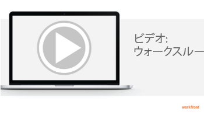

# レポートの自動配信のスケジュール設定

<!-- Audited: 4/2025 -->

<!--

(NOTE: If this stays, fix links which now go to the reference article)

-->

レポートをスケジュールして、定義したスケジュールに従ってユーザーに自動的に配信したり、1 回限りで手動でレポートを送信したりできます。Adobe Workfront からレポートを送信すると、ユーザーは Workfront レポートが添付されたメールが送信されます。

レポートの配信に影響を及ぼす可能性のあるサイズ制限などの情報について詳しくは、[レポート配信の概要](../../../reports-and-dashboards/reports/creating-and-managing-reports/set-up-report-deliveries.md)を参照してください。

## アクセス要件

+++ 展開すると、この記事の機能のアクセス要件が表示されます。 

<table style="table-layout:auto"> 
 <col> 
 <col> 
 <tbody> 
  <tr> 
   <td role="rowheader">Adobe Workfront パッケージ</td> 
   <td> 
任意
 </td> 
  </tr> 
  <tr> 
   <td role="rowheader">Adobe Workfront プラン</td> 
   <td> 
      
標準

      
プラン

   </td>
  </tr> 
  <tr> 
   <td role="rowheader">アクセスレベル設定</td> 
   <td> 
レポート、ダッシュボード、カレンダーへのアクセス権を編集

   
フィルター、ビュー、グループ化へのアクセスの編集

   </td> 
  </tr> 
  <tr> 
   <td role="rowheader">オブジェクト権限</td> 
     <td> 
レポートに対する権限を管理します。
</td> 
  </tr> 
 </tbody> 
</table>

この表の情報について詳しくは、[Workfront ドキュメントのアクセス要件](/help/quicksilver/administration-and-setup/add-users/access-levels-and-object-permissions/access-level-requirements-in-documentation.md)を参照してください。

+++

## 前提条件

開始する前に、レポートを作成する必要があります。レポートの作成について詳しくは、[カスタムレポートの作成](../../../reports-and-dashboards/reports/creating-and-managing-reports/create-custom-report.md)を参照してください。

## レポートの配信スケジュールの設定

自動配信のレポートをスケジュールする手順は、&#x200B;のとおりです。

{{step1-to-reports}}

>[!NOTE]
>
>レポート配信にプロンプトは含まれていません。レポート配信のデータを制限する場合は、送信するレポートにフィルターを適用することをお勧めします。

1. **レポート** ページで、レポートを選択します。
1. 画面の上部で、表示されるドロップダウンから「**Report Actions**」、「**レポートを送信**」の順にクリックします。 **レポートを送信**&#x200B;ダイアログボックスが表示されます。

   >[!TIP]
   >
   >任意の時点でレポートを手動で送信するには、レポートに移動し、**レポートのアクション**／**レポートを送信**／**今すぐ送信**&#x200B;をクリックします。

1. 「**定期配信**」タブを選択します。
1. （条件付き）既存の繰り返しレポート配信を変更するには、ダイアログボックスの右側にある「**繰り返し配信**」セクションでレポート配信を選択します。
1. 次の情報を指定します。

   <table style="table-layout:auto"> 
    <col> 
    <col> 
    <tbody> 
     <tr> 
      <td role="rowheader"> 
送信先
 </td> 
      <td> 
レポートの送信先となるユーザー、グループ、チーム、または役割の名前を入力し、ドロップダウンリストに表示された名前をクリックします。
 
または
 
レポートにアクセスするWorkfront システムの外部ユーザーのメールアドレスを入力します。
 
この手順を繰り返して、複数のユーザー、グループ、チームまたは役割にレポートを送信します。
 
メモ：  
レポート配信の受信者を追加する際は、次の点を考慮してください。
 
        <ul> 
         <li>
お客様の組織がWorkfront通知を特定のメールドメインに制限している場合、レポートをメール許可リストに記載されているメールアドレスにのみ送信できます。
 
例えば、ユーザーがレポート受信者として設定され、以前に許可された電子メールアドレスを持っていて、そのドメインへの電子メールの配信を停止するように更新された場合、ユーザーは配信されたレポートを受け取ることができなくなります。

Workfront 管理者がメールの許可リストを更新する方法について詳しくは、<a href="../../../administration-and-setup/get-started-wf-administration/configure-your-email-allowlist.md#configur" class="MCXref xref">メールの許可リストの設定</a>の節を参照してください。
</li> 
         <li> 
多数のユーザーを受信者として追加すると、配信が失敗する可能性があります。配信に失敗した場合は、小さなユーザーグループに対して複数のレポート配信をスケジュールできます。
 </li> 
        </ul> </td> 
     </tr> 
     <tr> 
      <td role="rowheader"> 
メールの件名
 </td> 
      <td> 
メール通知の件名を入力します。
 
デフォルトでは、メールの件名は次のようになります。
 
<em>Workfront レポート：[Name of the report] [Date]</em> 
 </td> 
     </tr> 
     <tr> 
      <td role="rowheader"> 
メールのメッセージ
 </td> 
      <td> 
メールに含めるメッセージを入力してください。
 
デフォルトでは、メールのメッセージは次のようになります。
 
<em>[Date] に Workfront が生成した [report frequency] レポート [Name of the report] が添付されています。</em> 
 
メモ：Excel ファイルとして配信されるレポートのみに、次のメッセージがメールに追加されます。「MS Excel（XLS）ファイルタイプでは、サポートするハイパーリンクの数に制限（65,530）があることに注意してください。これらの制限を超えた場合、ファイルを開くことができないので、ハイパーリンクなしで再送信することをお勧めします。レポートスケジューラーに戻って、ハイパーリンクを削除してからレポートを再送信してください。」「レポートスケジューラーに戻って」というフレーズは、レポートに戻るリンクです。
 </td> 
     </tr> 
     <tr> 
      <td role="rowheader"> 
次のアクセス権限でこのレポートを配信
 </td> 
      <td> 
レポートにアクセスできるユーザーの名前を入力し、ドロップダウンリストに表示された名前をクリックします。レポートを受け取るユーザーには、ここで指定するユーザーと同じレベルのレポートへのアクセス権が付与されます。 詳しくは、<a href="../../../reports-and-dashboards/reports/creating-and-managing-reports/run-deliver-report-access-rights-another-user.md" class="MCXref xref">別のユーザーのアクセス権を持つレポートの実行と配信</a>を参照してください。
 
メモ：このフィールドではワイルドカードはサポートされません。例えば、ワイルドカード <em>$$User.ID</em>を使用すると、レポートを受信するユーザーのアクセス権を使用してレポートが実行されません。
 </td> 
     </tr> 
     <tr> 
      <td role="rowheader"> 
形式
 </td> 
      <td> 
配信されるレポートの形式を選択します。
 
       <ul> 
        <li> 
HTML
 </li> 
        <li> 
PDF
 
PDFを選択すると、表示される追加の<strong>用紙サイズ </strong>および<strong>方向</strong> オプションを使用して出力をフォーマットできます。
 </li> 
        <li> 
MS Excel（.xlsx）
 </li> 
        <li> 
TSV
 </li> 
       </ul> </td> 
     </tr> 
     <tr> 
      <td role="rowheader"> 
リンクを含める
 </td> 
      <td> 
このオプションは、<strong>形式</strong>ドロップダウンメニューで <strong>MS Excel</strong> が選択されている場合にのみ使用できます。このオプションを有効にすると、書き出された Excel ドキュメントにハイパーリンクが含まれます。
 
65,530 個を超えるリンクを含むドキュメントは開くことができません。書き出すドキュメントに 65,530 個を超えるリンクが含まれている場合は、このオプションの選択を解除します。
 
このオプションは、デフォルトで有効になっています。
 </td> 
     </tr> 
     <tr> 
      <td role="rowheader"> 
概要
 </td> 
      <td> 
配信を繰り返すタイミングの概要を表示します。
 </td> 
     </tr> 
     <tr> 
      <td role="rowheader"> 
繰り返し
 </td> 
      <td> 
レポートを毎日、毎週、毎月、毎年のどれで配信するかを選択します。
 </td> 
     </tr> 
     <tr> 
      <td role="rowheader"> 
繰り返す間隔
 </td> 
      <td> 
配信の繰り返し頻度を選択します。このオプションに選択する値は、<strong>繰り返し</strong>ドロップダウンリストで選択したオプションに基づきます。
 </td> 
     </tr> 
     <tr> 
      <td role="rowheader"> 
時間
 </td> 
      <td> 
配信を送信する時刻を選択します。
 
ヒント：システムの読み込みはレポートの配信時間に影響を与える可能性があるため、スケジュールされた時間と実際の配信時間の間に最大24時間の遅延が発生する場合があります。 特定の時間までに配信するレポートが必要な場合は、必要な時間の前に配信をスケジュールすることをお勧めします。一般的に、配信のスケジュールは、必要な日付の少なくとも1日前に設定することをお勧めします。
 </td> 
     </tr> 
     <tr> 
      <td role="rowheader"> 
曜日
 </td> 
      <td> 
このオプションは、<strong>繰り返し</strong>オプションが<strong>毎週</strong>または<strong>毎月</strong>に設定されている場合に使用できます。
 
       <ul> 
        <li> 
<strong>繰り返し</strong>オプションが<strong>毎週</strong>に設定されている場合：配信を送信する曜日を選択します。
 </li> 
        <li> 
<strong>繰り返し</strong>オプションが<strong>毎月</strong>に設定されている場合：配信を月の特定日、曜日、または月末のいずれに送信するかを選択します（これらのオプションでは「<strong>開始日</strong>」で選択した日付を利用します）。
 </li> 
       </ul> </td> 
     </tr> 
     <tr> 
      <td role="rowheader"> 
開始日
 </td> 
      <td>スケジュールされた配信を開始する日付を選択します。</td> 
     </tr> 
     <tr> 
      <td role="rowheader"> 
終了日
 </td> 
      <td>スケジュールされた配信が終了する日付を選択します。</td> 
     </tr> 
     <tr> 
      <td role="rowheader"> 
実行しない
 </td> 
      <td>スケジュールされた配信を無期限に継続する場合、「<strong>実行しない</strong>」を選択します。</td> 
     </tr> 
    </tbody> 
   </table>

1. **保存**&#x200B;をクリックして、レポート配信を保存します。 レポートは、**レポートを送信** ダイアログボックスの&#x200B;**配信の繰り返し** セクションに表示され、スケジュールされた時間に送信されます。

   レポートの配信に影響を与える可能性のあるサイズ制限について詳しくは、[レポートの配信制限](../../../reports-and-dashboards/reports/creating-and-managing-reports/set-up-report-deliveries.md#understanding-export-limits)および[書き出し制限](../../../reports-and-dashboards/reports/creating-and-managing-reports/set-up-report-deliveries.md#export)を参照してください。

>[!IMPORTANT]
>
>スケジュールされたレポートは、配信のために処理される際に、内部時間制限の対象となります。 レポートの送信に制限を超える時間がかかった場合は、通知が届き、残りのスケジュールされた配信に関係なくレポートは配信されなくなります。 レポートを引き続き送信するには、まずフィルターとビューを使用してレポートのサイズを小さくしてから、新しいスケジュール配信を作成します。
>
>スケジュールされたレポート配信を使用してBI ツールを使用してWorkfront データを分析する場合は、代わりにWorkfront Data Connectを使用することをお勧めします。 詳しくは、[Workfront Data Connectの概要](/help/quicksilver/reports-and-dashboards/data-lake/data-lake-overview.md)を参照してください。

## スケジュールされたレポート配信の削除

スケジュール済みレポート配信を削除するには、&#x200B;の手順に従います。

{{step1-to-reports}}

1. **レポート** ページで、レポートを選択します。

1. 画面の上部で、表示されるドロップダウンから「**Report Actions**」、「**レポートを送信**」の順にクリックします。 **レポートを送信**&#x200B;ダイアログボックスが表示されます。

1. 「**定期配信**」タブを選択します。
1. ダイアログボックスの右側にある「**配信の繰り返し**」セクションで、削除するスケジュールされた配信をクリックします。
1. **繰り返し配信**&#x200B;の詳細セクションで、**削除**&#x200B;をクリックします。

1. 「**削除**」をクリックして確定します。

<!--
## Video walk-through

View the following video to learn how to schedule a report delivery. This video was recorded in Workfront Classic. However, the content also applies to the new Workfront experience.

<h2 data-mc-conditions="QuicksilverOrClassic.Draft mode">Additional information</h2>
-->

<!--

See also:

-->

<!--
  <li data-mc-conditions="QuicksilverOrClassic.Draft mode"><a href="https://one.workfront.com/s/learningpath2/workfront-reporting-20Y0z000000blhLEAQ" target="_blank">Learning Path for reports and dashboards</a> </li>
  -->

<!--
  
<a href="https://one.workfront.com/s/basic-report-creation-program">Basic Report Creation Program for the new Workfront experience</a> 

  -->
