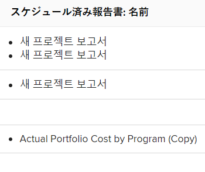
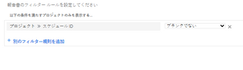
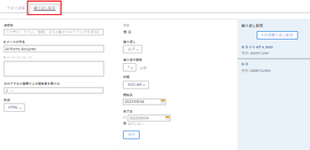
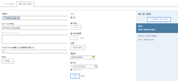

# レポート配信の概要

<!--

(NOTE: This is linked to the UI in the Send Report box inside the Preview sandbox. If you change title, log bug for Dev to fix the link) 

-->

レポートが定義したスケジュールに従ってユーザーに自動的に配信されるようにスケジュールしたり、レポートを 1 回限りに手動で送信したりできます。 Adobe Workfrontからレポートを送信すると、そのユーザーは、別の添付ファイルでWorkfrontレポートが記載された電子メールを受け取ります。

配信用のレポートの設定について詳しくは、 [レポートの自動配信のスケジュール設定](../../../reports-and-dashboards/reports/creating-and-managing-reports/set-up-automatic-report-delivery.md).

プレビューサンドボックス環境では、レポートの配信スケジュールを設定したり、手動で配信したりすることはできません。 プレビューサンドボックスについて詳しくは、次の記事を参照してください。 [Adobe Workfrontプレビューサンドボックス環境](../../../administration-and-setup/set-up-workfront/workfront-testing-environments/wf-preview-sandbox-environment.md).\
プレビューサンドボックス環境でのレポートの配信について詳しくは、次の記事を参照してください。 [プレビューサンドボックス環境でのレポートの送信](../../../reports-and-dashboards/reports/creating-and-managing-reports/send-report-preview-sandbox-environment.md).

## レポートの配信制限

<!--

(NOTE: [! This information is shared between "Exporting Data" and "Setting Up Report Deliveries."])

-->

配信するレポートをスケジュールする際は、次の点を考慮してください。

* 任意のレポートに対して、最大 10 回までの繰り返し配信をスケジュールできます。
* レポートの作成者の場合にのみ、レポートの配信をスケジュールできます。 作成しなかったレポートを送信する必要がある場合は、手動で送信できます。

## 書き出し制限

Workfrontでのレポートの表示方法や、手動でのエクスポート、配信されたレポート、API を使用したレポートの書き出し方法に影響するいくつかのサイズ制限があります。

* **5 MB のファイルサイズ：** 配信が予定されている書き出しレポートのファイルサイズ制限。 E メールに添付されたエクスポート済みファイルが 5 MB を超える場合、添付されたエクスポート済みレポートの代わりに、ファイルをダウンロードできるリンクが電子メールで送信されます。 

  >[!NOTE]
  >
  >Excelの.xlsx ファイルが 5MB を超える場合、電子メールは生成されません。 レポートは、手動でこの形式にエクスポートできます。 レポートのエクスポートについて詳しくは、 [データを書き出し](../../../reports-and-dashboards/reports/creating-and-managing-reports/export-data.md).

* **50,000 行：** .pdf ファイルおよびタブ区切りファイルのレポート書き出しで許可されるデータの行数。

  Excelの.xls ファイルの場合、この制限は次のとおりです。 **65,000 行**.

  Excelの.xlsx ファイルの場合、この制限はです。 **100,000 行**.

  これらの制限により、列見出しと、レポート内のグループ化の行が除外されます。 例えば、1 つのレポートに 6 つのグループが含まれ、50,000 行のデータが含まれる場合、エクスポートされるファイルの行数は 50,000 行になります。

  レポートにこれらの制限を超える項目がある場合は、レポートの書き出しと配信が成功しないというエラーが表示されます。 結果を配信できるように、画面に表示される項目の数を、この制限値以下の数に減らします。 すべてのデータをエクスポートする場合は、フィルターを使用して少ない負荷のデータを取得し、複数のエクスポートを実行することをお勧めします。 詳しくは、 [フィルターの概要](../../../reports-and-dashboards/reports/reporting-elements/filters-overview.md).

  以下の制限が適用されます。

   * レポートの手動エクスポート。
   * 予定レポート。
   * API 統合を通じたエクスポート。
   * キックスタートを通じてエクスポートされたデータ。

     キックスタートを使用したデータのエクスポートの詳細については、「 [「キックスタート」を使用してAdobe Workfrontからデータを書き出す](../../../administration-and-setup/manage-workfront/using-kick-starts/export-data-from-wf-via-kick-starts.md).

     >[!NOTE]
     >
     50,000 行を Excel 形式のファイルにのみエクスポートできます。 

   * プロジェクトの使用状況情報をエクスポートします。

     プロジェクトの使用率情報を書き出す方法の詳細については、 [リソース使用率レポートの概要](../../../reports-and-dashboards/reports/using-built-in-reports/resource-utilization-report.md).

* **65,530 ハイパーリンク：** これは、65,530 個を超えるハイパーリンクを含むドキュメントに対して Excel が課す制限です。 これらのドキュメントは、手動でエクスポートしたり、配信されたレポートに送信したりする際には開けません。 Excel ドキュメントのデータは 200 行に過ぎませんが、ドキュメント内に 65,530 個を超えるリンクがある場合、ドキュメントは開きません。 この制限は、Excel ファイルにのみ存在し、他のサポートされている形式には存在しません。 
* **256 列**:256 列を超えるドキュメントに対して Excel が課す制限です。 これらのドキュメントは、手動でエクスポートしたり、配信されたレポートに送信したりすることはできません。 この制限は、Excel ファイルにのみ存在し、他のサポートされている形式には存在しません。 

制限を超えてデータをエクスポートしようとすると、エクスポートで予期されたデータの一部が受け取らない場合があります。 代わりに、制限内に変更されたレポートが作成されます。 

さらに、の実行に 60 分以上かかるレポートは停止します。

制限に関するご不明な点や問題がある場合は、Workfrontテクニカルサポートにお問い合わせください。

## 配信されたレポートのタイムスタンプを理解する

<!--

(NOTE: Note about if this is delivered at a time based on the user's time zone settings?)

-->

電子メールでレポートを受け取った場合、配信と同時にWorkfrontでレポートを表示すると、レポートのタイムスタンプと時刻の形式がWorkfrontの形式と一致しないことがあります。 

次の点に注意してください。 

* ブラウザーでレポートを表示する場合、レポートのタイムスタンプと形式は、ブラウザーの設定で定義された、ブラウザーのロケールとタイムゾーンに一致します。
* レポートが電子メールで配信されると、Workfrontプロファイルで指定されたユーザーのロケールとタイムゾーンに合ったタイムスタンプと形式でレポートが配信されます。\
  Workfrontのユーザーのロケールとタイムゾーンについて詳しくは、 [ユーザーのプロファイルの編集](../../../administration-and-setup/add-users/create-and-manage-users/edit-a-users-profile.md).

## 特別なビューを持つレポート {#reports-with-a-special-view}

レポートに特別なビューを適用すると、Workfrontのレポートの「詳細」タブに特別なビューが表示されます。

特別な表示を持つレポートの配信スケジュールを設定すると、特別な表示ではなく、送信済み E メールの添付ファイルにデフォルトの「詳細」タブが配信されます。

以下は特別なビューと見なされます。

* プロジェクトレポートのマイルストーン表示
* プロジェクトまたはタスクレポートのガント表示
* グラフをデフォルトのタブとして持つレポート

>[!NOTE]
>
レポートに、特別なビューを持つデフォルトのタブに加えて、「マトリックス」タブも表示されている場合、レポートは「マトリックス」タブに表示されたとおりに配信されます。

レポートに特別なビューを適用する方法の詳細については、「 [カスタムレポートの作成](../../../reports-and-dashboards/reports/creating-and-managing-reports/create-custom-report.md).

## 配信されたファイルを使用

 Workfrontからレポートを送信すると、そのレポートが別の添付ファイルで送信された電子メールがユーザーに送信されます。 

* [件名、添付ファイル名、レポートタイトル](#subject-line-attachment-name-and-report-title)
* [タイムスタンプ](#timestamps)
* [ブランディング](#branding)
* [書式設定](#formatting)
* [リンク](#links)

### 件名、添付ファイル名、レポートタイトル {#subject-line-attachment-name-and-report-title}

配信されたレポートの電子メールの件名行について詳しくは、 [レポートの自動配信のスケジュール設定](../../../reports-and-dashboards/reports/creating-and-managing-reports/set-up-automatic-report-delivery.md).

添付されたレポートの名前は次のとおりです。 *The_Name_Of_The_Report*&#x200B;書き出されたファイル形式が続きます。 

配信したレポートをPDFまたはHTMLファイル形式で書き込むようにスケジュールした場合、レポートのタイトルは次のようになります。

*レポートの名前。*

Excel、Excel(.xlsx) または TSV 形式で配信される予定のレポートにはタイトルがありません。

>[!NOTE]
>
レポートに説明が含まれている場合、ファイルがPDFまたはHTMLファイルとしてフォーマットされている場合は、書き出されたファイルに含まれます。

### タイムスタンプ {#timestamps}

添付ファイルにタイムスタンプが表示されるのは、ファイルの形式が.pdf の場合のみです。 タイムスタンプは、添付ファイルのフッターに表示されます。

タイムスタンプには以下が含まれます。

* 日付
* 時間
* レポートが送信されたタイムゾーン

### ブランディング {#branding}

Workfront管理者がWorkfrontインスタンスにカスタマイズしたブランディングを追加した場合は、.pdf 形式で送信されるレポートに、パーソナライズしたロゴも含まれます。

その他の形式で送信されたレポートは、ロゴを使用してパーソナライズすることはできません。

Workfrontインスタンスのブランディングについて詳しくは、 [Adobe Workfrontインスタンスのブランディング](../../../administration-and-setup/customize-workfront/brand-workfront/brand-your-workfront-instance.md).

### 書式設定 {#formatting}

レポートに特別な表示がない限り、レポートの送信または配信スケジュールを行うときは、レポートのデフォルトタブを常に受け取ります。

Web アプリケーションでレポートに特別な書式が設定されている場合、「詳細」タブと「マトリックス」タブが.pdf および Excel ファイル用にのみ配信される場合は、レポートに特別な書式を設定して配信する必要があります。

配信ファイルには、レポートのフィルター、表示、グループ化は含まれません。 レポートの説明は、レポートをPDFファイルとして送信する場合にのみ表示されます。

特別なビューでのレポートの受信について詳しくは、 [特別なビューを持つレポート](#reports-with-a-special-view).\
レポートのデフォルトのタブの選択と特殊な書式について詳しくは、 [カスタムレポートの作成](../../../reports-and-dashboards/reports/creating-and-managing-reports/create-custom-report.md).

### リンク {#links}

WorkfrontからPDFまたは Excel 形式にレポートを送信する場合、元のドキュメントに存在する作業リンクは、送信されたファイル内に残ります。 リンクは、Workfront内のリンクをサポートする任意のオブジェクトを指すことができます。

また、電子メールメッセージ内のレポートの名前はリンクです。

## 予定レポートに関するレポート

次の項目を作成することで、レポートの配信が設定されているかどうかを確認できます。

* **A ビュー** リスト内の Report オブジェクトまたはレポート用のレポートの場合：レポートのリストまたはレポート用のレポート内のビューを作成し、ビューに次の列を追加します。\
  *予定レポート名。\
  *そのレポートに対してスケジュールされたすべての配信の名前は、箇条書きリストの列に表示されます。\
  

* **フィルター** レポートオブジェクトの場合：レポートのリストまたは次のステートメントを使用して、レポートに関するレポートでフィルターを作成します。 *予定レポート ID が空ではありません*.\
  これにより、リストまたはレポートでスケジュールされたレポートのみが表示されます。\
  \
  レポートの作成について詳しくは、 [カスタムレポートの作成](../../../reports-and-dashboards/reports/creating-and-managing-reports/create-custom-report.md). レポートの作成について詳しくは、 [レポートアクティビティに関するレポートの作成](../../../reports-and-dashboards/reports/report-usage/create-report-reporting-activities.md).

<!--
<h2 data-mc-conditions="QuicksilverOrClassic.Draft mode">Scheduling a Repeating&nbsp;Report Delivery</h2>
-->

<!--

You can schedule up to 10 repeating report deliveries for any given report.

-->

<!--

You can schedule a report to be delivered only if you are the creator of the report. If you need to send a report that you did not create, you can send it on a manual basis.

-->

<!--

To schedule&nbsp;a report for automatic delivery or to edit an existing report delivery:&nbsp;​

-->

<!--
   <li value="1" data-mc-conditions="QuicksilverOrClassic.Draft mode">Navigate to and click the name of the report for which you want to schedule delivery.&nbsp;</li>
   -->

<!--
   <li value="2" data-mc-conditions="QuicksilverOrClassic.Draft mode">Click <strong>Report Actions</strong>, then&nbsp;<strong>Send Report</strong>.  The <strong>Send Report</strong> dialog box is displayed.</li>
   -->

<!--
   <li value="3" data-mc-conditions="QuicksilverOrClassic.Draft mode">Select the <strong>Repeating Deliveries</strong>&nbsp;tab. </li>
   -->

<!--
   <li value="4" data-mc-conditions="QuicksilverOrClassic.Draft mode">(Conditional)&nbsp;To modify an existing repeating report delivery, select the report delivery in the <strong>Repeating Deliveries</strong>&nbsp;section.</li>
   -->

<!--
   <li value="5" data-mc-conditions="QuicksilverOrClassic.Draft mode">Specify the following information:
   <ul>
   <li data-mc-conditions="QuicksilverOrClassic.Draft mode"><strong>Send to:</strong> Begin typing the name of the user, group, team, or role who you want to send&nbsp;the report to, then click the name when it appears in the drop-down list. Or Specify the email address of a person external to the Workfront system who you want to have access to the report.  Repeat this process to send the report to multiple users, groups, teams, or roles.</li>
   <li data-mc-conditions="QuicksilverOrClassic.Draft mode"><strong>Email Subject:</strong> Specify a subject for the email notification.  By default, the email subject is: <em>Workfront Report: <Name of the report> Date of the Export</em>.<strong></strong></li>
   <li data-mc-conditions="QuicksilverOrClassic.Draft mode"><strong>Email Message:</strong> Specify a message to include in the email. By default, the email message is:&nbsp;<em>Attached is the <report frequency> report <Name of the report> generated by Workfront on <Date>.</em> 
   <note type="note">
   For reports delivered as an Excel file only, the following message is also added to the email: "Please be aware that with MS Excel (XLS) file types, there is a limit (65,530) on the number of hyperlinks these file types support. If you exceed those limits, your file will not open and it is recommended to resend without the hyperlinks.&nbsp;Please go back to the report scheduler&nbsp;to remove hyperlinks and resend the report." The "please go back to the report scheduler" phrase is a link back to the report.&nbsp;
   </note>
   </li>
   <li data-mc-conditions="QuicksilverOrClassic.Draft mode"><strong>Deliver this report with the Access Rights of:</strong>&nbsp;Begin typing the name of a user who has access to the report, then click the name when it appears&nbsp;in the drop-down list. Users who receive the report will be granted the same level of access to the report as the user that you specify&nbsp;here.  For more information, see <a href="../../../reports-and-dashboards/reports/creating-and-managing-reports/run-deliver-report-access-rights-another-user.md" class="MCXref xref">Run and deliver a report with the access rights of another user</a>
   <note type="note">
   This field does not support wildcards. For example, using the wildcard $$User.ID does not run the report with the access rights of the user who is receiving the report.
   </note>
   </li>
   <li data-mc-conditions="QuicksilverOrClassic.Draft mode"><strong>Format:</strong> Select in which of the following formats you want the report to be delivered:
   <ul>
   <li data-mc-conditions="QuicksilverOrClassic.Draft mode"> HTML</li>
   <li data-mc-conditions="QuicksilverOrClassic.Draft mode">PDF</li>
   <li data-mc-conditions="QuicksilverOrClassic.Draft mode">MS&nbsp;Excel</li>
   <li data-mc-conditions="QuicksilverOrClassic.Draft mode">MS Excel (.xlsx)</li>
   <li data-mc-conditions="QuicksilverOrClassic.Draft mode">TSV &nbsp;</li>
   </ul></li>
   <li data-mc-conditions="QuicksilverOrClassic.Draft mode"><strong>Include Links:</strong>&nbsp;This option is available&nbsp;only when <strong>MS Excel</strong> is selected in the <strong>Format</strong> drop-down menu. When this option is enabled, any hyperlinks are included in the exported Excel document.  Documents that contain more than 65,530 links cannot be opened. If the exported document will contain more than 65,530 links, deselect this option. This option is enabled by default.&nbsp;</li>
   <li data-mc-conditions="QuicksilverOrClassic.Draft mode"><strong>Summary:</strong> Displays a summary of when the delivery repeats.</li>
   <li data-mc-conditions="QuicksilverOrClassic.Draft mode"><strong>Repeats:</strong> Select whether the report should be delivered daily, weekly, monthly, or yearly.</li>
   <li data-mc-conditions="QuicksilverOrClassic.Draft mode"><strong>Repeats Every:</strong> Select the frequency with which you want&nbsp;the delivery to repeat. The value you select for this option is&nbsp;based on the option that is selected in the <strong>Repeats</strong>&nbsp;drop-down list.</li>
   <li data-mc-conditions="QuicksilverOrClassic.Draft mode"><strong>Time:</strong> Select the time of day for the delivery to be sent.</li>
   
<strong>Repeats On:</strong>&nbsp;This option is available when the <strong>Repeats</strong>&nbsp;option is set to either <strong>Weekly</strong>&nbsp;or <strong>Monthly</strong>.

   <li data-mc-conditions="QuicksilverOrClassic.Draft mode">When the <strong>Repeats</strong>&nbsp;option is set to <strong>Weekly</strong>: Select the days of the week that the delivery is sent.</li>
   <li data-mc-conditions="QuicksilverOrClassic.Draft mode">When the <strong>Repeats</strong>&nbsp;option is set to <strong>Monthly</strong>: Select whether the delivery is sent on the day of the month, day of the week, or last day of the month (these options leverage the date that you select in the <strong>Starts On</strong>&nbsp;field).</li>
   <li data-mc-conditions="QuicksilverOrClassic.Draft mode"><strong>Starts On:</strong> Select the date for the scheduled delivery to begin.</li>
   <li data-mc-conditions="QuicksilverOrClassic.Draft mode"><strong>Ends On:</strong> Select a date for the scheduled delivery to end.  Or</li>
   <li data-mc-conditions="QuicksilverOrClassic.Draft mode">Select <strong>Never</strong>&nbsp;if you want the scheduled delivery to last indefinitely.</li>
   -->

<!--
   <li value="6" data-mc-conditions="QuicksilverOrClassic.Draft mode">Click <strong>Save</strong>&nbsp;to save the report delivery.  The report is saved in the <strong>Repeating Deliveries</strong>&nbsp;section&nbsp;(in the <strong>Send Report</strong> dialog box).  The report will be sent at the schedule time Or To manually send the report, click <strong>Send Now</strong>. For more information about sending the report instantly or manually, see&nbsp;.</li>
   -->

<!--
<h2 data-mc-conditions="QuicksilverOrClassic.Draft mode">Deleting a Scheduled Report Delivery</h2>
-->

<!--
   <li value="1" data-mc-conditions="QuicksilverOrClassic.Draft mode">Go to the report with the delivery you want to delete.</li>
   -->

<!--
   <li value="2" data-mc-conditions="QuicksilverOrClassic.Draft mode">Click <strong>Report Actions</strong>, then <strong>Send Report</strong>.&nbsp;</li>
   -->

<!--
   <li value="3" data-mc-conditions="QuicksilverOrClassic.Draft mode">Click <strong>Repeating Deliveries</strong>.&nbsp;</li>
   -->

<!--
   <li value="4" data-mc-conditions="QuicksilverOrClassic.Draft mode">Click the name of the scheduled delivery you want to delete, then click <strong>Delete</strong>. The report is no longer set up for the scheduled delivery.&nbsp;</li>
   -->

<!--
<h2 data-mc-conditions="QuicksilverOrClassic.Draft mode">Sending a Report Manually, on a One-Time Basis</h2>
-->

<!--

You can manually send a report&nbsp;that has been previously scheduled, or you can create a single-use report delivery.​

-->

<!--
  <li data-mc-conditions="QuicksilverOrClassic.Draft mode"><a title="Setting Up Report Deliveries" href="#sending-a-scheduled-report-now" class="MCXref xref">Sending a Scheduled Report Now</a> </li>
  -->

<!--
  <li data-mc-conditions="QuicksilverOrClassic.Draft mode"><a title="Setting Up Report Deliveries" href="#sending-a-report-one-time-only" class="MCXref xref">Sending a Report (One Time Only)</a> </li>
  -->

<!--
<h3 data-mc-conditions="QuicksilverOrClassic.Draft mode" id="sending-a-scheduled-report-now">Sending a Scheduled Report Now</h3>
-->

<!--

After a scheduled report has been set up, you can manually send the report rather than&nbsp;waiting until the scheduled time.

-->

<!--
   <li value="1" data-mc-conditions="QuicksilverOrClassic.Draft mode">Navigate to and click the name of the report that you want to send now.</li>
   -->

<!--
   <li value="2" data-mc-conditions="QuicksilverOrClassic.Draft mode">Click <strong>Report Actions</strong>, then&nbsp;<strong>Send Report</strong>.  The Send Report dialog box is displayed.</li>
   -->

<!--
   <li value="3" data-mc-conditions="QuicksilverOrClassic.Draft mode">Click the <strong>Repeating Deliveries</strong> tab.</li>
   -->

<!--
   <li value="4" data-mc-conditions="QuicksilverOrClassic.Draft mode">In the <strong>Repeating Deliveries</strong>&nbsp;section, select the report delivery that was previously created. </li>
   -->

<!--
   <li value="5" data-mc-conditions="QuicksilverOrClassic.Draft mode">Click <strong>Send Now</strong>.  The report is sent to all users identified in the scheduled delivery.</li>
   -->

<!--
<h3 data-mc-conditions="QuicksilverOrClassic.Draft mode" id="sending-a-report-one-time-only">Sending a Report (One Time Only)</h3>
-->

<!--

You can manually send a report at any time. When you send a report in this way, delivery information (such as&nbsp;the users you are sending to and&nbsp;the email subject) are not saved. If you want to create a report delivery that you can save for later use, create a repeating scheduled report.&nbsp;

-->

<!--

To send a report to users (one time only):

-->

<!--
   <li value="1" data-mc-conditions="QuicksilverOrClassic.Draft mode">Navigate to and click the name of the report that you want to send now.</li>
   -->

<!--
   <li value="2" data-mc-conditions="QuicksilverOrClassic.Draft mode">Click <strong>Report Actions</strong>, then&nbsp;<strong>Send Report</strong>.  The <strong>Send Report</strong> dialog box is displayed. </li>
   -->

<!--
   <li value="3" data-mc-conditions="QuicksilverOrClassic.Draft mode">On the <strong>Send Now</strong>&nbsp;tab, specify the following information:
   <ul>
   <li data-mc-conditions="QuicksilverOrClassic.Draft mode"><strong>Send to:</strong> Begin typing the name of the user, group, team, or role who you want to send&nbsp;the report to, then click the name when it appears in the drop-down list.&nbsp;Or, specify the email address of a person external to the Workfront system who you want to have access to the report.  Repeat this process to send the report to multiple users, groups, teams, or roles.</li>
   <li data-mc-conditions="QuicksilverOrClassic.Draft mode"><strong>Email Subject:</strong> Specify a subject for the email notification.  By default, the email subject is: <em>Workfront Report: <Name of the report> Date of the Export</em>.</li>
   <li data-mc-conditions="QuicksilverOrClassic.Draft mode"><strong>Email Message:</strong> Specify a message to include in the email. By default, the email message is:&nbsp;<em>Attached is the <report frequency> report <Name of the report> generated by Workfront on <Date>.</em> 
   <note type="note">
   For reports delivered as an Excel file only, the following message is also added to the email: "Please be aware that with MS Excel (XLS) file types, there is a limit (65,530) on the number of hyperlinks these file types support. If you exceed those limits, your file will not open and it is recommended to resend without the hyperlinks.&nbsp;Please go back to the report scheduler&nbsp;to remove hyperlinks and resend the report." The "please go back to the report scheduler" phrase is a link back to the report.&nbsp;
   </note>
   </li>
   <li data-mc-conditions="QuicksilverOrClassic.Draft mode"><strong>Deliver this report with the Access Rights of:</strong>&nbsp;Begin typing the name of a user who has access to the report, then click the name when it appears&nbsp;in the drop-down list. Users who receive the report will be granted the same level of access to the report as the user that you specify&nbsp;here.  For more information, see <a href="../../../reports-and-dashboards/reports/creating-and-managing-reports/run-deliver-report-access-rights-another-user.md" class="MCXref xref">Run and deliver a report with the access rights of another user</a>.
   <note type="note">
   This field does not support wildcards. For example, using the wildcard $$User.ID does not run the report with the access rights of the user who is receiving the report.
   </note>
   </li>
   <li data-mc-conditions="QuicksilverOrClassic.Draft mode"><strong>Format:</strong> Select in which of the following formats you want the report to be delivered:
   <ul>
   <li data-mc-conditions="QuicksilverOrClassic.Draft mode"> HTML</li>
   <li data-mc-conditions="QuicksilverOrClassic.Draft mode">PDF</li>
   <li data-mc-conditions="QuicksilverOrClassic.Draft mode">MS Excel</li>
   <li data-mc-conditions="QuicksilverOrClassic.Draft mode">MS&nbsp;Excel (.xlsx)</li>
   <li data-mc-conditions="QuicksilverOrClassic.Draft mode">TSV</li>
   </ul></li>
   <li data-mc-conditions="QuicksilverOrClassic.Draft mode"><strong>Include Links:</strong>&nbsp;This option is available&nbsp;only when <strong>MS Excel</strong> is selected in the <strong>Format</strong> drop-down menu. When this option is enabled, any hyperlinks are included in the exported Excel document.  Documents that contain more than 65,000 links cannot be opened. If the exported document will contain more than 65,000 links, deselect this option. This option is enabled by default.</li>
   </ul></li>
   -->

<!--
   <li value="4" data-mc-conditions="QuicksilverOrClassic.Draft mode">Click <strong>Send Now</strong>.  The report is sent to all users that you identified.  Or  Click <strong>Make Repeating Delivery</strong>&nbsp;if you want to set up&nbsp;a scheduled delivery with this same information, then complete the additional information regarding the frequency of when the report is sent.</li>
   -->
