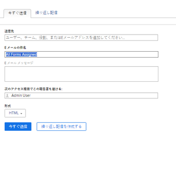

# レポート配信の概要

<!--

(NOTE: This is linked to the UI in the Send Report box inside the Preview sandbox. If you change title, log bug for Dev to fix the link) 

-->

レポートが定義したスケジュールに従ってユーザーに自動的に配信されるようにスケジュールしたり、レポートを 1 回限りに手動で送信したりできます。 Adobe Workfront からレポートを送信すると、ユーザーは Workfront レポートが添付されたメールが送信されます。

レポートの配信設定の詳細については、[自動レポート配信のスケジュールを設定](../../../reports-and-dashboards/reports/creating-and-managing-reports/set-up-automatic-report-delivery.md)の記事を参照してください。

プレビューサンドボックス環境では、レポートの配信をスケジュールしたり、手動で配信したりすることはできません。プレビューサンドボックスについて詳しくは、記事[Adobe Workfront プレビューサンドボックス環境](../../../administration-and-setup/set-up-workfront/workfront-testing-environments/wf-preview-sandbox-environment.md)を参照してください。\
プレビューサンドボックス環境でのレポートの配信について詳しくは、記事[プレビューサンドボックス環境でレポートを送信](../../../reports-and-dashboards/reports/creating-and-managing-reports/send-report-preview-sandbox-environment.md)を参照してください。

## レポートの配信制限

<!--

(NOTE: [! This information is shared between "Exporting Data" and "Setting Up Report Deliveries."])

-->

レポートの配信をスケジュールする場合は、次の点を考慮してください。

* 任意のレポートに対して、最大 10 回の繰り返しレポート配信をスケジュールできます。
* レポートの作成者である場合のみ、レポートの配信をスケジュールできます。作成していないレポートを送信する必要がある場合は、手動で送信できます。

## 書き出し制限

Workfront でのレポートの表示方法、および手動書き出し、配信されたレポート、または API を介したレポートの書き出し方法に影響するサイズ制限がいくつかあります。

* **5MB のファイルサイズ：**&#x200B;配信が予定されているすべての書き出しレポートのファイルサイズ制限。メールに添付された書き出し済みファイルが 5 MB を超える場合、添付の書き出し済みレポートの代わりに、ファイルをダウンロードできるリンクがメールで送信されます。

  >[!NOTE]
  >
  >5MB を超える Excel .xlsx ファイルはメールを生成しません。レポートは、手動でこの形式にエクスポートできます。 レポートのエクスポートについて詳しくは、 [データを書き出し](../../../reports-and-dashboards/reports/creating-and-managing-reports/export-data.md).

* **50,000 行：**.pdf およびタブ区切りファイルのレポートの書き出しで許可されるデータの行数。

  Excel .xls ファイルの場合、この制限は **65,000 行**&#x200B;です。

  Excel .xlsx ファイルの場合、この制限は **100,000 行**&#x200B;です。

  これらの制限には、レポート内のグループ化の行だけでなく、列見出しも除外されます。例えば、1 つのレポートに 6 つのグループが含まれ、50,000 行のデータが含まれる場合、エクスポートされるファイルの行数は 50,000 行になります。

  レポートにこれらの制限を超える項目が含まれる場合、レポートの書き出しと配信が成功しないかったというエラーが表示されます。結果を配信できるように、画面に表示される項目の数を、この制限値以下の数に減らします。 すべてのデータをエクスポートする場合は、フィルターを使用して少ない負荷のデータを取得し、複数のエクスポートを実行することをお勧めします。 詳しくは、 [フィルターの概要](../../../reports-and-dashboards/reports/reporting-elements/filters-overview.md).

  以下の制限が適用されます。

   * レポートの手動書き出し。
   * スケジュール済みレポート。
   * API 統合を経由した書き出し。
   * キックスタートを経由して書き出されたデータ。

     キックスタートを経由したデータの書き出しに関して詳しくは、記事[キックスタートを経由した Adobe Workfront からのデータの書き出し](../../../administration-and-setup/manage-workfront/using-kick-starts/export-data-from-wf-via-kick-starts.md)を参照してください。

     >[!NOTE]
     >
     >50,000 行をキックスタートファイルに書き出すことができますが、データは Excel 形式のファイルにのみ書き出すことができます。

   * プロジェクトの稼働率情報を書き出します。

     プロジェクトの稼働率情報を書き出す方法に関して詳しくは、[リソース稼働率レポートの概要](../../../reports-and-dashboards/reports/using-built-in-reports/resource-utilization-report.md)を参照してください。

* **65,530 個のハイパーリンク：**&#x200B;これは、65,530 個を超えるハイパーリンクを含むドキュメントに対して Excel が課す制限です。これらのドキュメントは、手動で書き出した場合や、配信されたレポートに添付された場合には開けません。Excel ドキュメントのデータは 200 行に過ぎなくても、ドキュメント内に 65,530 個を超えるリンクがある場合、ドキュメントは開きません。この制限は、Excel ファイルにのみ存在し、他のサポートされている形式には該当しません。
* **256 列**：Excel が 256 列を超えるドキュメントに対して課される制限です。これらのドキュメントは、手動で書き出したり、配信されたレポートに添付して送信したりすることはできません。この制限は、Excel ファイルにのみ存在し、他のサポートされている形式には該当しません。

制限を超えてデータを書き出そうとすると、書き出しで予想されたデータの一部を受信できない場合があります。代わりに、制限内に変更されたレポートが作成されます。

加えて、実行に 60 分以上かかるレポートは停止します。

制限に関するご不明な点や問題がある場合は、Workfront 技術サポートにお問い合わせください。

## 配信されたレポートのタイムスタンプについて

<!--

(NOTE: Note about if this is delivered at a time based on the user's time zone settings?)

-->

レポートをメールで受信する場合、配信と同時に Workfront でレポートを表示すると、レポートのタイムスタンプと時刻形式が Workfront のものと一致しない可能性があります。

次の点に注意してください。

* ブラウザーでレポートを表示する場合、レポートのタイムスタンプと形式は、ブラウザーの設定で定義された、ブラウザーのロケールとタイムゾーンに一致します。
* レポートがメールで配信される場合、レポートは、Workfront プロファイルで指定されているユーザーロケールとタイムゾーンに一致するタイムスタンプと形式で配信されます。\
  Workfront のユーザーロケールとタイムゾーンについて詳しくは、[ユーザーのプロファイルの編集](../../../administration-and-setup/add-users/create-and-manage-users/edit-a-users-profile.md)の記事を参照してください。

## 特別なビューを備えたレポート {#reports-with-a-special-view}

レポートに特別なビューを適用すると、Workfrontのレポートの「詳細」タブに特別なビューが表示されます。

特別なビューを持つレポートの配信スケジュールを設定すると、特別なビューではなく、送信済み E メールの添付ファイルに「詳細」タブが配信されます。

以下は特別なビューと見なされます。

* プロジェクトレポートのマイルストーンビュー
* プロジェクトまたはタスクレポートのガントビュー
* 「グラフ」をデフォルトタブとするレポート

>[!NOTE]
>
>特別なビューを備えたデフォルトタブに加えて、レポートに「マトリックス」タブも存在する場合、レポートは「マトリックス」タブでの表示どおりに配信されます。

特別なビューをレポートに適用する方法について詳しくは、[カスタムレポートの作成](../../../reports-and-dashboards/reports/creating-and-managing-reports/create-custom-report.md)の記事を参照してください。

## 配信されたファイルの使用

Workfrontからレポートを送信すると、そのレポートが別の添付ファイルで送信された電子メールがユーザーに送信されます。

* [件名行、添付ファイル名およびレポートタイトル](#subject-line-attachment-name-and-report-title)
* [タイムスタンプ](#timestamps)
* [ブランディング](#branding)
* [書式](#formatting)
* [リンク](#links)

### 件名行、添付ファイル名およびレポートタイトル {#subject-line-attachment-name-and-report-title}

配信されたレポートメールの件名行について詳しくは、[レポートの自動配信のスケジュール](../../../reports-and-dashboards/reports/creating-and-managing-reports/set-up-automatic-report-delivery.md)を参照してください。

添付されたレポートの名前は次のとおりです。 *The_Name_Of_The_Report*&#x200B;書き出されたファイル形式が続きます。

配信するレポートを PDF または HTML ファイル形式でスケジュールした場合、レポートのタイトルは次のようになります。

*レポート名*

Excel、Excel（.xlsx）または TSV 形式で配信される予定のレポートには、タイトルがありません。

>[!NOTE]
>
>レポートに説明が含まれている場合、ファイルが PDF または HTML ファイル形式の場合は、書き出されたファイルに含まれます。

### タイムスタンプ {#timestamps}

添付ファイルにタイムスタンプが表示されるのは、ファイルが PDF 形式の場合のみです。タイムスタンプは、添付ファイルのフッターに含まれます。

タイムスタンプには以下が含まれます。

* 日付
* 時間
* レポートが送信されたタイムゾーン

### ブランディング {#branding}

Workfront 管理者がカスタマイズしたブランディングを Workfront インスタンスに追加した場合、PDF 形式で送信されるレポートには、パーソナライズしたロゴも含まれます。

その他の形式で送信されるレポートは、ロゴでパーソナライズすることはできません。

Workfront インスタンスのブランディングについて詳しくは、[Adobe Workfront インスタンスのブランディング](../../../administration-and-setup/customize-workfront/brand-workfront/brand-your-workfront-instance.md)の記事を参照してください。

### 書式 {#formatting}

レポートに特別な表示がない限り、レポートの送信や配信スケジュールをおこなう際には、レポートの「詳細」タブを常に受け取ります。

Web アプリケーションでレポートに特別な書式が設定されている場合、「詳細」タブと「マトリックス」タブが .pdf および Excel ファイル用にのみ配信される場合は、レポートに特別な書式を設定して配信する必要があります。

配信されるファイルには、レポートのフィルター、ビューまたはグループ化は含まれません。レポートの説明は、レポートを PDF ファイルとして送信する場合にのみ含まれます。

特別なビューでのレポートの受信について詳しくは、[特別なビューを持つレポート](#reports-with-a-special-view)の記事を参照してください。\
レポートのデフォルトのタブの選択と特殊な形式について詳しくは、[カスタムレポートの作成](../../../reports-and-dashboards/reports/creating-and-managing-reports/create-custom-report.md)を参照してください。

### リンク {#links}

WorkfrontからPDFまたは Excel 形式にレポートを送信する場合、元のドキュメントに存在する作業リンクは、送信されたファイル内に残ります。 リンクは、Workfront 内のリンクをサポートする任意のオブジェクトを指すことができます。

また、メールメッセージ内のレポートの名前はリンクです。

## スケジュールされたレポートに関するレポート

次の項目を作成することで、レポートの配信が設定されているかどうかを確認できます。

* リスト内のレポートオブジェクトの&#x200B;**ビュー**&#x200B;またはレポート用のレポートの場合、レポートのリストまたはレポート用のレポート内のビューを作成し、ビューに次の列を追加します。\
  *スケジュール済みレポート名。\
  *そのレポートに対してスケジュールされたすべての配信の名前は、箇条書きリストの列に表示されます。\
  

* **フィルター** レポートオブジェクトの場合：レポートのリストまたは次のステートメントを使用して、レポートに関するレポートでフィルターを作成します。 *予定レポート ID が空ではありません*.\
  これにより、リストまたはレポートでスケジュールされたレポートのみが表示されます。\
  \
  レポートの作成について詳しくは、[カスタムレポートの作成](../../../reports-and-dashboards/reports/creating-and-managing-reports/create-custom-report.md)を参照してください。レポートの作成について詳しくは、[レポートアクティビティに関するレポートの作成](../../../reports-and-dashboards/reports/report-usage/create-report-reporting-activities.md)を参照してください。

<!--
<h2 data-mc-conditions="QuicksilverOrClassic.Draft mode">Scheduling a Repeating Report Delivery</h2>
-->

<!--

You can schedule up to 10 repeating report deliveries for any given report.

-->

<!--

You can schedule a report to be delivered only if you are the creator of the report. If you need to send a report that you did not create, you can send it on a manual basis.

-->

<!--

To schedule a report for automatic delivery or to edit an existing report delivery: ​

-->

<!--
   <li value="1" data-mc-conditions="QuicksilverOrClassic.Draft mode">Navigate to and click the name of the report for which you want to schedule delivery. </li>
   -->

<!--
   <li value="2" data-mc-conditions="QuicksilverOrClassic.Draft mode">Click <strong>Report Actions</strong>, then <strong>Send Report</strong>.  The <strong>Send Report</strong> dialog box is displayed.</li>
   -->

<!--
   <li value="3" data-mc-conditions="QuicksilverOrClassic.Draft mode">Select the <strong>Repeating Deliveries</strong> tab. </li>
   -->

<!--
   <li value="4" data-mc-conditions="QuicksilverOrClassic.Draft mode">(Conditional) To modify an existing repeating report delivery, select the report delivery in the <strong>Repeating Deliveries</strong> section.</li>
   -->

<!--
   <li value="5" data-mc-conditions="QuicksilverOrClassic.Draft mode">Specify the following information:
   <ul>
   <li data-mc-conditions="QuicksilverOrClassic.Draft mode"><strong>Send to:</strong> Begin typing the name of the user, group, team, or role who you want to send the report to, then click the name when it appears in the drop-down list. Or Specify the email address of a person external to the Workfront system who you want to have access to the report.  Repeat this process to send the report to multiple users, groups, teams, or roles.</li>
   <li data-mc-conditions="QuicksilverOrClassic.Draft mode"><strong>Email Subject:</strong> Specify a subject for the email notification.  By default, the email subject is: <em>Workfront Report: <Name of the report> Date of the Export</em>.<strong></strong></li>
   <li data-mc-conditions="QuicksilverOrClassic.Draft mode"><strong>Email Message:</strong> Specify a message to include in the email. By default, the email message is: <em>Attached is the <report frequency> report <Name of the report> generated by Workfront on <Date>.</em> 
   <note type="note">
   For reports delivered as an Excel file only, the following message is also added to the email: "Please be aware that with MS Excel (XLS) file types, there is a limit (65,530) on the number of hyperlinks these file types support. If you exceed those limits, your file will not open and it is recommended to resend without the hyperlinks. Please go back to the report scheduler to remove hyperlinks and resend the report." The "please go back to the report scheduler" phrase is a link back to the report. 
   </note>
   </li>
   <li data-mc-conditions="QuicksilverOrClassic.Draft mode"><strong>Deliver this report with the Access Rights of:</strong> Begin typing the name of a user who has access to the report, then click the name when it appears in the drop-down list. Users who receive the report will be granted the same level of access to the report as the user that you specify here.  For more information, see <a href="../../../reports-and-dashboards/reports/creating-and-managing-reports/run-deliver-report-access-rights-another-user.md" class="MCXref xref">Run and deliver a report with the access rights of another user</a>
   <note type="note">
   This field does not support wildcards. For example, using the wildcard $$User.ID does not run the report with the access rights of the user who is receiving the report.
   </note>
   </li>
   <li data-mc-conditions="QuicksilverOrClassic.Draft mode"><strong>Format:</strong> Select in which of the following formats you want the report to be delivered:
   <ul>
   <li data-mc-conditions="QuicksilverOrClassic.Draft mode"> HTML</li>
   <li data-mc-conditions="QuicksilverOrClassic.Draft mode">PDF</li>
   <li data-mc-conditions="QuicksilverOrClassic.Draft mode">MS Excel</li>
   <li data-mc-conditions="QuicksilverOrClassic.Draft mode">MS Excel (.xlsx)</li>
   <li data-mc-conditions="QuicksilverOrClassic.Draft mode">TSV  </li>
   </ul></li>
   <li data-mc-conditions="QuicksilverOrClassic.Draft mode"><strong>Include Links:</strong> This option is available only when <strong>MS Excel</strong> is selected in the <strong>Format</strong> drop-down menu. When this option is enabled, any hyperlinks are included in the exported Excel document.  Documents that contain more than 65,530 links cannot be opened. If the exported document will contain more than 65,530 links, deselect this option. This option is enabled by default. </li>
   <li data-mc-conditions="QuicksilverOrClassic.Draft mode"><strong>Summary:</strong> Displays a summary of when the delivery repeats.</li>
   <li data-mc-conditions="QuicksilverOrClassic.Draft mode"><strong>Repeats:</strong> Select whether the report should be delivered daily, weekly, monthly, or yearly.</li>
   <li data-mc-conditions="QuicksilverOrClassic.Draft mode"><strong>Repeats Every:</strong> Select the frequency with which you want the delivery to repeat. The value you select for this option is based on the option that is selected in the <strong>Repeats</strong> drop-down list.</li>
   <li data-mc-conditions="QuicksilverOrClassic.Draft mode"><strong>Time:</strong> Select the time of day for the delivery to be sent.</li>
   
<strong>Repeats On:</strong> This option is available when the <strong>Repeats</strong> option is set to either <strong>Weekly</strong> or <strong>Monthly</strong>.

   <li data-mc-conditions="QuicksilverOrClassic.Draft mode">When the <strong>Repeats</strong> option is set to <strong>Weekly</strong>: Select the days of the week that the delivery is sent.</li>
   <li data-mc-conditions="QuicksilverOrClassic.Draft mode">When the <strong>Repeats</strong> option is set to <strong>Monthly</strong>: Select whether the delivery is sent on the day of the month, day of the week, or last day of the month (these options leverage the date that you select in the <strong>Starts On</strong> field).</li>
   <li data-mc-conditions="QuicksilverOrClassic.Draft mode"><strong>Starts On:</strong> Select the date for the scheduled delivery to begin.</li>
   <li data-mc-conditions="QuicksilverOrClassic.Draft mode"><strong>Ends On:</strong> Select a date for the scheduled delivery to end.  Or</li>
   <li data-mc-conditions="QuicksilverOrClassic.Draft mode">Select <strong>Never</strong> if you want the scheduled delivery to last indefinitely.</li>
   -->

<!--
   <li value="6" data-mc-conditions="QuicksilverOrClassic.Draft mode">Click <strong>Save</strong> to save the report delivery.  The report is saved in the <strong>Repeating Deliveries</strong> section (in the <strong>Send Report</strong> dialog box).  The report will be sent at the schedule time Or To manually send the report, click <strong>Send Now</strong>. For more information about sending the report instantly or manually, see .</li>
   -->

<!--
<h2 data-mc-conditions="QuicksilverOrClassic.Draft mode">Deleting a Scheduled Report Delivery</h2>
-->

<!--
   <li value="1" data-mc-conditions="QuicksilverOrClassic.Draft mode">Go to the report with the delivery you want to delete.</li>
   -->

<!--
   <li value="2" data-mc-conditions="QuicksilverOrClassic.Draft mode">Click <strong>Report Actions</strong>, then <strong>Send Report</strong>. </li>
   -->

<!--
   <li value="3" data-mc-conditions="QuicksilverOrClassic.Draft mode">Click <strong>Repeating Deliveries</strong>. </li>
   -->

<!--
   <li value="4" data-mc-conditions="QuicksilverOrClassic.Draft mode">Click the name of the scheduled delivery you want to delete, then click <strong>Delete</strong>. The report is no longer set up for the scheduled delivery. </li>
   -->

<!--
<h2 data-mc-conditions="QuicksilverOrClassic.Draft mode">Sending a Report Manually, on a One-Time Basis</h2>
-->

<!--

You can manually send a report that has been previously scheduled, or you can create a single-use report delivery.​

-->

<!--
  <li data-mc-conditions="QuicksilverOrClassic.Draft mode"><a title="Setting Up Report Deliveries" href="#sending-a-scheduled-report-now" class="MCXref xref">Sending a Scheduled Report Now</a> </li>
  -->

<!--
  <li data-mc-conditions="QuicksilverOrClassic.Draft mode"><a title="Setting Up Report Deliveries" href="#sending-a-report-one-time-only" class="MCXref xref">Sending a Report (One Time Only)</a> </li>
  -->

<!--
<h3 data-mc-conditions="QuicksilverOrClassic.Draft mode" id="sending-a-scheduled-report-now">Sending a Scheduled Report Now</h3>
-->

<!--

After a scheduled report has been set up, you can manually send the report rather than waiting until the scheduled time.

-->

<!--
   <li value="1" data-mc-conditions="QuicksilverOrClassic.Draft mode">Navigate to and click the name of the report that you want to send now.</li>
   -->

<!--
   <li value="2" data-mc-conditions="QuicksilverOrClassic.Draft mode">Click <strong>Report Actions</strong>, then <strong>Send Report</strong>.  The Send Report dialog box is displayed.</li>
   -->

<!--
   <li value="3" data-mc-conditions="QuicksilverOrClassic.Draft mode">Click the <strong>Repeating Deliveries</strong> tab.</li>
   -->

<!--
   <li value="4" data-mc-conditions="QuicksilverOrClassic.Draft mode">In the <strong>Repeating Deliveries</strong> section, select the report delivery that was previously created. </li>
   -->

<!--
   <li value="5" data-mc-conditions="QuicksilverOrClassic.Draft mode">Click <strong>Send Now</strong>.  The report is sent to all users identified in the scheduled delivery.</li>
   -->

<!--
<h3 data-mc-conditions="QuicksilverOrClassic.Draft mode" id="sending-a-report-one-time-only">Sending a Report (One Time Only)</h3>
-->

<!--

You can manually send a report at any time. When you send a report in this way, delivery information (such as the users you are sending to and the email subject) are not saved. If you want to create a report delivery that you can save for later use, create a repeating scheduled report. 

-->

<!--

To send a report to users (one time only):

-->

<!--
   <li value="1" data-mc-conditions="QuicksilverOrClassic.Draft mode">Navigate to and click the name of the report that you want to send now.</li>
   -->

<!--
   <li value="2" data-mc-conditions="QuicksilverOrClassic.Draft mode">Click <strong>Report Actions</strong>, then <strong>Send Report</strong>.  The <strong>Send Report</strong> dialog box is displayed. </li>
   -->

<!--
   <li value="3" data-mc-conditions="QuicksilverOrClassic.Draft mode">On the <strong>Send Now</strong> tab, specify the following information:
   <ul>
   <li data-mc-conditions="QuicksilverOrClassic.Draft mode"><strong>Send to:</strong> Begin typing the name of the user, group, team, or role who you want to send the report to, then click the name when it appears in the drop-down list. Or, specify the email address of a person external to the Workfront system who you want to have access to the report.  Repeat this process to send the report to multiple users, groups, teams, or roles.</li>
   <li data-mc-conditions="QuicksilverOrClassic.Draft mode"><strong>Email Subject:</strong> Specify a subject for the email notification.  By default, the email subject is: <em>Workfront Report: <Name of the report> Date of the Export</em>.</li>
   <li data-mc-conditions="QuicksilverOrClassic.Draft mode"><strong>Email Message:</strong> Specify a message to include in the email. By default, the email message is: <em>Attached is the <report frequency> report <Name of the report> generated by Workfront on <Date>.</em> 
   <note type="note">
   For reports delivered as an Excel file only, the following message is also added to the email: "Please be aware that with MS Excel (XLS) file types, there is a limit (65,530) on the number of hyperlinks these file types support. If you exceed those limits, your file will not open and it is recommended to resend without the hyperlinks. Please go back to the report scheduler to remove hyperlinks and resend the report." The "please go back to the report scheduler" phrase is a link back to the report. 
   </note>
   </li>
   <li data-mc-conditions="QuicksilverOrClassic.Draft mode"><strong>Deliver this report with the Access Rights of:</strong> Begin typing the name of a user who has access to the report, then click the name when it appears in the drop-down list. Users who receive the report will be granted the same level of access to the report as the user that you specify here.  For more information, see <a href="../../../reports-and-dashboards/reports/creating-and-managing-reports/run-deliver-report-access-rights-another-user.md" class="MCXref xref">Run and deliver a report with the access rights of another user</a>.
   <note type="note">
   This field does not support wildcards. For example, using the wildcard $$User.ID does not run the report with the access rights of the user who is receiving the report.
   </note>
   </li>
   <li data-mc-conditions="QuicksilverOrClassic.Draft mode"><strong>Format:</strong> Select in which of the following formats you want the report to be delivered:
   <ul>
   <li data-mc-conditions="QuicksilverOrClassic.Draft mode"> HTML</li>
   <li data-mc-conditions="QuicksilverOrClassic.Draft mode">PDF</li>
   <li data-mc-conditions="QuicksilverOrClassic.Draft mode">MS Excel</li>
   <li data-mc-conditions="QuicksilverOrClassic.Draft mode">MS Excel (.xlsx)</li>
   <li data-mc-conditions="QuicksilverOrClassic.Draft mode">TSV</li>
   </ul></li>
   <li data-mc-conditions="QuicksilverOrClassic.Draft mode"><strong>Include Links:</strong> This option is available only when <strong>MS Excel</strong> is selected in the <strong>Format</strong> drop-down menu. When this option is enabled, any hyperlinks are included in the exported Excel document.  Documents that contain more than 65,000 links cannot be opened. If the exported document will contain more than 65,000 links, deselect this option. This option is enabled by default.</li>
   </ul></li>
   -->

<!--
   <li value="4" data-mc-conditions="QuicksilverOrClassic.Draft mode">Click <strong>Send Now</strong>.  The report is sent to all users that you identified.  Or  Click <strong>Make Repeating Delivery</strong> if you want to set up a scheduled delivery with this same information, then complete the additional information regarding the frequency of when the report is sent.</li>
   -->
