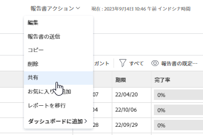

# Adobe Workfrontでのレポートの共有

Adobe Workfront管理者がアクセスレベルを割り当てる際に、ユーザーにレポートの表示や編集のアクセス権を付与します。 問題へのアクセス権の付与について詳しくは、 [レポート、ダッシュボード、カレンダーへのアクセス権の付与](../../../administration-and-setup/add-users/configure-and-grant-access/grant-access-reports-dashboards-calendars.md).

ユーザーに付与されるアクセスレベルに加えて、共有する特定のレポートを表示または管理する権限をユーザーに付与することもできます。 アクセスレベルと権限の詳細については、 [アクセスレベルと権限の連携](../../../administration-and-setup/add-users/access-levels-and-object-permissions/how-access-levels-permissions-work-together.md).

権限は、Workfrontの 1 つの項目に固有で、その項目に対して実行できるアクションを定義します。

>[!NOTE]
>
>Workfront管理者は、システム内のすべてのユーザーに対して、それらの項目の所有者にならずに、システム内の項目に対する権限を追加または削除できます。

## アクセス要件

オブジェクトを共有するには、次の条件を満たす必要があります。

<table style="table-layout:auto"> 
 <col> 
 <col> 
 <tbody> 
  <tr> 
   <td role="rowheader">Adobe Workfront plan*</td> 
   <td> 
任意 
 </td> 
  </tr> 
  <tr> 
   <td role="rowheader">Adobe Workfront license*</td> 
   <td> 
レビュー以上
 </td> 
  </tr> 
  <tr> 
   <td role="rowheader">アクセスレベル設定*</td> 
   <td> 
レポート、ダッシュボード、カレンダーへのアクセス権以上の表示
 
注意：まだアクセス権がない場合は、Workfront管理者に、アクセスレベルに追加の制限を設定しているかどうかを問い合わせてください。 Workfront管理者がアクセスレベルを変更する方法について詳しくは、 <a href="../../../administration-and-setup/add-users/configure-and-grant-access/create-modify-access-levels.md" class="MCXref xref">カスタムアクセスレベルの作成または変更</a>.
 </td> 
  </tr> 
  <tr> 
   <td role="rowheader">オブジェクト権限</td> 
   <td> 
レポートの表示権限以上
 
追加のアクセス権のリクエストについて詳しくは、 <a href="../../../workfront-basics/grant-and-request-access-to-objects/request-access.md" class="MCXref xref">オブジェクトへのアクセスのリクエスト </a>.
 </td> 
  </tr> 
 </tbody> 
</table>

&#42;保有しているプラン、ライセンスの種類、アクセス権を確認するには、Workfront管理者に問い合わせてください。

## レポートの共有に関する考慮事項

以下の考慮事項に加えて、 [レポート、ダッシュボード、カレンダーの共有](../../../workfront-basics/grant-and-request-access-to-objects/permissions-reports-dashboards-calendars.md).

* 作成したレポートを他の個人、チーム、グループ、職務上の役割、会社と共有できます。 また、自分と共有していた他のユーザーと作成したレポートを共有することもできます。
* また、組織全体と共有したり、公開したりすることもできます。 レポートを公開すると、他のユーザーと共有できる URL が生成されます。
* 個々のレポートを共有することも、レポートのリストから複数のレポートを共有することもできます。

## レポートを共有する方法

次の方法で、Workfrontでレポートを共有できます。

* 手動 ( [レポートの共有](#share-a-report) 」の節を参照してください。
* 自動的に（共有されているレポートを含むダッシュボードから表示権限を継承することで）。 オブジェクトに対する継承された権限の表示については、 [オブジェクトの継承された権限の表示](../../../workfront-basics/grant-and-request-access-to-objects/view-inherited-permissions-on-objects.md).

## レポートの共有 {#share-a-report}

1 つのレポートまたはリストから複数のレポートを共有する場合、同じ結果になります。

1. レポートのリストに移動し、1 つまたは複数のレポートを選択して、 **共有**.

   または

   1 つのレポートの名前をクリックし、「**レポートのアクション/**」をクリックします&#x200B;**共有**.

   

1. 表示されるボックスで、 **担当者、チーム、役割、グループ、会社の追加…** フィールドに、レポートを共有するユーザー、チーム、ジョブの役割、グループまたは会社の名前を入力し、 **入力** 名前が表示されたら、

1. 追加した名前のアクセスレベルを調整するには、名前の右にあるドロップダウンメニューをクリックし、以下のいずれかのオプションを選択します。

   <table style="table-layout:auto"> 
    <col> 
    <col> 
    <tbody> 
     <tr> 
      <td role="rowheader">それを表示</td> 
      <td> 
受信者がレポートを <strong>レポート</strong>  をクリックし、実行します。
 
次をクリックできます。 <strong>詳細設定</strong> を使用して、ユーザーとユーザーのどちらが <strong>共有</strong> システムの中の誰とでも
 </td> 
     </tr> 
     <tr> 
      <td role="rowheader">それを管理</td> 
      <td> 
受信者にレポートへの完全な編集アクセスを許可します。
 
次をクリックできます。 <strong>詳細設定</strong> を使用して、ユーザーとユーザーのどちらが <strong>削除</strong> システムからの報告と <strong>共有</strong> システムの中の誰とでも
 </td> 
     </tr> 
    </tbody> 
   </table>

1. （オプション）上記の 2 つの手順を繰り返して、リストに他の名前を追加し、そのオプションを設定します。
1. （オプション） **ギア** アイコン  共有ボックスの右上隅で、次のいずれかのオプションを選択します。

   * **この機能を外部ユーザーに公開する：** 他のユーザーと共有できる URL を生成する場合は、このオプションを選択します。 URL を持っているユーザーは誰でも、Adobe Workfrontのライセンスを持っていなくてもレポートにアクセスできます。

      >[!CAUTION]
      >
      >機密情報を含むオブジェクトを外部のユーザーと共有する場合は、慎重におこなうことをお勧めします。 これにより、Workfrontのユーザーや組織の一員でなくても、ユーザーは情報を表示できます。

      >[!NOTE]
      >
      >プロンプトが表示され、公開されている場合は、そのプロンプトを使用してレポートを実行できるように、レポートを実行するユーザーがWorkfrontにログインする必要があります。 Workfrontにログインできない場合は、プロンプトが表示されずにレポートが表示されます。 プロンプトを使用したレポートの共有に関する制限の詳細については、「 [プロンプトレポートの共有に関する制限](../../../reports-and-dashboards/reports/creating-and-managing-reports/add-prompt-report.md#limitations-of-running-public-prompted-reports) 記事内 [レポートにプロンプトを追加する](../../../reports-and-dashboards/reports/creating-and-managing-reports/add-prompt-report.md).

   * **次のようにして、システム全体で表示できるようにします。** レポートにアクセスできるWorkfrontの全員がレポートを表示できるように、このオプションを選択します。

1. 「**保存**」をクリックします。
