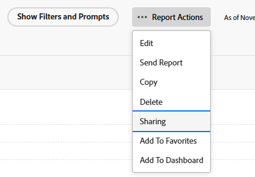

# Adobe Workfront でのレポートの共有

<!-- Audited: 11/2024 -->

Adobe Workfront 管理者は、ユーザーにアクセスレベルを割り当てる際に、レポートの表示や編集を行えるアクセス権を付与します。イシューに対するアクセス権の付与について詳しくは、[レポート、ダッシュボード、カレンダーへのアクセス権の付与](../../../administration-and-setup/add-users/configure-and-grant-access/grant-access-reports-dashboards-calendars.md)を参照してください。

ユーザーに付与するアクセスレベルに加えて、自分が共有を行うアクセス権を持っている特定のレポートを、表示、管理する権限をユーザーに付与することもできます。アクセスレベルと権限について詳しくは、[アクセスレベルと権限の連携方法](../../../administration-and-setup/add-users/access-levels-and-object-permissions/how-access-levels-permissions-work-together.md)を参照してください。

権限は、Workfrontの 1 つの項目に固有で、その項目に対して実行できるアクションを定義します。

>[!NOTE]
>
>Workfront 管理者は、システム内のすべてのユーザーに対して、システム内のアイテムに対する権限の追加や削除を、それらのアイテムの所有者にならなくても行うことができます。

## アクセス要件

+++ 展開すると、この記事の機能のアクセス要件が表示されます。 

<table style="table-layout:auto"> 
 <col> 
 <col> 
 <tbody> 
  <tr> 
   <td role="rowheader">Adobe Workfront パッケージ</td> 
   <td> 
任意
 </td> 
  </tr> 
  <tr> 
   <td role="rowheader">Adobe Workfront プラン</td> 
   <td> 
      
ライト

      
レビュー

   </td>
  </tr> 
  <tr> 
   <td role="rowheader">アクセスレベル設定</td> 
   <td> 
報告書、ダッシュボード、カレンダーへのアクセスを表示する（またはそれ以上）
</td> 
  </tr> 
  <tr> 
   <td role="rowheader">オブジェクト権限</td> 
   <td> 
レポートに対する権限以上を表示
</td> 
  </tr> 
 </tbody> 
</table>

この表の情報について詳しくは、[Workfront ドキュメントのアクセス要件](/help/quicksilver/administration-and-setup/add-users/access-levels-and-object-permissions/access-level-requirements-in-documentation.md)を参照してください。

+++

## レポートの共有に関する考慮事項

以下の考慮事項に加えて、[レポート、ダッシュボード、カレンダーを共有](../../../workfront-basics/grant-and-request-access-to-objects/permissions-reports-dashboards-calendars.md)も参照してください。

* 作成したレポートを、他の個人、チーム、グループ、担当業務や会社と共有できます。他の人が作成し、自分と共有したレポートを共有することもできます。
* また、組織全体と共有したり、公開したりすることもできます。レポートを公開すると、他のユーザーと共有できる URL が生成されます。
* 個々のレポートを共有したり、レポートのリストから複数のレポートを共有したりすることができます。

## レポートを共有する方法

以下の方法で、Workfront でレポートを共有できます。

* 手動（[レポートを共有](#share-a-report)の節を参照）。
* 自動（共有されているレポートを含むダッシュボードから表示権限を継承することにより）。オブジェクトに対する継承された権限の表示について詳しくは、[オブジェクトの継承された権限を表示](../../../workfront-basics/grant-and-request-access-to-objects/view-inherited-permissions-on-objects.md)を参照してください。

## レポートを共有 {#share-a-report}

リストから 1 つのレポートを共有することも、複数のレポートを共有することも同じです。

1. レポートのリストに移動し、1 つまたは複数のレポートを選択して、「**共有**」をクリックします。

   または

   1 つのレポートの名前をクリックし、**「レポートのアクション」、**「**共有**」の順にクリックします。

   

1. 表示されるボックスで、「**担当者、チーム、役割、グループや会社を追加…**」フィールドに、レポートを共有するユーザー、チーム、担当業務、グループや会社の名前を入力し、名前が表示されたら **Enter** を押します。

1. 追加した名前のアクセスレベルを調整するには、名前の右側にあるドロップダウンメニューをクリックし、以下のオプションの 1 つを選択します。

   <table style="table-layout:auto"> 
    <col> 
    <col> 
    <tbody> 
     <tr> 
      <td role="rowheader">それを表示</td> 
      <td> 
受信者アクセスを許可して、<strong> レポート </strong> エリアでレポートを表示および実行できるようにします。
 
「<strong>詳細設定</strong>」をクリックして、ユーザーがシステム内の誰とでも<strong>共有</strong>できるようにするかどうかを指定します。
 </td> 
     </tr> 
     <tr> 
      <td role="rowheader">それを管理</td> 
      <td> 
受信者にレポートへの完全な編集アクセス権を許可します。
 
「<strong>詳細設定</strong>」をクリックして、ユーザーがシステムからレポートを<strong>削除</strong>して、システム内の誰とでも<strong>共有</strong>できるようにするかどうかを指定します。
 </td> 
     </tr> 
    </tbody> 
   </table>

1. （オプション）上記の 2 つの手順を繰り返して、リストに他の名前を追加し、そのオプションを設定します。
1. （任意）共有ボックスの **招待されたユーザーのみがアクセスできる** ドロップダウンメニューをクリックして、次のいずれかのオプションを選択します。

   * **招待されたユーザーのみがアクセスできます** このオプションを選択して、レポートへのアクセス権を付与されたユーザーのみがレポートを表示できるようにします。

   * **システム内の全員が閲覧できます** レポートへのアクセス権を持つWorkfront内の全員がレポートを閲覧できるように、このオプションを選択します。

1. （オプション）共有ボックスの右上隅にある **歯車** アイコン  をクリックし、オプションで次のオプションを選択します。

   * **これを外部ユーザーに公開** 他のユーザーと共有できる URL を生成する場合は、このオプションを選択します。 URL を知っているユーザーは誰でも、Adobe Workfront のライセンスを持っていなくてもレポートにアクセスできます。

     >[!CAUTION]
     >
     >機密情報を含んだオブジェクトを外部ユーザーと共有する場合は、注意することをお勧めします。Workfront のユーザーや組織の一員でなくても、情報を表示できるようになるからです。

     >[!NOTE]
     >
     >報告書にプロンプトがあり、それを公開で共有する場合、公開共有リンクを介して報告書を実行しているユーザーは、プロンプトを使用して報告書を実行できません。 Workfrontにログインして、公開共有リンクを使用せずにレポートにアクセスしない限り、レポートはプロンプトの適用なしで表示されます。 プロンプトを使用したレポートの共有制限の詳細については、「[&#x200B; プロンプトをレポートに追加する &#x200B;](../../../reports-and-dashboards/reports/creating-and-managing-reports/add-prompt-report.md#limitations-of-running-public-prompted-reports) の記事の [&#x200B; プロンプト レポートの共有制限 &#x200B;](../../../reports-and-dashboards/reports/creating-and-managing-reports/add-prompt-report.md) を参照してください。

1. 「**保存**」をクリックします。
