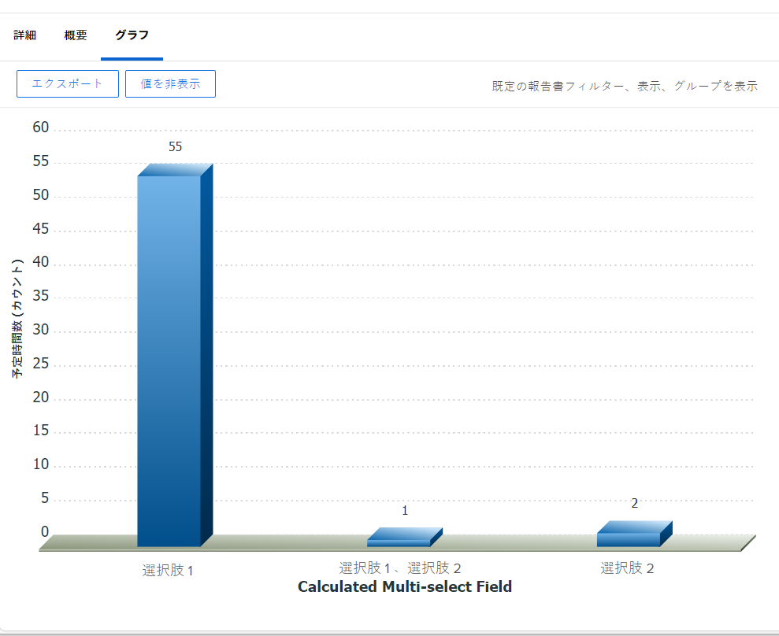

# 複数選択できるカスタムフィールドによってレポートをグラフ化する

<!--The highlighted information on this page refers to functionality not yet generally available. It is available for all customers in the Preview environment and for a select group of customers in the Production environment.-->

複数選択カスタムフィールドを使用してグラフを作成するのではなく、複数選択カスタムフィールドの各オプションに対して個別のフィールドを作成することをお勧めします。

複数選択カスタムフィールドの例を次に示します。

* チェック ボックス
* 複数選択ドロップダウンメニュー

テキストモードの使用について詳しくは、 [テキストモードの概要](../../../reports-and-dashboards/reports/text-mode/understand-text-mode.md).

ただし、複数選択フィールドの各オプションに個別のフィールドを指定できない場合は、計算カスタムフィールドを使用して、複数選択フィールドから選択をグループ化し、複数選択フィールドでレポートをグラフ化できます。 その後、計算フィールド別にレポートのグラフを表示できます。

>[!NOTE]
>
>選択したいずれかの選択肢を持つ項目は、1 回だけカウントされます。
>
>たとえば、選択肢 1 と選択肢 2 をオプションとして持つチェックボックスカスタムフィールドがあり、フォームをタスクに添付すると、選択肢 1 と選択肢 2 の両方を持つタスクは、選択肢 1 と選択肢 2 のみを持つタスクとは別のグラフ要素に表示されます。
>
>選択肢 1 が選択されたタスクは、選択肢 1 と選択肢 2 が選択されたタスクと同じグラフ要素に表示されません。

## アクセス要件

この記事の手順を実行するには、次のアクセス権が必要です。

<table style="table-layout:auto"> 
 <col> 
 <col> 
 <tbody> 
  <tr> 
   <td role="rowheader">Adobe Workfront plan*</td> 
   <td> 
任意
 </td> 
  </tr> 
  <tr> 
   <td role="rowheader">Adobe Workfront license*</td> 
   <td> 
計画 
 </td> 
  </tr> 
  <tr> 
   <td role="rowheader">アクセスレベル設定*</td> 
   <td> 
レポート、ダッシュボード、カレンダーへのアクセスを編集
 
フィルター、ビュー、グループへのアクセスを編集
 
注意：まだアクセス権がない場合は、Workfront管理者に、アクセスレベルに追加の制限が設定されているかどうかを問い合わせてください。 Workfront管理者がアクセスレベルを変更する方法について詳しくは、 <a href="../../../administration-and-setup/add-users/configure-and-grant-access/create-modify-access-levels.md" class="MCXref xref">カスタムアクセスレベルの作成または変更</a>.
 </td> 
  </tr> 
  <tr> 
   <td role="rowheader">オブジェクトの権限</td> 
   <td> 
レポートに対する権限の管理
 
追加のアクセス権のリクエストについて詳しくは、 <a href="../../../workfront-basics/grant-and-request-access-to-objects/request-access.md" class="MCXref xref">オブジェクトへのアクセスのリクエスト </a>.
 </td> 
  </tr> 
 </tbody> 
</table>

&#42;保有するプラン、ライセンスの種類、アクセス権を確認するには、Workfront管理者に問い合わせてください。

## 前提条件

開始する前に、複数選択カスタムフィールドで選択した値を表示する計算カスタムフィールドを作成する必要があります。 詳しくは、 [複数選択のカスタムフィールドを参照する計算済みカスタムフィールドを作成する](#build-a-calculated-custom-field-that-references-a-multi-select-custom-field) 」の節を参照してください。

## 複数選択でカスタムフィールドを使用してレポートをグラフ化する

<!--

(NOTE: this moved to its own article, linked in the Note above!)

-->

複数選択のカスタムフィールドを参照して、レポート内にグラフを作成することはできません。 代わりに、指定したオブジェクトと、その計算フィールドによってグループ化された複数選択カスタムフィールドの値を記録する計算フィールドを作成できます。 

* [複数選択のカスタムフィールドを参照する計算済みカスタムフィールドを作成する](#build-a-calculated-custom-field-that-references-a-multi-select-custom-field)
* [計算されたカスタムフィールドを参照するグラフを作成する](#build-a-chart-that-references-a-calculated-custom-field)

### 複数選択のカスタムフィールドを参照する計算済みカスタムフィールドを作成する {#build-a-calculated-custom-field-that-references-a-multi-select-custom-field}

複数選択のカスタムフィールドを参照する計算フィールドを作成するには、次の前提条件が満たされている必要があります。

* カスタムフォーム内の複数選択カスタムフィールド。\
  カスタムフォームの作成とカスタムフィールドの追加について詳しくは、この記事を参照してください。 [カスタムフォームの作成または編集](../../../administration-and-setup/customize-workfront/create-manage-custom-forms/create-or-edit-a-custom-form.md).

* 複数選択カスタムフィールドがオブジェクトに添付されたカスタムフォーム。
* 各オブジェクトの複数選択カスタムフィールドの値。

複数選択カスタムフィールドを参照する計算済みカスタムフィールドを作成するには：

1. カスタムフォームを作成するか、既存のフォームを編集します。

   カスタムフォームの作成について詳しくは、 [カスタムフォームの作成または編集](../../../administration-and-setup/customize-workfront/create-manage-custom-forms/create-or-edit-a-custom-form.md).

1. カスタムフォームで使用する 1 つ以上のオブジェクトを選択します。
1. クリック **フィールドを追加**&#x200B;を、 **計算済み** 複数選択カスタムフィールドをフォームに追加する場合。

1. Adobe Analytics の **ラベル** ボックスで、新しい計算フィールドに名前を付け、複数選択カスタムフィールドを参照することを示します。

   例：「計算された複数選択フィールド」

1. Adobe Analytics の **計算** ボックスに、次のコードを入力します。

   `{DE:Multi-select Custom Field}`

   これにより、複数選択カスタムフィールドで選択した選択肢が計算カスタムフィールドに追加されます。 例えば、フォームがタスクに添付され、複数選択カスタムフィールドから選択 1 が選択された場合、計算カスタムフィールドには「選択 1」という値が表示されます。 別のタスクで選択 1 と選択 2 を選択した場合は、計算されたカスタムフィールドに「選択 1、選択 2」という値が表示されます。

1. 「複数選択カスタムフィールド」を、Workfrontに表示される複数選択カスタムフィールドの実際の名前に置き換えます。

   

1. （オプション）複数選択カスタムフィールドが既にこのフォームに存在し、このフォームが既にオブジェクトに添付されている場合は、 **以前の計算を（バックグラウンドで）更新する** オプション。

   これにより、複数選択カスタムフィールドの値が、既にオブジェクトに添付されているフォームに追加されるので、新しい計算フィールドに自動的に入力されます。

1. クリック **完了**.
1. 「**保存して閉じる**」をクリックします。

   計算されたカスタムフィールドがカスタムフォームに追加されます。現在フォームがオブジェクトに添付されている場合は、複数選択カスタムフィールドの情報がフィールドに入力されます。

### 計算されたカスタムフィールドを参照するグラフを作成する {#build-a-chart-that-references-a-calculated-custom-field}

1. （オプション）グラフに表示するすべての計算フィールドに値を入力するには、レポートの「詳細」タブで、複数選択カスタムフィールドと計算カスタムフィールドの両方を持つカスタムフォームを含むすべてのオブジェクトを選択し、 **編集**.
1. （オプションおよび条件付き） **カスタム式の再計算** 「 」フィールドで「 」をクリックし、 **変更を保存**.\
   

   >[!NOTE]
   >
   >このオプションは、プロジェクトを一括編集する際には使用できなくなりました。  プロジェクトの式は、 **その他** アイコン  をクリックし、 **式を再計算**.

1. 複数選択カスタムフィールドを参照する計算フィールドのグラフを追加するレポートに移動します。
1. クリック **レポートのアクション**&#x200B;を、 **編集**.

1. を選択します。 <strong>グループ化</strong> 「 」タブで、「 」をクリックします。 <strong>グループを追加</strong>.
1. 次を追加： <strong>計算された複数選択フィールド</strong> をグループ化として作成しました。
1. を選択します。 <strong>グラフ</strong> 」タブをクリックし、レポートにグラフを追加します。

   例えば、 **列** グラフ。
    レポートへのグラフの追加について詳しくは、 <a href="../../../reports-and-dashboards/reports/creating-and-managing-reports/create-custom-report.md#add-a-chart" class="MCXref xref">レポートにグラフを追加する</a> 記事内 <a href="../../../reports-and-dashboards/reports/creating-and-managing-reports/create-custom-report.md" class="MCXref xref">カスタムレポートの作成</a>.
1. Adobe Analytics の **下 (X) 軸** フィールドで、 <strong>計算された複数選択フィールド</strong> をクリックしてグラフに表示します。
1. 「<strong>保存して閉じる</strong>」をクリックします。

   レポートには、計算された複数選択フィールドでグループ化された結果がグラフに表示されます。

   