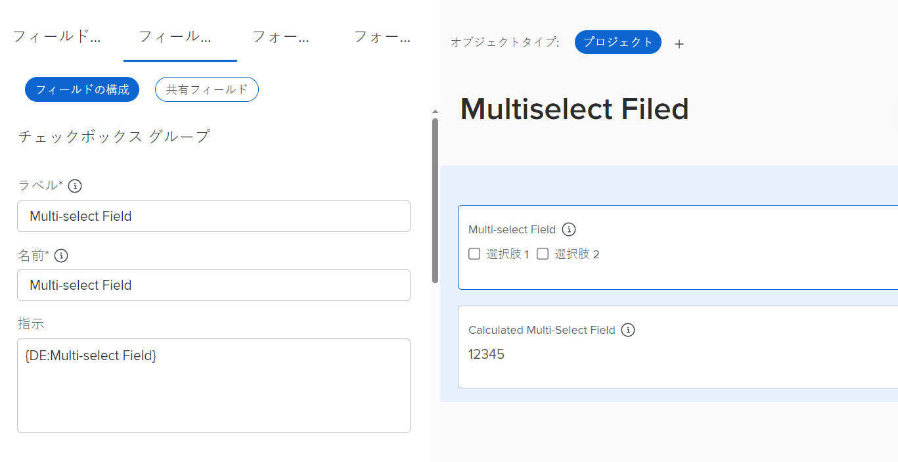
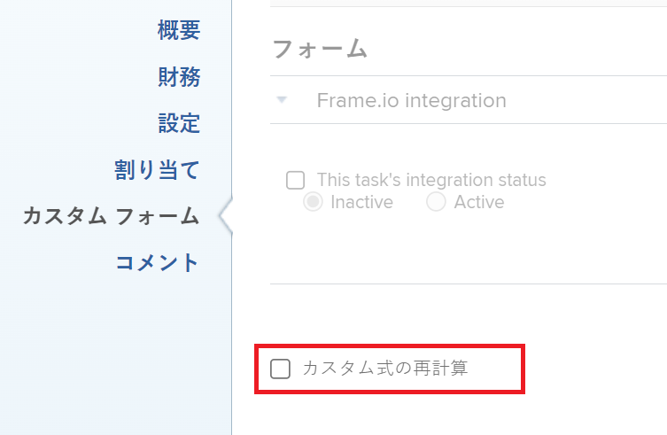

# 複数選択できるカスタムフィールドによってレポートをグラフ化する

<span class="preview">このページで強調表示されている情報は、まだ一般に利用できない機能を示しています。 プレビュー環境のすべての顧客と、実稼動環境の特定の顧客グループに対して使用できます。</span>

複数選択できるカスタムフィールドを使用して、レポートのグラフを表示することはできません。 複数選択カスタムフィールドを参照する追加の計算フィールドを作成して、複数選択カスタムフィールドの値を基準にレポートのグラフを表示する必要があります。

## アクセス要件

この記事の手順を実行するには、次のアクセス権が必要です。

<table style="table-layout:auto"> 
 <col> 
 <col> 
 <tbody> 
  <tr> 
   <td role="rowheader">Adobe Workfront plan*</td> 
   <td> <p>任意</p> </td> 
  </tr> 
  <tr> 
   <td role="rowheader">Adobe Workfront license*</td> 
   <td> <p>計画 </p> </td> 
  </tr> 
  <tr> 
   <td role="rowheader">アクセスレベル設定*</td> 
   <td> <p>レポート、ダッシュボード、カレンダーへのアクセスを編集</p> <p>フィルター、ビュー、グループへのアクセスを編集</p> <p>注意：まだアクセス権がない場合は、Workfront管理者に、アクセスレベルに追加の制限を設定しているかどうかを問い合わせてください。 Workfront管理者がアクセスレベルを変更する方法について詳しくは、 <a href="../../../administration-and-setup/add-users/configure-and-grant-access/create-modify-access-levels.md" class="MCXref xref">カスタムアクセスレベルの作成または変更</a>.</p> </td> 
  </tr> 
  <tr> 
   <td role="rowheader">オブジェクト権限</td> 
   <td> <p>レポートに対する権限の管理</p> <p>追加のアクセス権のリクエストについて詳しくは、 <a href="../../../workfront-basics/grant-and-request-access-to-objects/request-access.md" class="MCXref xref">オブジェクトへのアクセスのリクエスト </a>.</p> </td> 
  </tr> 
 </tbody> 
</table>

&#42;保有しているプラン、ライセンスの種類、アクセス権を確認するには、Workfront管理者に問い合わせてください。

## 前提条件

開始する前に、複数選択カスタムフィールドで選択した値を表示する計算カスタムフィールドを作成する必要があります。 詳しくは、 [複数選択のカスタムフィールドを参照する計算済みカスタムフィールドを作成する](#build-a-calculated-custom-field-that-references-a-multi-select-custom-field) 」の節を参照してください。

## 複数選択でカスタムフィールドを使用してレポートをグラフ化する

<!--
<p data-mc-conditions="QuicksilverOrClassic.Draft mode">(NOTE: this moved to its own article, linked in the Note above!)</p>
-->

複数選択のカスタムフィールドを参照して、レポート内にグラフを作成することはできません。 代わりに、指定したオブジェクトと、その計算フィールドによってグループ化された複数選択カスタムフィールドの値を記録する計算フィールドを作成できます。 

* [複数選択のカスタムフィールドを参照する計算済みカスタムフィールドを作成する](#build-a-calculated-custom-field-that-references-a-multi-select-custom-field)
* [計算されたカスタムフィールドを参照するグラフを作成する](#build-a-chart-that-references-a-calculated-custom-field)

### 複数選択のカスタムフィールドを参照する計算済みカスタムフィールドを作成する {#build-a-calculated-custom-field-that-references-a-multi-select-custom-field}

複数選択のカスタムフィールドを参照する計算フィールドを作成するには、次の前提条件が満たされている必要があります。

* カスタムフォームで複数選択カスタムフィールドを作成します。\
   カスタムフォームの作成とカスタムフィールドの追加について詳しくは、この記事を参照してください。 [カスタムフォームの作成または編集](../../../administration-and-setup/customize-workfront/create-manage-custom-forms/create-or-edit-a-custom-form.md).

* カスタムフォームをオブジェクトに添付します。
* 複数選択カスタムフィールドに、各オブジェクトの値を入力します。

複数選択カスタムフィールドを参照する計算済みカスタムフィールドを作成するには：

1. カスタムフォームを作成するか、既存のフォームを編集します。\
   カスタムフォームの作成について詳しくは、 [カスタムフォームの作成または編集](../../../administration-and-setup/customize-workfront/create-manage-custom-forms/create-or-edit-a-custom-form.md).

1. カスタムフォームで使用する 1 つ以上のオブジェクトを選択します。
1. クリック&#x200B;**フィールドを追加**&#x200B;を、 **計算済み** 複数選択カスタムフィールドをフォームに追加する場合。

1. 内 **ラベル** ボックスで、新しい計算フィールドに名前を付け、複数選択カスタムフィールドを参照することを示します。\
   例：「計算された複数選択フィールド」

1. 内 **計算** ボックスに、次のコードを入力します。

   ```
   {DE:Multi-select Custom Field}
   ```

1. 「複数選択カスタムフィールド」を、Workfrontに表示される複数選択カスタムフィールドの実際の名前に置き換えます。

   

1. （オプション）複数選択カスタムフィールドが既にこのフォームに存在し、このフォームが既にオブジェクトに添付されている場合は、 **以前の計算を更新** オプション。\
   これにより、新しいフィールドには、既にオブジェクトに添付されているフォームに追加される際に、複数選択カスタムフィールドの値が自動的に入力されます。

1. クリック **完了**.
1. 「**保存して閉じる**」をクリックします。

### 計算されたカスタムフィールドを参照するグラフを作成する {#build-a-chart-that-references-a-calculated-custom-field}

1. （オプション）グラフに表示するすべての計算フィールドに値が入力されるようにするには、複数選択カスタムフィールドと計算カスタムフィールドの両方を含むカスタムフォームを含むレポート内のすべてのオブジェクトを選択し、 **編集**.
1. （オプションおよび条件付き） **カスタム式の再計算** 「 」フィールドで、「 **変更を保存**.\
   

   >[!NOTE]
   >
   ><span class="preview">このオプションは、プレビュー環境でプロジェクトを一括編集する際に使用できなくなりました。  プロジェクトの式を一括で再計算する場合は、「 **詳細**  をクリックし、 **式を再計算**. </span>


1. 複数選択カスタムフィールドを参照する計算フィールドのグラフを追加するレポートに移動します。
1. クリック **レポートのアクション**&#x200B;を、 **編集**.

1. を選択します。 <strong>グループ化</strong> 「 」タブで、「 <strong>グループを追加</strong>.
1. を<strong>計算された複数選択フィールド</strong> をグループ化として作成しました。
1. を選択します。 <strong>グラフ</strong> タブをクリックし、レポートにグラフを追加します。<br>レポートへのグラフの追加について詳しくは、 <a href="../../../reports-and-dashboards/reports/creating-and-managing-reports/create-custom-report.md#add-a-chart" class="MCXref xref">レポートへのグラフの追加</a> 記事内 <a href="../../../reports-and-dashboards/reports/creating-and-managing-reports/create-custom-report.md" class="MCXref xref">カスタムレポートの作成</a>.
1. を選択します。 <strong>計算された複数選択フィールド</strong> をグラフに表示するフィールドの 1 つとして追加します。
1. 「<strong>保存して閉じる</strong>」をクリックします。<br>レポートには、計算された複数選択フィールドでグループ化された結果がグラフに表示されます。
