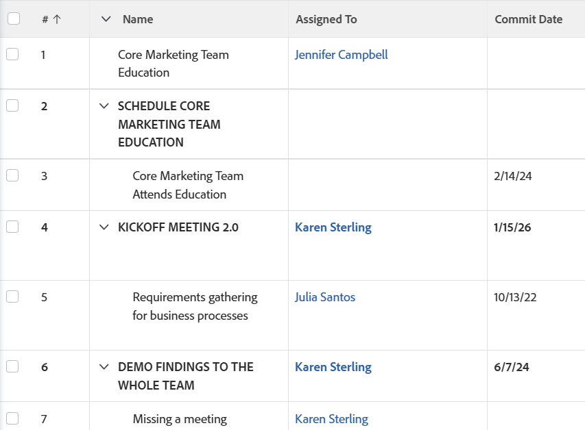

# ビュー：親タスクの名前をすべて大文字で表示

この列をタスクビューに追加すると、親タスクの名前をすべて大文字で表示できます。

## アクセス要件

この記事の手順を実行するには、次のアクセス権が必要です。

<table style="table-layout:auto"> 
 <col> 
 <col> 
 <tbody> 
  <tr> 
   <td role="rowheader">Adobe Workfront プラン*</td> 
   <td> 
任意
 </td> 
  </tr> 
  <tr> 
   <td role="rowheader">Adobe Workfront ライセンス*</td> 
   <td> 
フィルター、ビュー、グループ化の変更をリクエストする 

   
レポートの変更を計画する

    </td> 
  </tr> 
  <tr> 
   <td role="rowheader">アクセスレベル設定*</td> 
   <td> 
レポート、ダッシュボード、カレンダーへのアクセス権を編集して、レポートを変更できるようにします。
 
個々のビューを変更するフィルター、ビュー、グループ化の編集アクセス
 
<b>メモ</b>

まだアクセス権がない場合は、Workfront 管理者に問い合わせて、アクセスレベルに追加の制限が設定されているかどうかを確認してください。Workfront 管理者がアクセスレベルを変更する方法について詳しくは、<a href="../../../administration-and-setup/add-users/configure-and-grant-access/create-modify-access-levels.md" class="MCXref xref">カスタムアクセスレベルの作成または変更</a>を参照してください。
 </td>
</tr> 
  <tr> 
   <td role="rowheader">オブジェクト権限</td> 
   <td> 
レポートに対する権限を管理します。
 
追加のアクセス権のリクエストについて詳しくは、<a href="../../../workfront-basics/grant-and-request-access-to-objects/request-access.md" class="MCXref xref">オブジェクトへのアクセス権のリクエスト</a>を参照してください。
 </td> 
  </tr> 
 </tbody> 
</table>

&#42;保有するプラン、ライセンスタイプ、アクセス権を確認するには、Workfront 管理者に問い合わせてください。

## 親タスクの名前をすべて大文字で表示する

タスクビューでこの列を作成するには、以下のように行います。

1. タスクのリストに移動します。
1. 「**表示**」ドロップダウンメニューから、「**ビューのカスタマイズ**」を選択します。\
   または\
   **ビュー**&#x200B;ドロップダウンメニューから、**新規ビュー**&#x200B;を選択します。

1. **列のプレビュー**&#x200B;エリアで、リストにタスク名が表示される列のヘッダーをクリックします。
1. 「**テキストモードに切り替え**」をクリックします。
1. テキストモード領域にカーソルを置き、「**クリックしてテキストを編集**」をクリックします。
1. 「**テキストモード**」ボックスにあるテキストを削除し、次のコードに置き換えます。 <pre>descriptionkey=name displayname=Task Name textmode=true valueexpression=IF({numberOfChildren}>&quot;0&quot;,UPPER({name}),{name}) valueformat=HTML width=150 </pre>

1. 「**ビューを保存**」をクリックします。
