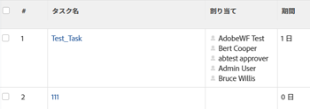
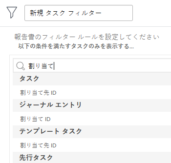

# レポートまたはリスト：オブジェクトに関連付けられたユーザーを表示する

レポートやリストのオブジェクトに関連付けられたユーザー、担当業務、チームを表示し、それらをフィルターで参照することができます。オブジェクトに関連付けられたユーザー、担当業務、またはチームでグループ化することはできません。

次のオブジェクトに関連付けられたユーザー、担当業務、またはチームで表示またはフィルタリングできます。

<table style="table-layout:auto"> 
 <col> 
 <col> 
 <tbody> 
  <tr> 
   <td role="rowheader">オブジェクト</td> 
   <td>関連するユーザーまたは担当業務</td> 
  </tr> 
  <tr> 
   <td role="rowheader">プロジェクト</td> 
   <td> 
プロジェクトレポートでは、すべてのユーザーとそのユーザーがプロジェクトで果たす担当業務を表示できます。プロジェクトレポートでは、ユーザーまたはユーザーに関連付けられた担当業務でフィルタリングすることはできません。 
 </td> 
  </tr> 
  <tr> 
   <td role="rowheader">タスク</td> 
   <td>タスクレポートでは、タスクに割り当てられたすべてのユーザー、担当業務、チームで表示やフィルタリングを行うことができます。</td> 
  </tr> 
  <tr> 
   <td role="rowheader">イシュー</td> 
   <td>イシューレポートでは、イシューに割り当てられたすべてのユーザー、担当業務、チームで表示やフィルタリングを行うことができます。</td> 
  </tr> 
  <tr> 
   <td role="rowheader">ポートフォリオ</td> 
   <td>プロジェクトレポートでは、すべてのユーザーとそのユーザーがプロジェクトで果たす担当業務を表示し、ポートフォリオごとにレポートをグループ化できます。プロジェクトレポートでは、ユーザーまたはユーザーに関連付けられた担当業務でフィルタリングすることはできません。</td> 
  </tr> 
  <tr> 
   <td role="rowheader">プログラム</td> 
   <td>プロジェクトレポートでは、すべてのユーザーとそのユーザーがプロジェクトで果たす担当業務を表示し、プログラムごとにレポートをグループ化できます。プロジェクトレポートでは、ユーザーまたはユーザーに関連付けられた担当業務でフィルタリングすることはできません。</td> 
  </tr> 
 </tbody> 
</table>

## プロジェクトに関連付けられているすべてのユーザーと担当業務を表示する

プロジェクトに関連付けられているすべてのユーザーをプロジェクトリストまたはレポートのビューに表示できます。これには、プロジェクトの「ユーザー」セクションに一覧表示されているすべてのユーザーが含まれます。また、プロジェクトのタスクやイシューに割り当てられた際に関連付けられた役割を、プロジェクトレポートで表示することもできます。

プロジェクト上のすべてのユーザーとその役割を表示するプロジェクトレポートの作成について詳しくは、[表示：担当業務を持つプロジェクトユーザーのリスト](../../../reports-and-dashboards/reports/custom-view-filter-grouping-samples/view-project-user-list.md)を参照してください。

プロジェクトフィルターでは、プロジェクトに関連付けられたユーザーや担当業務をフィルタリングできません。

## タスクに割り当てられているすべてのユーザー、担当業務、またはチームを表示する

「割り当て」フィールドをビューに追加すると、タスクに割り当てられているすべてのユーザー、役割、またはチームをタスクリストまたはレポートのビューに表示できます。

タスクフィルター内の次のフィールドを参照すると、タスクに割り当てられたユーザー、担当業務、またはチームでフィルタリングできます。

* 割り当てられたユーザー
* 割り当てられた役割
* チーム

## イシューに割り当てられているすべてのユーザー、担当業務、またはチームを表示する

「割り当て」フィールドをビューに追加すると、イシューに割り当てられているすべてのユーザー、役割、またはチームをイシューリストまたはレポートのビューに表示できます。

イシューフィルター内の次のフィールドを参照すると、イシューに割り当てられたユーザー、担当業務、またはチームでフィルタリングできます。

* 割り当てられたユーザー
* 割り当てられた役割
* チーム

## ポートフォリオに関連付けられているすべてのユーザーと担当業務を表示する

プロジェクトレポートに表示し、ポートフォリオ別にレポートをグループ化すると、ポートフォリオに関連付けられているすべてのユーザーと役割を表示できます。

プロジェクト上のすべてのユーザーとその役割を表示するプロジェクトレポートの作成について詳しくは、[表示：担当業務を持つプロジェクトユーザーのリスト](../../../reports-and-dashboards/reports/custom-view-filter-grouping-samples/view-project-user-list.md)を参照してください。

ポートフォリオまたはプロジェクトフィルターでは、プロジェクトに関連付けられたユーザーや担当業務をフィルタリングできません。

## プログラムに関連付けられているすべてのユーザーと担当業務を表示する

プロジェクトレポートに表示し、プログラム別にレポートをグループ化すると、プログラムに関連付けられているすべてのユーザーと役割を表示できます。

プロジェクト上のすべてのユーザーとその役割を表示するプロジェクトレポートの作成について詳しくは、[表示：担当業務を持つプロジェクトユーザーのリスト](../../../reports-and-dashboards/reports/custom-view-filter-grouping-samples/view-project-user-list.md)を参照してください。

プログラムまたはプロジェクトフィルターでは、プロジェクトに関連付けられたユーザーや担当業務をフィルタリングできません。
