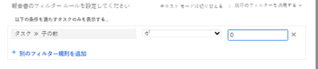
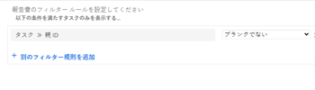
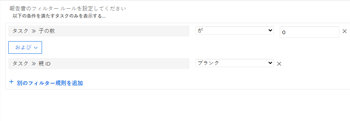

# フィルター：親タスクを表示

以下のタスクフィルターを適用して、作業タスクを表示できます。 作業タスクとは、独立して作業でき、他のタスクの親タスクではないタスクです。 ある例では、フィルターは、親自身になり得る子タスクを識別します。 この場合、タスクは実行されません。

>[!TIP]
>
>* 1 つのレポートに複数のフィルターを追加する場合は、すべてのフィルターを Report Builder インターフェイスを使用して追加し、他のフィルタールールをすべて追加した後で「テキストモードに切り替え」をクリックすることをお勧めします。 次に、上記のように、親タスクフィルターのコードを追加できます。 
* また、レポートを読みやすくするために、「プロジェクト名」のグループを追加することをお勧めします。 レポートへのグループ化の追加について詳しくは、 [Adobe Workfrontでのグループ化の概要](../../../reports-and-dashboards/reports/reporting-elements/groupings-overview.md).
>


## アクセス要件

この記事の手順を実行するには、次のアクセス権が必要です。

<table style="table-layout:auto"> 
 <col> 
 <col> 
 <tbody> 
  <tr> 
   <td role="rowheader">Adobe Workfront plan*</td> 
   <td> <p>任意</p> </td> 
  </tr> 
  <tr> 
   <td role="rowheader">Adobe Workfront license*</td> 
   <td> <p>計画 </p> </td> 
  </tr> 
  <tr> 
   <td role="rowheader">アクセスレベル設定*</td> 
   <td> <p>レポート、ダッシュボード、カレンダーへのアクセスを編集</p> <p>フィルター、ビュー、グループへのアクセスを編集</p> <p>注意：まだアクセス権がない場合は、Workfront管理者に、アクセスレベルに追加の制限を設定しているかどうかを問い合わせてください。 Workfront管理者がアクセスレベルを変更する方法について詳しくは、 <a href="../../../administration-and-setup/add-users/configure-and-grant-access/create-modify-access-levels.md" class="MCXref xref">カスタムアクセスレベルの作成または変更</a>.</p> </td> 
  </tr> 
  <tr> 
   <td role="rowheader">オブジェクト権限</td> 
   <td> <p>レポートに対する権限の管理</p> <p>追加のアクセス権のリクエストについて詳しくは、 <a href="../../../workfront-basics/grant-and-request-access-to-objects/request-access.md" class="MCXref xref">オブジェクトへのアクセスのリクエスト </a>.</p> </td> 
  </tr> 
 </tbody> 
</table>

&#42;保有しているプラン、ライセンスの種類、アクセス権を確認するには、Workfront管理者に問い合わせてください。

## 子のないタスクを表示します（親を持つことができます）

子のないタスクを表示するには、タスクレポートに次のフィルタを適用します。 彼らは自分の両親を持ち、他の仕事の子どもでもよい。

1. 次の **メインメニュー** をクリックし、 **レポート。**

1. クリック **新しいレポート**.
1. を選択します。 **タスクレポート**.
1. クリック **フィルター**.
1. クリック **フィルタールールを追加**.
1. 内 **フィールド名の入力を開始…** 行、入力を開始 **子の数**.

1. 選択 **等しい（大文字と小文字を区別）** モディファイアに対して、次のように入力します。 **0** 子の数に対して。\
   

   または

   クリック **テキストモードに切り替え**&#x200B;をクリックし、テキスト編集ウィンドウで、次のテキストをコピーして貼り付けます。 

   ```
   numberOfChildren=0
   numberOfChildren_Mod=eq
   ```


1. クリック **保存して閉じる**.

   これにより、システムで作業中のタスクのレポートが取り込まれます。 これらのタスクの一部は親を持つことができますが、親タスク自体ではありません。

## 親を含むタスクを表示（子を含む可能性があります）

次のフィルタをタスクレポートに適用して、親と共にタスクを表示できます。親と共にタスクを表示する場合は、子タスクを表示します。 ただし、フィルターによって子が除外されないので、これらのタスクには、独自の子を含めることもできます。 他のタスクの親でもある子タスクは、作業タスクとは見なされません。

1. 次の **メインメニュー** 、「 **レポート」をクリックします。
1. クリック **新しいレポート**.
1. を選択します。 **タスクレポート**.
1. クリック **フィルター**.
1. クリック **フィルタールールを追加**.
1. 内 **フィールド名の入力を開始…** 行、入力を開始 **親 ID**.
1. 選択 **空白でない** を設定します。

   

   または

   クリック **テキストモードに切り替え**&#x200B;をクリックし、テキスト編集ウィンドウで、次のテキストをコピーして貼り付けます。 

   `parentID_Mod=notblank`

1. クリック **保存して閉じる**.

   これにより、親を持ち、その親の子タスクであるシステム内のすべてのタスクのレポートが取り込まれます。 これらのタスクの一部は、親自身である可能性があります。

## 子を持たず、親を持たないタスクを表示（スタンドアロンタスク）

次のフィルタをタスクレポートに適用して、スタンドアロンの作業タスクを表示できます。 これらのタスクには親がなく、自分の子を持ちません。

1. 次の **メインメニュー** をクリックし、 **レポート。**
1. クリック **新しいレポート**.
1. を選択します。 **タスクレポート**.
1. クリック **フィルター**.
1. クリック **フィルタールールを追加** そして **フィールド名の入力を開始…** 行の入力を開始 **子の数** 選択 **等しい（大文字と小文字を区別）** モディファイアに対して、次のように入力します。 **0** 子の数に対して。
1. クリック **別のフィルタールールを追加** そして **フィールド名の入力を開始…** 行の入力を開始 **親 ID**&#x200B;を選択し、「 **空白である**.

   

   または

   手順 6 ～ 7 の代わりに、 **テキストモードに切り替え** テキスト編集ウィンドウで、次のテキストをコピーして貼り付けます。 

   <!--
   <p data-mc-conditions="QuicksilverOrClassic.Draft mode">(NOTE: ensure steps above stay accurate)</p>
   -->

   ```
   numberOfChildren=0
   numberOfChildren_Mod=eq
   parentID_Mod=isblank
   ```

1. クリック **保存して閉じる**.

   これにより、親も子も含まないシステム内のすべてのタスクのレポートが取り込まれます。 これらは、スタンドアロンの作業タスクです。
