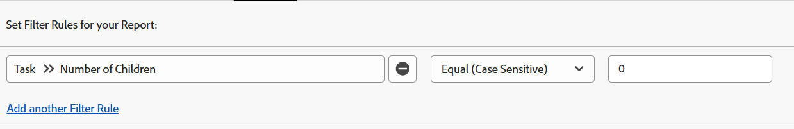

# フィルター：親タスクを表示

<!--Audited: 10/2024-->

以下のタスクフィルターを適用して、作業タスクを表示できます。作業タスクとは、独立して作業でき、他のタスクの親タスクではないタスクです。ある例では、フィルターは、親自身になり得る子タスクを識別します。この場合、それらは作業タスクではありません。

>[!TIP]
>
>* 1 つのレポートに複数のフィルターを追加する場合は、すべてのフィルターを Report Builder インターフェイスを使用して追加し、他のフィルタールールをすべて追加した後で「テキストモードに切り替え」をクリックすることをお勧めします。次に、上記のように、親タスクフィルターのコードを追加できます。 
>* また、レポートを読みやすくするために、プロジェクト名のグループ化を追加することをお勧めします。レポートへのグループ化の追加について詳しくは、[Adobe Workfront でのグループ化の概要](../../../reports-and-dashboards/reports/reporting-elements/groupings-overview.md)の記事を参照してください。
>

## アクセス要件

+++ 展開すると、この記事の機能のアクセス要件が表示されます。

この記事の手順を実行するには、次のアクセス権が必要です。

<table style="table-layout:auto"> 
 <col> 
 <col> 
 <tbody> 
  <tr> 
   <td role="rowheader">Adobe Workfront プラン</td> 
   <td> <p>任意</p> </td> 
  </tr> 
  <tr> 
   <td role="rowheader">Adobe Workfront プラン*</td> 
   <td> 
    <p>新規：</p>
   <ul><li><p>フィルターを変更するコントリビューター </p></li>
   <li><p>レポートを変更する場合は Standard</p></li> </ul>

<p>現在：</p>
   <ul><li><p>フィルターを変更する場合は「要求」 </p></li>
   <li><p>レポートを変更するためのプラン</p></li> </ul></td> 
  </tr> 
  <tr> 
   <td role="rowheader">アクセスレベル設定</td> 
   <td> <p>レポート、ダッシュボード、カレンダーへのアクセス権を編集して、レポートを変更できるようにします。</p> <p>フィルターを変更する場合は、フィルター、ビュー、グループ化への編集アクセス権</p> </td> 
  </tr> 
  <tr> 
   <td role="rowheader">オブジェクト権限</td> 
   <td> <p>レポートに対する権限を管理します。</p>  </td> 
  </tr> 
 </tbody> 
</table>

*詳しくは、[Workfront ドキュメントのアクセス要件 ](/help/quicksilver/administration-and-setup/add-users/access-levels-and-object-permissions/access-level-requirements-in-documentation.md) を参照してください。

+++

## 子のないタスクを表示します（親を含む可能性があります）

タスクレポートに次のフィルターを適用して、子のないタスクを表示できます。 彼らは自分の親を持つことができ、他の仕事の子供になることができます。

1. 右上隅の **メインメニュー**、または左上隅の **メインメニュー** がある場合は、**レポート** をクリックします。

1. 「**新しいレポート**」をクリックします。
1. 「**タスクレポート**」を選択します。
1. 「**フィルター**」をクリックします。
1. 「**フィルタールールを追加**」をクリックします。
1. **フィールド名の入力を開始…** 行で **子の数** と入力し始め、**タスク/子の数** をクリックしてリストに表示します。

1. 修飾子として「**等しい（大文字と小文字を区別）**」を選択し、子の数に **0** と入力します。\
   

   または

   **テキストモードに切り替え** をクリックし、テキスト編集ウィンドウで、次のテキストをコピーして貼り付けます

   ```
   numberOfChildren=0
   numberOfChildren_Mod=eq
   ```


1. 「**保存して閉じる**」をクリックします。

   これにより、システム内で動作しているすべてのタスクのレポートが取得されます。これらのタスクの一部は親を持つことができますが、親タスク自体ではありません。

## 親を含むタスクを表示（子を含む可能性があります）

次のフィルターをタスクレポートに適用して、親を持つタスク、つまり子タスクを表示できます。ただし、フィルターによって子が除外されないので、これらのタスクには、独自の子を含めることもできます。他のタスクの親でもある子タスクは、作業タスクとは見なされません。

1. 右上隅の **メインメニュー**、または左上隅の **メインメニュー** がある場合は、**レポート** をクリックします。

1. 「**新しいレポート**」をクリックします。
1. 「**タスクレポート**」を選択します。
1. 「**フィルター**」をクリックします。
1. 「**フィルタールールを追加**」をクリックします。
1. **フィールド名の入力を開始…** 行で **親 ID** と入力し始め、**タスク/親 ID** を選択してリストに表示します。
1. 修飾子に「**空白でない**」を選択します。

   

   または

   「**テキストモードに切り替え**」をクリックし、テキスト編集ウィンドウで次のテキストをコピーして貼り付けます。

   `parentID_Mod=notblank`

1. 「**保存して閉じる**」をクリックします。

   これにより、親を持ち、その親の子タスクであるシステム内のすべてのタスクのレポートが取得されます。これらのタスクの一部は、親自身である可能性があります。

## 子を持たず、親を持たないタスクを表示する（スタンドアロンタスク）

タスクレポートに次のフィルターを適用して、スタンドアロンの作業タスクを表示できます。 これらのタスクには親がなく、独自の子はありません。

1. 右上隅の **メインメニュー**、または左上隅の **メインメニュー** がある場合は、**レポート** をクリックします。

1. 「**新しいレポート**」をクリックします。
1. 「**タスクレポート**」を選択します。
1. 「**フィルター**」をクリックします。
1. 「**フィルタールールを追加**」をクリックします。
1. **フィールド名の入力を開始…** 行で **子の数** と入力し始め、リストから **タスク/子の数** を選択します。
1. 修飾子として「**等しい（大文字と小文字を区別）**」を選択し、子の数に **0** と入力します。
1. 「**別のフィルタールールを追加**」をクリックします。
1. **フィールド名の入力を開始…** 行で **親 ID** と入力し、リストから **タスク/親 ID** を選択します。
1. 修飾子として **空白** を選択します。

   

   または

   手順 6～10<!--ensure steps above stay accurate--> の代わりに、「**テキストモードに切り替え**」をクリックし、テキスト編集ウィンドウで、次のテキストをコピーして貼り付けます。

   ```
   numberOfChildren=0
   numberOfChildren_Mod=eq
   parentID_Mod=isblank
   ```

1. 「**保存して閉じる**」をクリックします。

   これにより、親も子も含まないシステム内のすべてのタスクのレポートが取り込まれます。これらは、スタンドアロンの作業タスクです。
