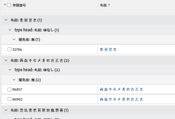

# グループ化：ポートフォリオ所有者、プログラム所有者、プロジェクト所有者およびプロジェクトステータスに関する 4 レベルのタスクグループ化

このタスクグループ化では、4 レベルのグループ化を提供します。この場合、タスクは、ポートフォリ所有者、プログラム所有者、プロジェクト所有者およびプロジェクトステータス別にグループ化されます。標準インターフェイスを使用する場合は、最大 3 レベルのグループ化に限られます。第 4 レベルを追加するには、テキストモードを使用する必要があります。同時に 4 つを超える条件でレポートをグループ化することはできません。

## アクセス要件

この記事の手順を実行するには、次のアクセス権が必要です。

<table style="table-layout:auto"> 
 <col> 
 <col> 
 <tbody> 
  <tr> 
   <td role="rowheader">Adobe Workfront プラン*</td> 
   <td> 
任意
 </td> 
  </tr> 
  <tr> 
   <td role="rowheader">Adobe Workfront ライセンス*</td> 
   <td> 
グループ化を変更するためのリクエスト 

   
レポートを変更するためのプラン
 </td> 
  </tr> 
  <tr> 
   <td role="rowheader">アクセスレベル設定*</td> 
   <td> 
レポート、ダッシュボード、カレンダーへのアクセス権を編集して、レポートを変更できるようにします。
 
フィルター、ビュー、グループ化へのアクセス権を編集して、グループ化を変更できるようにします。
 
<b>メモ</b>

まだアクセス権がない場合は、Workfront 管理者に問い合わせて、アクセスレベルに追加の制限が設定されているかどうかを確認してください。Workfront 管理者がアクセスレベルを変更する方法について詳しくは、<a href="../../../administration-and-setup/add-users/configure-and-grant-access/create-modify-access-levels.md" class="MCXref xref">カスタムアクセスレベルの作成または変更</a>を参照してください。
 </td>
</tr>  
  <tr> 
   <td role="rowheader">オブジェクト権限</td> 
   <td> 
レポートに対する権限を管理します。
 
追加のアクセス権のリクエストについて詳しくは、<a href="../../../workfront-basics/grant-and-request-access-to-objects/request-access.md" class="MCXref xref">オブジェクトへのアクセス権のリクエスト</a>を参照してください。
 </td> 
  </tr> 
 </tbody> 
</table>

&#42;保有するプラン、ライセンスタイプ、アクセス権を確認するには、Workfront 管理者に問い合わせてください。

## ポートフォリオ所有者、プログラム所有者、プロジェクト所有者およびプロジェクトステータスに関する 4 レベルのタスクグループ化の作成

このグループ化を適用するには、次の操作を行います。

1. タスクのリストに移動します。
1. 「**グループ化**」ドロップダウンメニューで「**新規グループ化**」を選択します。

1. 「**テキスト モードに切り替える**」をクリックします。
1. **報告書のグループ化**&#x200B;エリア内のテキストを削除します。
1. 次のコードでテキストを置き換えます。
   <pre>group.0.linkedname=project group.0.name=Portfolio Owner group.0.notime=false group.0.valuefield=project:portfolio:owner:name group.0.valueformat=string group.1.linkedname=project group.1.name=Program Owner group.1.notime=false group.1.valuefield=project:program:owner:name group.1.valueformat=string group.2.linkedname=projectOwnerMM group.2.listgrouingparsedmethod=nested(project).nested(owner).string(name) group.2.namekey=projectownermm group.2.notime=false group.2.valuefield=projectOwnerMM:name group.2.valueformat=string group.3.enumclass=com.attask.common.constants.ProjectStatusEnum group.3.linkedname=project group.3.namekey=view.relatedcolumn group.3.namekeyargkey.0=project group.3.namekeyargkey.1=status group.3.notime=false group.3.valuefield=project:status group.3.valueformat=val</pre>

1. 「**グループ化の保存**」をクリックします。
