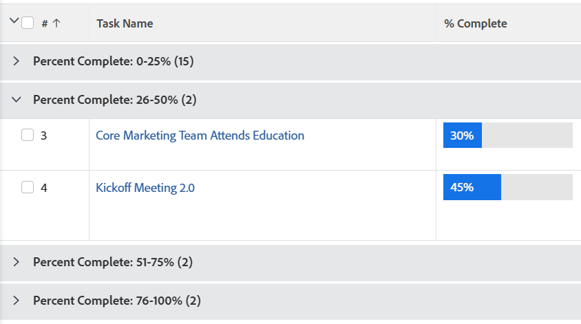

# グループ化：グループ化内のすべてのオブジェクトに共通の計算された値でリストの結果を整理

<!--Audited: 10/2024-->

タスクを表示するときに、完了率でグループ化し、0～25、26～50、51～75、75～99、100 の範囲に分けたい場合があります。これは、テキストモードを使用してグループ化を作成することで可能です。



## アクセス要件

+++ 展開すると、この記事の機能のアクセス要件が表示されます。

この記事の手順を実行するには、次のアクセス権が必要です。

<table style="table-layout:auto"> 
 <col> 
 <col> 
 <tbody> 
  <tr> 
   <td role="rowheader">Adobe Workfront プラン</td> 
   <td> <p>任意</p> </td> 
  </tr> 
  <tr> 
   <td role="rowheader">Adobe Workfront プラン*</td> 
   <td> 
    <p>新規：</p>
   <ul><li><p>フィルターを変更するコントリビューター </p></li>
   <li><p>レポートを変更する場合は Standard</p></li> </ul>

<p>現在：</p>
   <ul><li><p>フィルターを変更する場合は「要求」 </p></li>
   <li><p>レポートを変更するためのプラン</p></li> </ul></td> 
  </tr> 
  <tr> 
   <td role="rowheader">アクセスレベル設定</td> 
   <td> <p>レポート、ダッシュボード、カレンダーへのアクセス権を編集して、レポートを変更できるようにします。</p> <p>フィルターを変更する場合は、フィルター、ビュー、グループ化への編集アクセス権</p> </td> 
  </tr> 
  <tr> 
   <td role="rowheader">オブジェクト権限</td> 
   <td> <p>レポートに対する権限を管理します。</p>  </td> 
  </tr> 
 </tbody> 
</table>

*詳しくは、[Workfront ドキュメントのアクセス要件 &#x200B;](/help/quicksilver/administration-and-setup/add-users/access-levels-and-object-permissions/access-level-requirements-in-documentation.md) を参照してください。

+++

## グループ化内のすべてのオブジェクトに共通の計算された値でリストの結果を整理

タスクのリストにこのグループ化を適用するには、次の操作を行います。

1. タスクのリストに移動します。
1. **グループ化**&#x200B;ドロップダウンメニューで、「**新規グループ化**」を選択します。

1. 「**テキストモードに切り替える**」をクリックします。
1. 使用可能なスペースに、次のコードを追加します。

   ```
   textmode=true
   group.0.valueexpression=IF({percentComplete}>=0&&{percentComplete}<=25,'0-25%',IF({percentComplete}>25&&{percentComplete}<=50,'26-50%',IF({percentComplete}>50&&{percentComplete}<=75,'51-75%',IF({percentComplete}>75&&{percentComplete}<=100,'76-100%',''))))
   group.0.linkedname=direct
   group.0.valueformat=doubleAsString
   group.0.namekey=percentComplete
   ```

1. 「**完了**」、「**グループ化の保存**」の順にクリックします。
1. （オプション）グループ化名を更新し、「**グループ化を保存**」をクリックします。
