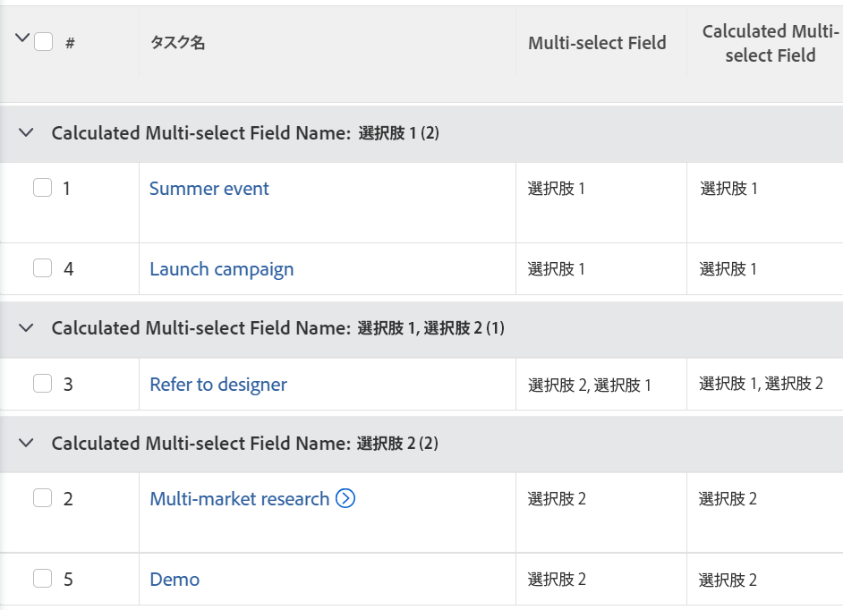
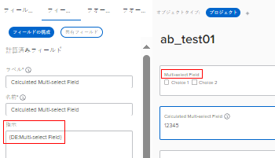

# 複数選択カスタムフィールドでレポートのグループ化

<!--Audited: 10/2024-->

Adobe Workfront レポートの複数選択カスタムフィールドにおいて値でグループ化できるのは、テキストモードを使用した場合のみです。

複数選択カスタムフィールドの例は、次のとおりです。

* チェックボックス
* 複数選択ドロップダウンメニュー

テキストモードの使用について詳しくは、[テキストモードの概要](../../../reports-and-dashboards/reports/text-mode/understand-text-mode.md)の記事を参照してください。

## 複数選択カスタムフィールドでグループ化する際の考慮事項

* テキストモードのグループ化を使用するレポートのグラフを作成することはできません。複数選択カスタムフィールドを参照する追加の計算フィールドを作成して、複数選択カスタムフィールドの値を基準にしたレポートのグラフを表示する必要があります。

  詳しくは、[複数選択できるカスタムフィールドでのレポートのグラフ化](../../../reports-and-dashboards/reports/custom-view-filter-grouping-samples/chart-report-by-multi-select-custom-field.md)を参照してください。
* いずれかの選択肢が選択された項目は、1 回だけカウントされます。

  たとえば、あるチェックボックスカスタムフィールドにオプションとして選択肢 1 と選択肢 2 があり、そのフォームをタスクに添付すると、選択肢 1 と選択肢 2 の両方を持つタスクは、選択肢 1 または選択肢 2 のいずれかのみが選択されたタスクとは別にグループ化されます。

## アクセス要件

+++ 展開すると、この記事の機能のアクセス要件が表示されます。

この記事の手順を実行するには、次のアクセス権が必要です。

<table style="table-layout:auto"> 
 <col> 
 <col> 
 <tbody> 
  <tr> 
   <td role="rowheader">Adobe Workfront プラン</td> 
   <td> 
任意
 </td> 
  </tr> 
  <tr> 
   <td role="rowheader">Adobe Workfront プラン*</td> 
   <td> 
    
新規：

   <ul><li>
フィルターを変更するコントリビューター 
</li>
   <li>
レポートを変更する場合は Standard
</li> </ul>

現在：

   <ul><li>
フィルターを変更する場合は「要求」 
</li>
   <li>
レポートを変更するためのプラン
</li> </ul></td> 
  </tr> 
  <tr> 
   <td role="rowheader">アクセスレベル設定</td> 
   <td> 
レポート、ダッシュボード、カレンダーへのアクセス権を編集して、レポートを変更できるようにします。
 
フィルターを変更する場合は、フィルター、ビュー、グループ化への編集アクセス権
 </td> 
  </tr> 
  <tr> 
   <td role="rowheader">オブジェクト権限</td> 
   <td> 
レポートに対する権限を管理します。
  </td> 
  </tr> 
 </tbody> 
</table>

*詳しくは、[Workfront ドキュメントのアクセス要件 ](/help/quicksilver/administration-and-setup/add-users/access-levels-and-object-permissions/access-level-requirements-in-documentation.md) を参照してください。

+++

## 複数選択カスタムフィールドでのレポートのグループ化

複数選択のカスタムフィールドでグループ化するには、次の前提条件が満たされている必要があります。

* カスタムフォームに複数選択カスタムフィールドを作成します。\
  カスタムフォームの作成と、カスタムフォームへのカスタムフィールドの追加について詳しくは、[ カスタムフォームの作成 ](/help/quicksilver/administration-and-setup/customize-workfront/create-manage-custom-forms/form-designer/design-a-form/design-a-form.md) を参照してください。

* カスタムフォームをオブジェクトに添付します。
* 複数選択カスタムフィールドに、各オブジェクトの値を入力します。

レポートで複数選択のカスタムフィールドでグループ化するには、次の手順に従います。

1. 複数選択カスタムフィールドのグループ化を追加するレポートを作成するか、既存のレポートを編集します。\
   レポートの作成について詳しくは、[カスタムレポートの作成](../../../reports-and-dashboards/reports/creating-and-managing-reports/create-custom-report.md)の記事を参照してください。
1. 「**報告書アクション**」をクリックし、次に「**編集**」を選択します。
1. 「**グループ化**」タブを選択します。
1. 「**テキストモードに切り替える**」をクリックします。

1. **グループ化の条件** ボックスのテキストを選択し、以下のコードに置き換えます。

   <pre>
   group.0.displayname=Multi-select Custom Field Name
 group.0.valueexpression={DE:Multi-select Custom Field Name}
  group.0.valueformat=HTML
  group.0.textmode=true
   </pre>

1. 「複数選択カスタムフィールド名」は、Workfront インスタンスに表示される複数選択カスタムフィールドの実際の名前に置き換えます。
1. 「**保存して閉じる**」をクリックします。

   レポート内のオブジェクトは、複数選択カスタムフィールドの値でグループ化されます。

   

   レポートのグループ化の名前は、複数選択カスタムフィールドの名前に続いて、フィールドで選択された値になります。

<!--

<h2>Chart a report by multi-select Custom Fields</h2>

(NOTE: this moved to its own article, linked in the Note above!)

You cannot build a chart in a report by referencing a multi-select custom field. Instead, you can create a calculated field that records the values of the multi-select custom field on a given object and group by the calculated field.&nbsp;

<ul>
<li><a href="#build-a-calculated-custom-field-that-references-a-multi-select-custom-field" class="MCXref xref">Build a calculated custom field that references a multi-select custom field</a> </li>
<li><a href="#build-a-chart-that-references-a-calculated-custom-field" class="MCXref xref">Build a chart that references a calculated custom field</a> </li>
</ul>

<strong>Build a calculated custom field that references a multi-select custom field</strong>

To be able to build a calculated field that references a multi-select custom field, you must have the following prerequisites:

<ul>
<li>Build the multi-select custom field in a custom form. .</li>
<li>Attach the custom form to objects.</li>
<li>Populate the multi-select custom field with a value on each object.</li>
</ul>

To build the calculated custom field that references the multi-select custom field:

<ol>
<li value="1">Create a custom form, or edit an existing one. .</li>
<li value="2">Click<strong>Add a Field</strong>, then <strong>Calculated</strong> to add the multi-select custom field to the form.</li>
<li value="3">In the <strong>Label</strong> box, name the new calculated field to indicate that it references the multi-select custom field. For example: "Calculated Multi-select Field."</li>
<li value="4"> 
In the <strong>Calculation</strong> box, enter the following code:
<pre>{DE:Multi-select Custom Field}</pre> 
    
 </li>
<li value="5">Replace "Multi-select Custom Field" with the actual name of your multi-select custom field, as it appears in Workfront.</li>
<li value="6"> 
(Optional) If the multi-select custom field is already on this form and if this form is already attached to objects, enable the <strong>Update previous calculations</strong>&nbsp;option.
 
This ensures that the new field is automatically populated with the value from the multi-select custom field as it is added to the forms attached to the objects already.
 </li>
<li value="7">Click <strong>Done</strong>.</li>
<li value="8">Click <strong>Save +Close</strong>.</li>
</ol>

<strong>Build a chart that references a calculated custom field</strong>

<ol>
<li value="1"> Go to the report where you want to add the chart for the calculated field that references the multi-select custom field. </li>
<li value="2"> (Optional) To ensure that all the calculated fields that you want to chart by are populated with values, select all the objects in your report, then click <strong>Edit</strong>. </li>
<li value="3"> 
 (Optional and conditional) Enable the <strong>Recalculate Custom Expressions</strong> field, then click <strong>Save Changes</strong>.
 
    
 </li>
<li value="4"> Click <strong>Report Actions</strong>, then <strong>Edit</strong>. </li>
<li value="5">Select the <strong>Groupings</strong> tab, then click <strong>Add Grouping</strong>. </li>
<li value="6">Add the<strong>Calculated Multi-select Field</strong> you created as your grouping. </li>
<li value="7"> 
Select the <strong>Chart</strong> tab, and add a chart to your report.
 
For information about adding a chart to a report, see the section <a href="../../../reports-and-dashboards/reports/creating-and-managing-reports/create-custom-report.md#add-a-chart" class="MCXref xref">Add a chart to a report</a> in the article <a href="../../../reports-and-dashboards/reports/creating-and-managing-reports/create-custom-report.md" class="MCXref xref">Create a custom report</a>. 
 </li>
<li value="8">Select the <strong>Calculated Multi-select Field</strong> as one of the fields to display in the chart. </li>
<li value="9"> 
Click <strong>Save + Close</strong>.
 
The report displays the results grouped by the Calculated Multi-select Field in a chart. 
 </li>
</ol>

-->
