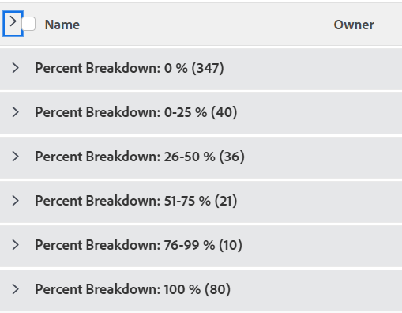

# グループ化：プロジェクトの割合の分類 1

このカスタムプロジェクトグループでは、完了率の値の範囲でグループ化されたプロジェクトを表示できます。

次のグループでは、プロジェクトを完了率の値でグループ化し、いずれかのグループに分けています。

* 0％
* 1-25%
* 26-50%
* 51-75%
* 76-99%
* 100%

## アクセス要件

この記事の手順を実行するには、次のアクセス権が必要です。

<table style="table-layout:auto"> 
 <col> 
 <col> 
 <tbody> 
  <tr> 
   <td role="rowheader">Adobe Workfront plan*</td> 
   <td> 
任意
 </td> 
  </tr> 
  <tr> 
   <td role="rowheader">Adobe Workfront license*</td> 
   <td> 
グループ化を変更するリクエスト 

   
レポートの変更計画
 </td> 
  </tr> 
  <tr> 
   <td role="rowheader">アクセスレベル設定*</td> 
   <td> 
レポート、ダッシュボード、カレンダーへのアクセスを編集して、レポートを変更します
 
フィルター、ビュー、グループへのアクセスを編集してグループ化を変更します
 
<b>メモ</b>

まだアクセス権がない場合は、Workfront管理者に、アクセスレベルに追加の制限を設定しているかどうかを問い合わせてください。 Workfront管理者がアクセスレベルを変更する方法について詳しくは、 <a href="../../../administration-and-setup/add-users/configure-and-grant-access/create-modify-access-levels.md" class="MCXref xref">カスタムアクセスレベルの作成または変更</a>.
 </td>
</tr>  
  <tr> 
   <td role="rowheader">オブジェクト権限</td> 
   <td> 
レポートに対する権限の管理
 
追加のアクセス権のリクエストについて詳しくは、 <a href="../../../workfront-basics/grant-and-request-access-to-objects/request-access.md" class="MCXref xref">オブジェクトへのアクセスのリクエスト </a>.
 </td> 
  </tr> 
 </tbody> 
</table>

&#42;保有しているプラン、ライセンスの種類、アクセス権を確認するには、Workfront管理者に問い合わせてください。

## プロジェクトの割合の分類でグループ化

このグループ化を適用するには：

1. プロジェクトのリストに移動します。
1. 次の **グループ化** ドロップダウンメニューで、「 **新しいグループ化**.

1. クリック **テキストモードに切り替え**.
1. ボックス内のテキストを削除し、使用可能なスペースに次のコードを貼り付けます。
   <pre>group.0.linkedname=direct group.0.name=Percent Breakdown group.0.notime=false group.0.valueexpression=IF({percentComplete}=0,"0 %",IF({percentComplete}&lt;=26,"0-25 %",IF({percentComplete}&lt;=51,"25-50 %",IF({percentComplete}&lt;=76,"50-75 %",IF({percentComplete}&lt;100,"75-99 %","100 %")))) group.0.valueformat=string</pre>

1. クリック **グループ化を保存**.
