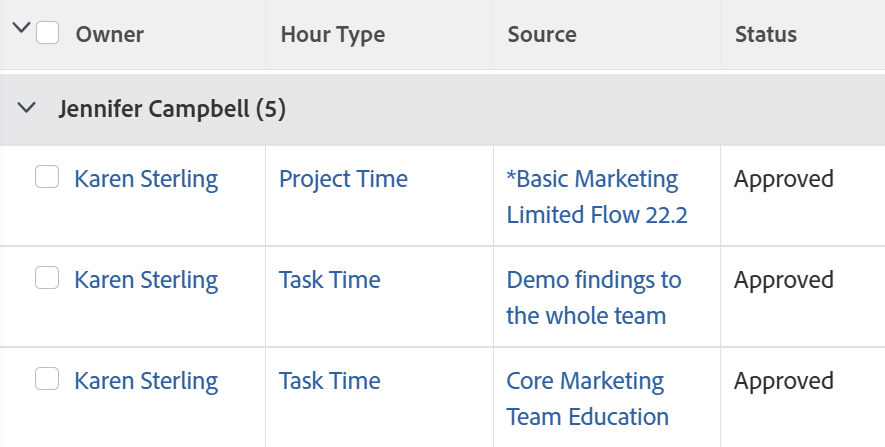

# グループ化：数時間のプロジェクトスポンサー

この時間のグループ化では、時間が記録されるプロジェクトのスポンサー別に時間が編成されます。 時間グループ化の標準の Report Builder インターフェイスでは、「プロジェクトスポンサー」フィールドへのマッピングは提供されません。 このフィールドにアクセスするには、「テキストモード」インターフェイスを使用する必要があります。

## アクセス要件

この記事の手順を実行するには、次のアクセス権が必要です。

<table style="table-layout:auto"> 
 <col> 
 <col> 
 <tbody> 
  <tr> 
   <td role="rowheader">Adobe Workfront plan*</td> 
   <td> 
任意
 </td> 
  </tr> 
  <tr> 
   <td role="rowheader">Adobe Workfront license*</td> 
   <td> 
グループ化を変更するリクエスト 

   
レポートの変更計画
 </td> 
  </tr> 
  <tr> 
   <td role="rowheader">アクセスレベル設定*</td> 
   <td> 
レポート、ダッシュボード、カレンダーへのアクセスを編集して、レポートを変更します
 
フィルター、ビュー、グループへのアクセスを編集してグループ化を変更します
 
<b>メモ</b>

まだアクセス権がない場合は、Workfront管理者に、アクセスレベルに追加の制限を設定しているかどうかを問い合わせてください。 Workfront管理者がアクセスレベルを変更する方法について詳しくは、 <a href="../../../administration-and-setup/add-users/configure-and-grant-access/create-modify-access-levels.md" class="MCXref xref">カスタムアクセスレベルの作成または変更</a>.
 </td>
</tr>  
  <tr> 
   <td role="rowheader">オブジェクト権限</td> 
   <td> 
レポートに対する権限の管理
 
追加のアクセス権のリクエストについて詳しくは、 <a href="../../../workfront-basics/grant-and-request-access-to-objects/request-access.md" class="MCXref xref">オブジェクトへのアクセスのリクエスト </a>.
 </td> 
  </tr> 
 </tbody> 
</table>

&#42;保有しているプラン、ライセンスの種類、アクセス権を確認するには、Workfront管理者に問い合わせてください。

## プロジェクトスポンサー別のグループ（時間）

このグループ化を適用するには：

1. 時間のリストに移動します。
1. 次の **グループ化** ドロップダウンメニューで、「 **新しいグループ化**.

1. クリック&#x200B;**テキストモードに切り替え**.
1. 内のテキストを削除します。 **レポートをグループ化** 領域

1. 次のコードに置き換えます。

   <pre>group.0.linkedname=project:sponsor:名前 group.0.name= group.0.valuefield=project:sponsor:名前 group.0.valueformat=HTML textmode=true </pre>

1. クリック **グループ化を保存**.
