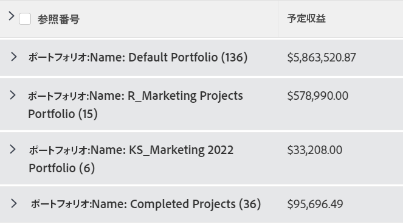
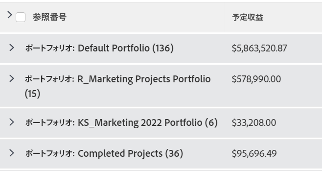
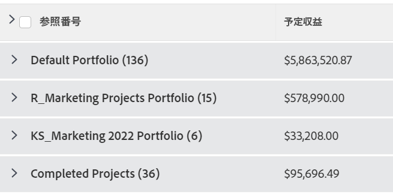

# グループ化：グループ化の表示名の編集

<!--Audited: 01/2024-->

グループ名を、ユーザーにとってより身近な名前に変更できます。

例えば、標準のポートフォリオ名のグループ化をプロジェクトのリストに適用すると、グループ化の名前は&#x200B;*ポートフォリオ：名前：`<name of portfolio>`* として表示されます。

テキストモードを使用してこのグループ化を変更し、読みやすい名前を表示できます。

## アクセス要件

この記事の手順を実行するには、次のアクセス権が必要です。

<table style="table-layout:auto"> 
 <col> 
 <col> 
 <tbody> 
  <tr> 
   <td role="rowheader">Adobe Workfront プラン*</td> 
   <td> 
任意
 </td> 
  </tr> 
  <tr> 
   <td role="rowheader">Adobe Workfront ライセンス*</td> 
   <td>

新規： 

   <ul>
   <li> 
グループを変更するコントリビューター 
</li>
   <li>
レポートを変更するための標準
</li></ul>

 現在：

   <ul>  
   <li>
グループ化を変更するためのリクエスト 
</li>
   <li>
レポートを変更するためのプラン
</li> </td> 
  </tr> 
  <tr> 
   <td role="rowheader">アクセスレベル設定*</td> 
   <td> 
レポート、ダッシュボード、カレンダーへのアクセス権を編集して、レポートを変更できるようにします。
 
フィルター、ビュー、グループ化へのアクセス権を編集して、グループ化を変更できるようにします。
 
<b>メモ</b>

まだアクセス権がない場合は、Workfront 管理者に問い合わせて、アクセスレベルに追加の制限が設定されているかどうかを確認してください。Workfront 管理者がアクセスレベルを変更する方法について詳しくは、<a href="../../../administration-and-setup/add-users/configure-and-grant-access/create-modify-access-levels.md" class="MCXref xref">カスタムアクセスレベルの作成または変更</a>を参照してください。
 </td>
</tr>  
  <tr> 
   <td role="rowheader">オブジェクト権限</td> 
   <td> 
レポートに対する権限を管理します。
 
追加のアクセス権のリクエストについて詳しくは、<a href="../../../workfront-basics/grant-and-request-access-to-objects/request-access.md" class="MCXref xref">オブジェクトへのアクセス権のリクエスト</a>を参照してください。
 </td> 
  </tr> 
 </tbody> 
</table>

&#42;保有するプラン、ライセンスタイプ、アクセス権を確認するには、Workfront 管理者に問い合わせてください。

## グループ化の表示名を編集

プロジェクトのグループ化の表示名を変更するには、次の手順に従います。

1. プロジェクトのリストに移動します。
1. 次から： **グループ化** ドロップダウンメニューで、「 **新しいグループ化**.

1. クリック **グループを追加**&#x200B;をクリックし、「Portfolio名」と入力します。 **最初の基準：** フィールドに値を入力し、リストに表示されるときに選択します。

1. 「**テキスト モードに切り替える**」をクリックします。
1. 次のいずれかの操作を行います。

   * 次のコードを、「**報告書のグループ化**」ボックスにある既存のテキストに追加します。

     `group.0.displayname=Your Value`

     または、この場合は次のようになります。

     `group.0.displayname=Portfolio`

   * グループ化のテキストモードインターフェイスで、「name」という単語が含まれる行をすべて削除したあと、次の行を追加します。

     `group.0.name=Your Value`

     または、この場合は次のようになります。

     `group.0.name=Portfolio`

     >[!TIP]
     >
     >また、 `group.0.name=` そして `group.0.displayname=` 行が空白の場合、グループ化にはグループ化の基準となる値が表示されます。

     

1. 「**完了**」をクリックし、「**グループ化の保存**」をクリックします。

   グループ化のデフォルト名は、テキストモードの情報に従って変更されます。
