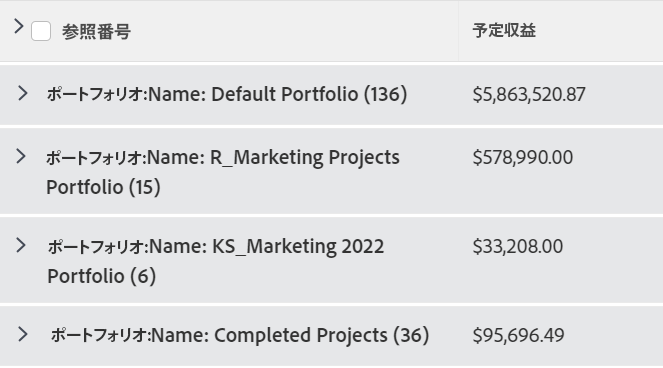
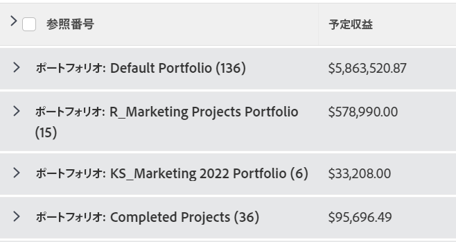
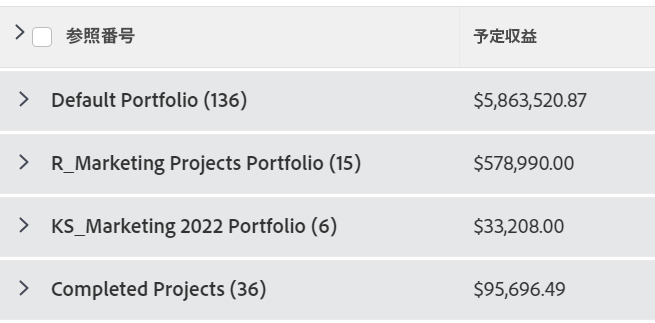

# グループ化：グループ化の表示名の編集

<!--Audited: 01/2024-->

グループ名を、ユーザーにとってより身近な名前に変更できます。

例えば、標準のポートフォリオ名のグループ化をプロジェクトのリストに適用すると、グループ化の名前は&#x200B;*ポートフォリオ：名前：`<name of portfolio>`* として表示されます。

テキストモードを使用してこのグループ化を変更し、読みやすい名前を表示できます。

## アクセス要件

+++ 展開すると、この記事の機能のアクセス要件が表示されます。 

<table style="table-layout:auto"> 
 <col> 
 <col> 
 <tbody> 
  <tr> 
   <td role="rowheader">Adobe Workfront パッケージ</td> 
   <td> 
任意
 </td> 
  </tr> 
  <tr> 
   <td role="rowheader">Adobe Workfront プラン</td> 
   <td> 
   
コントリビューターまたはフィルターを変更するリクエスト 

   
レポートを修正する標準または計画

  </tr> 
  <tr> 
   <td role="rowheader">アクセスレベル設定</td> 
   <td> 
レポート、ダッシュボード、カレンダーへのアクセス権を編集して、レポートを変更できるようにします。
 
フィルターを変更する場合は、フィルター、ビュー、グループ化への編集アクセス権
 </td> 
  </tr> 
  <tr> 
   <td role="rowheader">オブジェクト権限</td> 
   <td> 
レポートに対する権限を管理します。
  </td> 
  </tr> 
 </tbody> 
</table>

この表の情報について詳しくは、[Workfront ドキュメントのアクセス要件](/help/quicksilver/administration-and-setup/add-users/access-levels-and-object-permissions/access-level-requirements-in-documentation.md)を参照してください。

+++

## グループ化の表示名を編集

プロジェクトのグループ化の表示名を変更するには、次の手順に従います。

1. プロジェクトのリストに移動します。
1. **グループ化**&#x200B;ドロップダウンメニューで「**新規グループ化**」を選択します。

1. 「**グループ化を追加**」をクリックし、「**グループ化：**」フィールドに「Portfolio名」と入力し始め、リストに表示されたら選択します。

1. 「**テキスト モードに切り替える**」をクリックします。
1. 次のいずれかの操作を行います。

   * 次のコードを、「**報告書のグループ化**」ボックスにある既存のテキストに追加します。

     `group.0.displayname=Your Value`

     例えば、次のコードを追加して、表示名を「Portfolio」に変更します。

     `group.0.displayname=Portfolio`

   * グループ化のテキストモードインターフェイスで、「name」という単語が含まれる行をすべて削除したあと、次の行を追加します。

     `group.0.name=Your Value`

     例えば、次のコードを追加して、表示名を「Portfolio」に変更します。

     `group.0.name=Portfolio`

     >[!TIP]
     >
     >また、`group.0.name=` と `group.0.displayname=` の行を空白にすることもできます。この場合、グループ化にはグループ化の基準となる値が表示されます。

     

1. 「**完了**」をクリックし、「**グループ化の保存**」をクリックします。
1. （オプション）グループ化名を更新し、**グループ化を保存**&#x200B;をクリックします。

   グループ化のデフォルト名は、テキストモードの情報に従って変更されます。
