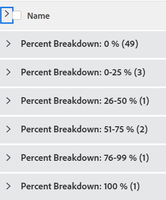

# グループ化：タスクのパーセントでの分類 1

<!--Audited: 10/2024-->

このカスタムのプロジェクトのグループ化では、プロジェクトを完了率の値の範囲でグループ化して表示できます。分類には、25 パーセントポイント増分の完了率の値が表示されます：0～25％、25～50％など。

次のグループ化では、タスクを完了率の値で整理して、6 つの異なるグループに分類します。

* 0％
* 1～25%
* 26～50%
* 51～75%
* 76～99%
* 100％



## アクセス要件

+++ 展開すると、この記事の機能のアクセス要件が表示されます。 

<table style="table-layout:auto"> 
 <col> 
 <col> 
 <tbody> 
  <tr> 
   <td role="rowheader">Adobe Workfront パッケージ</td> 
   <td> <p>任意</p> </td> 
  </tr> 
  <tr> 
   <td role="rowheader">Adobe Workfront プラン</td> 
   <td> 
   <p>コントリビューターまたはフィルターを変更するリクエスト </p>
   <p>レポートを修正する標準または計画</p>
  </tr> 
  <tr> 
   <td role="rowheader">アクセスレベル設定</td> 
   <td> <p>レポート、ダッシュボード、カレンダーへのアクセス権を編集して、レポートを変更できるようにします。</p> <p>フィルターを変更する場合は、フィルター、ビュー、グループ化への編集アクセス権</p> </td> 
  </tr> 
  <tr> 
   <td role="rowheader">オブジェクト権限</td> 
   <td> <p>レポートに対する権限を管理します。</p>  </td> 
  </tr> 
 </tbody> 
</table>

この表の情報について詳しくは、[Workfront ドキュメントのアクセス要件](/help/quicksilver/administration-and-setup/add-users/access-levels-and-object-permissions/access-level-requirements-in-documentation.md)を参照してください。

+++

## タスクの割合によるグループ化の分類

このグループ化を適用するには、次の操作を行います。

1. タスクのリストに移動します。
1. **グループ化**&#x200B;ドロップダウンメニューで「**新規グループ化**」を選択します。
1. 「**グループ化を追加**」をクリックします。

1. 「**テキストモードに切り替え**」をクリックします。
1. **Group by**&#x200B;領域のテキストを削除します。
1. 次のコードでテキストを置き換えます。

   ```
   group.0.linkedname=direct
   group.0.name=Percent Breakdown
   group.0.notime=false
   group.0.valueexpression=IF({percentComplete}=0,"0 %",IF({percentComplete}<=26,"0-25 %",IF({percentComplete}<=51,"26-50 %",IF({percentComplete}<=76,"51-75 %",IF({percentComplete}<100,"76-99 %","100 %")))))
   group.0.valueformat=string
   ```

1. 「**完了**」 > 「**グループ化を保存**」をクリックします。
1. （オプション）グループ化名を更新し、**グループ化を保存**&#x200B;をクリックします。
