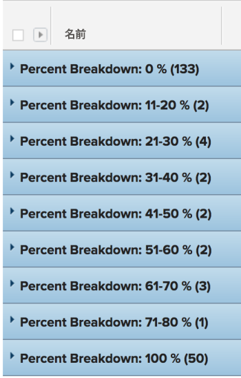

# グループ化：タスクのパーセントでの分類 2

<!--Audited: 10/2024-->

このカスタム タスク グループでは、完了率の値の範囲でグループ化されたタスクを表示できます。 内訳は、10% ポイントの増分の完了率値を示します（1～10%、11～20% など）。

次のグループ化では、プロジェクトを完了率の値で整理して、次のいずれかのグループに分けています。

* 0%
* 1～10％
* 11 - 20%
* 21 - 30%
* 31 - 40%
* 41 - 50%
* 51 - 60%
* 61 - 70%
* 71 - 80%
* 81 - 90%
* 91 - 99%
* 100％



## アクセス要件

+++ 展開すると、この記事の機能のアクセス要件が表示されます。 

<table style="table-layout:auto"> 
 <col> 
 <col> 
 <tbody> 
  <tr> 
   <td role="rowheader">Adobe Workfront パッケージ</td> 
   <td> <p>任意</p> </td> 
  </tr> 
  <tr> 
   <td role="rowheader">Adobe Workfront プラン</td> 
   <td> 
   <p>フィルターの変更者または変更依頼 </p>
   <p>レポートを変更するための標準またはプラン</p>
  </tr> 
  <tr> 
   <td role="rowheader">アクセスレベル設定</td> 
   <td> <p>レポート、ダッシュボード、カレンダーへのアクセス権を編集して、レポートを変更できるようにします。</p> <p>フィルターを変更する場合は、フィルター、ビュー、グループ化への編集アクセス権</p> </td> 
  </tr> 
  <tr> 
   <td role="rowheader">オブジェクト権限</td> 
   <td> <p>レポートに対する権限を管理します。</p>  </td> 
  </tr> 
 </tbody> 
</table>

この表の情報について詳しくは、[Workfront ドキュメントのアクセス要件](/help/quicksilver/administration-and-setup/add-users/access-levels-and-object-permissions/access-level-requirements-in-documentation.md)を参照してください。

+++

## タスクの割合によるグループ化の分類

このグループ化を適用するには、次の操作を行います。

1. タスクのリストに移動します。
1. **グループ化**&#x200B;ドロップダウンメニューで「**新規グループ化**」を選択します。
1. **グループ化を追加** をクリックします。

1. 「**テキストモードに切り替え**」をクリックします。
1. **グループ化** 領域のテキストを削除します。
1. 次のコードでテキストを置き換えます。

   ```
   group.0.linkedname=direct
   group.0.name=Percent Breakdown
   group.0.notime=false
   group.0.valueexpression=IF({percentComplete}=0,"0 %",IF({percentComplete}<=11,"1-10 %",IF({percentComplete}<=21,"11-20 %",IF({percentComplete}<=31,"21-30 %",IF({percentComplete}<41,"31-40 %",IF({percentComplete}<51,"41-50 %",IF({percentComplete}<61,"51-60 %",IF({percentComplete}<71,"61-70 %",IF({percentComplete}<81,"71-80 %",IF({percentComplete}<91,"81-90 %",IF({percentComplete}<100,"91-99 %","100 %")))))))))))
   textmode=true
   ```

1. **完了**/**グループ化を保存** をクリックします。
1. （オプション）グループ化名を更新し、「**グループ化を保存**」をクリックします。
