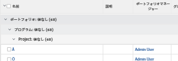

# グループ化：ポートフォリオ別、プログラム別、プロジェクト別のタスク

このタスクのグループ化を使用して、ポートフォリオ別、プログラム別、および関連付けられているプロジェクト別にタスクをグループ化します。

## アクセス要件

この記事の手順を実行するには、次のアクセス権が必要です。

<table style="table-layout:auto"> 
 <col> 
 <col> 
 <tbody> 
  <tr> 
   <td role="rowheader">Adobe Workfront plan*</td> 
   <td> 
任意
 </td> 
  </tr> 
  <tr> 
   <td role="rowheader">Adobe Workfront license*</td> 
   <td> 
計画 
 </td> 
  </tr> 
  <tr> 
   <td role="rowheader">アクセスレベル設定*</td> 
   <td> 
レポート、ダッシュボード、カレンダーへのアクセスを編集
 
フィルター、ビュー、グループへのアクセスを編集
 
注意：まだアクセス権がない場合は、Workfront管理者に、アクセスレベルに追加の制限を設定しているかどうかを問い合わせてください。 Workfront管理者がアクセスレベルを変更する方法について詳しくは、 <a href="../../../administration-and-setup/add-users/configure-and-grant-access/create-modify-access-levels.md" class="MCXref xref">カスタムアクセスレベルの作成または変更</a>.
 </td> 
  </tr> 
  <tr> 
   <td role="rowheader">オブジェクト権限</td> 
   <td> 
レポートに対する権限の管理
 
追加のアクセス権のリクエストについて詳しくは、 <a href="../../../workfront-basics/grant-and-request-access-to-objects/request-access.md" class="MCXref xref">オブジェクトへのアクセスのリクエスト </a>.
 </td> 
  </tr> 
 </tbody> 
</table>

&#42;保有しているプラン、ライセンスの種類、アクセス権を確認するには、Workfront管理者に問い合わせてください。

## ポートフォリオ、プログラム、プロジェクト別にタスクをグループ化

このグループ化を適用するには：

1. タスクのリストに移動します。
1. 次の **グループ化** ドロップダウンメニューで、「 **新しいグループ化**.

1. クリック **テキストモードに切り替え**.
1. 内のテキストを削除します。 **レポートをグループ化** 領域
1. 次のコードに置き換えます。

   <pre>group.0.linkedname=project group.0.namekey=portfolio group.0.notime=false group.0.valuefield=project:portfolio:名前 group.0.valueformat=string group.1.linkedname=project group.1.namekey=program group.1.notime=false group.1.valuefield=project:program:名前 group.1.valueformat=string group.2.name=Project group.2.valuefield=project:name group.2.valueformat=HTML textmode=true </pre>

1. クリック **グループ化を保存**.
