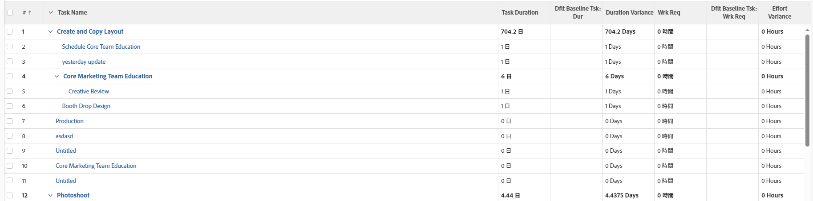

# 表示：タスクビューの期間および予定作業時間の基準差異

このビューでは、タスクビューに次の情報が表示されます。

* タスク情報と基準タスク情報。
* 期間とデフォルトのベースライン期間の差。
* 予定作業時間と既定の基準計画作業時間の差。

>[!NOTE]
>
> 次のビューに表示されるデータは、実績タスク値と、既定の基準タスクに関連付けられた値を比較します。

 

## アクセス要件

この記事の手順を実行するには、次のアクセス権が必要です。

<table style="table-layout:auto"> 
 <col> 
 <col> 
 <tbody> 
  <tr> 
   <td role="rowheader">Adobe Workfront plan*</td> 
   <td> 
任意
 </td> 
  </tr> 
  <tr> 
   <td role="rowheader">Adobe Workfront license*</td> 
   <td> 
計画 
 </td> 
  </tr> 
  <tr> 
   <td role="rowheader">アクセスレベル設定*</td> 
   <td> 
レポート、ダッシュボード、カレンダーへのアクセスを編集
 
フィルター、ビュー、グループへのアクセスを編集
 
注意：まだアクセス権がない場合は、Workfront管理者に、アクセスレベルに追加の制限を設定しているかどうかを問い合わせてください。 Workfront管理者がアクセスレベルを変更する方法について詳しくは、 <a href="../../../administration-and-setup/add-users/configure-and-grant-access/create-modify-access-levels.md" class="MCXref xref">カスタムアクセスレベルの作成または変更</a>.
 </td> 
  </tr> 
  <tr> 
   <td role="rowheader">オブジェクト権限</td> 
   <td> 
レポートに対する権限の管理
 
追加のアクセス権のリクエストについて詳しくは、 <a href="../../../workfront-basics/grant-and-request-access-to-objects/request-access.md" class="MCXref xref">オブジェクトへのアクセスのリクエスト </a>.
 </td> 
  </tr> 
 </tbody> 
</table>

&#42;保有しているプラン、ライセンスの種類、アクセス権を確認するには、Workfront管理者に問い合わせてください。

## タスクビューで期間と計画作業時間の基準差異を表示

1. タスクのリストに移動します。
1. 内 **表示** ドロップダウンメニューで、「 **新しいビュー**.

1. ビューの最初の列を除くすべての列を削除します。
1. 最初の列を選択した状態で、 **テキストモードに切り替え**.
1. 以下のテキストをコピーし、ビューの最初の列に貼り付けます。

   <pre>column.0.descriptionkey=name column.0.link.linkproperty.0.name=ID column.0.link.linkproperty.0.valuefield=ID column.0.link.linkproperty.0.valueformat=int column.0.link.lookup=link.view column.0.link.valuefield=objCode column.0.link.valueformat=val column.0.linkedname=direct column.0.listsort=string(name) column.0.namekey=name.abbr column.0.querysort=name column.0.shortview=false column.0.stretch=100 column.0.valuefield=name column.0.valueformat=HTML column.0.width=150 column.0.displayname=Task Name column.1.descriptionkey=duration column.1.linkedname=direct column.1.listsort=intAsInt(durationMinutes) column.1.namekey=duration.abbr column.1.querysort=durationMinutes column.1.shortview=false column.1.stretch=0 column.1.valuefield=durationFieldLong column.1.valueformat=compound column.1.viewalias=duration column.1.width=100 column.1.displayname=Task Duration column.2.descriptionkey=view.relatedcolumn column.2.descriptionkeyargkey.0=defaultbaselinetask column.2.descriptionkeyargkey.1=duration column.2.linkedname=defaultBaselineTask column.2.listsort=intAsInt(durationMinutes) column.2.namekey=duration column.2.namekeyargkey.0=defaultbaselinetask.abbr column.2.namekeyargkey.1=duration.abbr column.2.querysort=defaultBaselineTask:durationMinutes column.2.shortview=false column.2.stretch=0 column.2.valuefield=defaultBaselineTask:durationFieldLong column.2.valueformat=compound column.2.viewalias=defaultBaselineTask:duration column.2.width=100 column.2.displayname=Dflt ベースラインタスク：デュル column.2.durationunitfield=durationUnit.value column.3.description=Duration Variance"column.3.linkedname=direct column.3.listsort=intAsInt(durationMinutes) column.3.name=期間の平方偏差 column.3.querysort=durationMinutes column.3.shortview=false column.3.stretch=0 column.3.valueexpression=CONCAT(SUB({duration},{defaultBaselineTask})。{duration})/480," Days") column.3.valueformat=HTML column.3.viewalias=duration column.3.width=100 column.3.displayname=Duration Variance column.4.descriptionkey=workrequired column.4.linkedname=direct column.4.listsort=doubleAsDouble(workRequired) column.4.namekey=workrequired.abbr column.4.querysort=workRequired column.4.shortview=false column.4.stretch=0 column.4.valuefield=workFieldLong column.4.valueformat=compound column.4.viewalias=workrequired column.4.width=100 column.4.displayname=Work Req column.5.descriptionkey=view.relatedcolumn column.5.descriptionkeyargkey.0=defaultbaselinetask column.5.descriptionkeyargkey.1=workrequired column.5.linkedname=defaultBaselineTask column.5.listsort=doubleAsDouble(workRequired) column.5.namekey=view.relatedcolumn column.5.namekeyargkey.0=defaultbaselinetask.abbr column.5.namekeyargkey.1=workrequired.abbr column.5.querysort=defaultBaselineTask:workRequired column.5.shortview=false column.5.stretch=0 column.5.valuefield=defaultBaselineTask:workFieldLong column.5.valueformat=compound column.5.viewalias=defaultBaselineTask:workrequired column.5.width=100 column.5.displayname=Dflt ベースラインタスク：作業要求 column.6.descriptionkey=workrequired column.6.linkedname=direct column.6.listsort=doubleAsDouble(workRequired) column.6.name=Effort Variance column.6.querysort=workRequired column.6.shortview=false column.6.stretch=0 column.6.valueexpression=CONCAT(SUB({workRequired},{defaultBaselineTask})。{workRequired})/60," Hours") column.6.valueformat=HTML column.6.viewalias=workrequired column.6.width=100 column.6.displayname=Effort Variance</pre>

1. クリック **ビューを保存**.\
   
