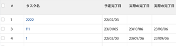
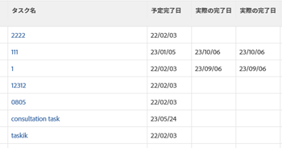

# 表示：時間と日付の差を計算する

>[!IMPORTANT]
>
>同じ種類の 2 つの異なるオブジェクト間のAdobe Workfrontで、時間と日付の差を計算することはできません。 たとえば、異なる 2 つのプロジェクト、タスク、またはタスクの 2 つの日付間の時間と日付の差を計算することはできません。

次の間の差を計算できます。

* 同じオブジェクト上の 2 つの日付フィールド間の時間と日付の差
* オブジェクト上のフィールドと親オブジェクト上の別のフィールドとの時間と日付の差

>[!TIP]
>
>これらの計算では、2 つの日付の間の日数が表示されます。 結果は日数で表示されます。 日付フィールドのタイムスタンプも考慮され、タイムスタンプが一致しない場合は、日数の後に小数が続く場合があります。 タスクが遅れて完了した場合は、日数が負の値で表示されます。

## アクセス要件

この記事の手順を実行するには、次のアクセス権が必要です。

<table style="table-layout:auto"> 
 <col> 
 <col> 
 <tbody> 
  <tr> 
   <td role="rowheader">Adobe Workfront plan*</td> 
   <td> <p>任意</p> </td> 
  </tr> 
  <tr> 
   <td role="rowheader">Adobe Workfront license*</td> 
   <td> <p>ビューの変更をリクエスト </p>
   <p>レポートの変更計画</p> </td> 
  </tr> 
  <tr> 
   <td role="rowheader">アクセスレベル設定*</td> 
   <td> <p>レポート、ダッシュボード、カレンダーへのアクセスを編集して、レポートを変更します</p> <p>フィルター、ビュー、グループへのアクセスを編集してビューを変更します</p> <p><b>メモ</b>

まだアクセス権がない場合は、Workfront管理者に、アクセスレベルに追加の制限を設定しているかどうかを問い合わせてください。 Workfront管理者がアクセスレベルを変更する方法について詳しくは、 <a href="../../../administration-and-setup/add-users/configure-and-grant-access/create-modify-access-levels.md" class="MCXref xref">カスタムアクセスレベルの作成または変更</a>.</p> </td>
</tr>  
  <tr> 
   <td role="rowheader">オブジェクト権限</td> 
   <td> <p>レポートに対する権限の管理</p> <p>追加のアクセス権のリクエストについて詳しくは、 <a href="../../../workfront-basics/grant-and-request-access-to-objects/request-access.md" class="MCXref xref">オブジェクトへのアクセスのリクエスト </a>.</p> </td> 
  </tr> 
 </tbody> 
</table>

&#42;保有しているプラン、ライセンスの種類、アクセス権を確認するには、Workfront管理者に問い合わせてください。

## 同じオブジェクト上の 2 つの日付フィールド間の時間と日付の差を計算します

たとえば、タスクの計画完了日と実際の完了日の差を計算できます。



1. タスクのリストに移動します。
1. 次の **表示** ドロップダウンメニューで、 **新しいビュー**.

1. クリック **列を追加** をクリックし、 **この列に表示** フィールドを選択し、リストに表示されるタイミングで選択します。

1. クリック **列を追加** をクリックし、 **この列に表示** フィールドを選択し、リストに表示されるタイミングで選択します。

1. クリック **列を追加**&#x200B;を選択し、「 **テキストモードに切り替え**.

1. テキストモード領域の上にマウスポインターを置いて、 **クリックしてテキストを編集**.
1. 検索したテキストを **テキストモード** 」ボックスに置き換えて、次のコードに置き換えます。

   ```
   displayname=Planned-Actual Completion Date<br>linkedname=direct<br>querysort=plannedCompletionDate<br>textmode=true<br>valueexpression=ROUND(DATEDIFF({plannedCompletionDate},{actualCompletionDate}),2)<br>valueformat=HTML
   ```

1. クリック **保存**&#x200B;を、 **ビューを保存**.

## オブジェクト上のフィールドと親オブジェクト上の別のフィールドの時間と日付の差を計算します

オブジェクトとその親の一覧については、「相互依存関係とオブジェクトの階層について」の項を参照してください。 [Adobe Workfrontのオブジェクトについて](../../../workfront-basics/navigate-workfront/workfront-navigation/understand-objects.md).\
たとえば、タスクの計画完了日と、その親タスクの計画完了日の差、またはタスクが存在するプロジェクトの差を計算できます。



1. タスクのリストに移動します。
1. 次の **表示** ドロップダウンメニューで、 **新しいビュー**.

1. クリック **列を追加** をクリックし、 **この列に表示** フィールドを選択し、リストに表示されるタイミングで選択します。

1. クリック **列を追加** をクリックし、 **この列に表示** フィールドを選択し、リストに表示されるタイミングで選択します。

1. クリック **列を追加**&#x200B;を選択し、「 **テキストモードに切り替え**.

1. テキストモード領域の上にマウスポインターを置いて、 **クリックしてテキストを編集**.
1. 検索したテキストを **テキストモード** 」ボックスに置き換え、次のいずれかのコードに置き換えます。

   * プロジェクトの計画完了日とタスクの計画完了日の差を表示する手順は、次のとおりです。

      ```
      displayname=Project Planned Completion - Task Planned Completion (Days)<br>textmode=true<br>valueexpression=ROUND(DATEDIFF({project}.{plannedCompletionDate},{plannedCompletionDate}),2)<br>valueformat=HTML
      ```

   * 親タスクの「計画完了日」とタスクの「計画完了日」の差を表示する手順は、次のとおりです。

      ```
      valueexpression=ROUND(DATEDIFF({parent}.{plannedCompletionDate},{plannedCompletionDate}),2)<br>textmode=true<br>valueformat=HTML<br>displayname=Parent Planned Completion - Planned Completion (Days)
      ```

1. クリック **保存**&#x200B;を、 **ビューを保存**.
