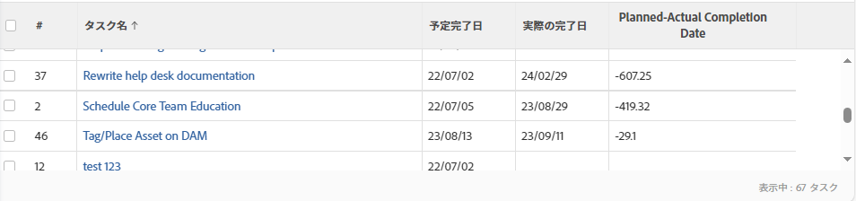
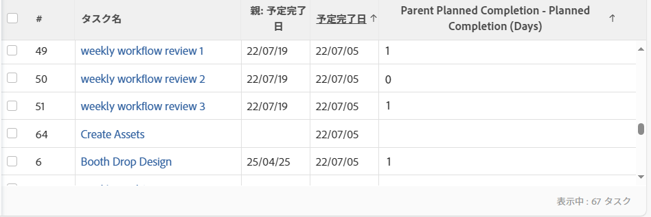

# 表示：時間と日付の差異の計算

<!-- Audited: 1/2024 -->

>[!IMPORTANT]
>
>同じ種類の 2 つの異なるオブジェクト間の Adobe Workfront で、時間と日付の差を計算することはできません。例えば、異なる 2 つのプロジェクト、タスク、またはイシューの 2 つの日付間の時間と日付の差を計算することはできません。

以下の項目の間の差を計算できます。

* 同じオブジェクト上の 2 つの日付フィールド間の時間と日付の差
* オブジェクト上のフィールドと親オブジェクト上の別のフィールドの間の時間と日付の差

>[!TIP]
>
>これらの計算では、2 つの日付の間の日数が表示されます。結果は日数で表示されます。日付フィールドのタイムスタンプも考慮され、タイムスタンプが一致しない場合は、日数の後に小数が続く場合があります。タスクが遅れて完了した場合は、日数が負の値で表示されます。

## アクセス要件

この記事の手順を実行するには、次のアクセス権が必要です。

<table style="table-layout:auto"> 
 <col> 
 <col> 
 <tbody> 
  <tr> 
   <td role="rowheader">Adobe Workfront プラン</td> 
   <td> <p>任意</p> </td> 
  </tr> 
  <tr> 
   <td role="rowheader">Adobe Workfront ライセンス</td> 
   <td> <p>新規： </p><ul><li><p>ビューを変更する寄稿者 </p></li><li>
   <p>レポートを変更するための標準</p></li></ul><p>または</p><p>現在：</p><ul><li><p>表示の変更をリクエスト </p></li><li>
   <p>レポートを変更するためのプラン</p> </li><ul></td> 
  </tr> 
  <tr> 
   <td role="rowheader">アクセスレベル設定</td> 
   <td> <p>レポート、ダッシュボード、カレンダーへのアクセス権を編集して、レポートを変更できるようにします。</p> <p>フィルター、表示、グループ化へのアクセス権を編集して、表示を変更できるようにします。</p> </td> 
  </tr>  
  <tr> 
   <td role="rowheader">オブジェクト権限</td> 
   <td> <p>レポートに対する権限を管理します。</p>  </td> 
  </tr> 
 </tbody> 
</table>

この表の情報の詳細については、 [Workfrontドキュメントのアクセス要件](/help/quicksilver/administration-and-setup/add-users/access-levels-and-object-permissions/access-level-requirements-in-documentation.md).

## 同じオブジェクト上の 2 つの日付フィールド間の時間と日付の差の計算

例えば、タスクの予定完了日と実際の完了日の差を計算できます。



1. タスクのリストに移動します。
1. **表示**&#x200B;ドロップダウンメニューで、「**新規ビュー**」をクリックします。

1. 「**列を追加**」をクリックし、さらに「**この列に表示**」フィールドに「予定完了日」を入力し始めるとリストに表示されるので、それを選択します。

1. 「**列を追加**」をクリックし、さらに「**この列に表示**」フィールドに「実際の完了日」を入力し始めるとリストに表示されるので、それを選択します。

1. 「**列を追加**」をクリックし、次に「**テキストモードに切り替え**」をクリックします。

1. テキストモードエリアにポインタを合わせ、「**クリックしてテキストを編集**」をクリックします。
1. 「**テキストモード**」ボックスにあるテキストを削除し、次のコードに置き換えます。

   ```
    displayname=Planned-Actual Completion Date
    linkedname=direct
    querysort=plannedCompletionDate
    textmode=true
    valueexpression=ROUND(DATEDIFF({plannedCompletionDate},{actualCompletionDate}),2)
    valueformat=HTML
   ```

1. 「**保存**」をクリックし、次に「**表示を保存**」をクリックします。

## オブジェクト上のフィールドと親オブジェクト上の別のフィールドの時間と日付の差を計算します

オブジェクトとその親のリストについて詳しくは、[Adobe Workfront のオブジェクトについて](../../../workfront-basics/navigate-workfront/workfront-navigation/understand-objects.md)にある「相互依存関係とオブジェクトの階層について」の節を参照してください。\
例えば、タスクの予定完了日と、その親タスクまたはタスクが属するプロジェクトの予定完了日との差を計算できます。



1. タスクのリストに移動します。
1. **表示**&#x200B;ドロップダウンメニューで、「**新規ビュー**」をクリックします。

1. 「**列を追加**」をクリックし、さらに「**この列に表示**」フィールドに「プロジェクトの予定完了日」または「親の完了日」を入力し始めるとリストに表示されるので、それを選択します。

1. 「**列を追加**」をクリックし、さらに「**この列に表示**」フィールドに「予定完了日」を入力し始めるとリストに表示されるので、それを選択します。

1. 「**列を追加**」をクリックし、次に「**テキストモードに切り替え**」をクリックします。

1. テキストモードエリアにポインタを合わせ、「**クリックしてテキストを編集**」をクリックします。
1. 「**テキストモード**」ボックスにあるテキストを削除し、次のコードに置き換えます。

   * プロジェクトの計画完了日とタスクの計画完了日の差を表示するには、以下のように行います。

     ```
      displayname=Project Planned Completion - Task Planned Completion (Days)
      textmode=true
      valueexpression=ROUND(DATEDIFF({project}.{plannedCompletionDate},{plannedCompletionDate}),2)
      valueformat=HTML
     ```

   * 親タスクの予定完了日とタスクの予定完了日の差を表示するには、以下のように行います。

     ```
      valueexpression=ROUND(DATEDIFF({parent}.{plannedCompletionDate},{plannedCompletionDate}),2)
      textmode=true<br>valueformat=HTML
      displayname=Parent Planned Completion - Planned Completion (Days)
     ```

1. 「**保存**」をクリックし、次に「**表示を保存**」をクリックします。
