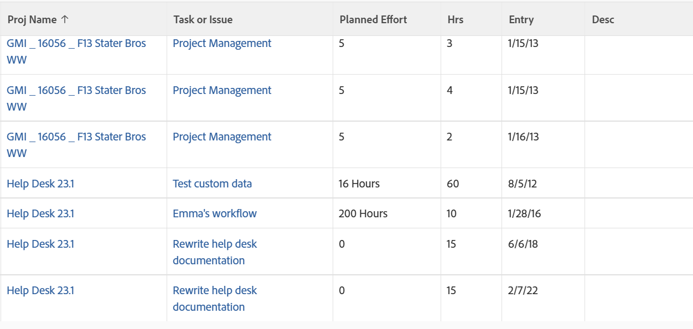

# ビュー：時間リスト内の結合したタスクとイシューの詳細

<!--Audited:11/2024-->

This hour view combines the Task and Issue Name columns, as well as the Task and Issue Planned Hours using the `sharecol` tag. 時間エントリはタスクかイシューのどちらかにのみ属することができるので、両方のオブジェクトが同じ列に同時に表示されることはありません。ビューの各行には、タスクかイシューのどちらかの情報が入力されます。

To learn more about the `sharecol` tag, see [View: merge information from multiple columns in one shared column](../../../reports-and-dashboards/reports/custom-view-filter-grouping-samples/view-merge-columns.md).



## アクセス要件

+++ 展開すると、この記事の機能のアクセス要件が表示されます。 

<table style="table-layout:auto"> 
 <col> 
 <col> 
 <tbody> 
  <tr> 
   <td role="rowheader">Adobe Workfront パッケージ</td> 
   <td> <p>任意</p> </td> 
  </tr> 
  <tr> 
   <td role="rowheader">Adobe Workfront プラン</td> 
   <td> 
   <p>フィルターの変更をコントリビューターまたはリクエスト </p>
   <p>レポートを変更するための「標準」または「プラン」</p>
  </tr> 
  <tr> 
   <td role="rowheader">アクセスレベル設定</td> 
   <td> <p>レポート、ダッシュボード、カレンダーへのアクセス権を編集して、レポートを変更できるようにします。</p> <p>フィルターを変更する場合は、フィルター、ビュー、グループ化への編集アクセス権</p> </td> 
  </tr> 
  <tr> 
   <td role="rowheader">オブジェクト権限</td> 
   <td> <p>レポートに対する権限を管理します。</p>  </td> 
  </tr> 
 </tbody> 
</table>

この表の情報について詳しくは、[Workfront ドキュメントのアクセス要件](/help/quicksilver/administration-and-setup/add-users/access-levels-and-object-permissions/access-level-requirements-in-documentation.md)を参照してください。

+++

## タスクとイシューの詳細の組み合わせを時間リストに表示

1. 時間のリストに移動します。
1. **表示**&#x200B;ドロップダウンメニューで、「**新規ビュー**」をクリックします。
1. **列のプレビュー**&#x200B;領域で、1 つを除くすべての列を削除します。
1. Click the header of the remaining column, then click **Switch to Text Mode** > **Edit Text Mode**.
1. **[テキストモードの編集]**&#x200B;ボックスで見つかったテキストを削除し、次のコードで置き換えます：

   ```
   column.1.querysort=project:name
   column.1.shortview=false
   column.1.stretch=0
   column.1.valuefield=project:name
   column.1.valueformat=HTML
   column.1.width=100
   column.2.description=Task or Issue
   column.2.link.linkproperty.0.name=ID
   column.2.link.linkproperty.0.valuefield=task:ID
   column.2.link.linkproperty.0.valueformat=int
   column.2.link.lookup=link.view
   column.2.link.valuefield=task:objCode
   column.2.link.valueformat=val
   column.2.linkedname=task
   column.2.listsort=nested(task).string(name)
   column.2.name=Task or Issue
   column.2.querysort=task:name
   column.2.sharecol=true
   column.2.shortview=false
   column.2.stretch=0
   column.2.valuefield=task:name
   column.2.valueformat=HTML
   column.2.width=100
   column.3.descriptionkey=optask
   column.3.link.linkproperty.0.name=ID
   column.3.link.linkproperty.0.valuefield=opTask:ID
   column.3.link.linkproperty.0.valueformat=int
   column.3.link.lookup=link.view
   column.3.link.valuefield=opTask:objCode
   column.3.link.valueformat=val
   column.3.linkedname=optask
   column.3.listsort=nested(opTask).string(name)
   column.3.namekey=opTask
   column.3.querysort=opTask:name
   column.3.shortview=false
   column.3.stretch=0
   column.3.valuefield=opTask:name
   column.3.valueformat=HTML
   column.3.width=1
   column.4.valuefield=task:work
   column.4.sharecol=true
   column.4.linkedname=task
   column.4.valueformat=doubleAsInt
   column.4.namekey=view.relatedcolumn
   column.4.querysort=task:work
   column.4.textmode=true
   column.4.namekeyargkey.0=task
   column.4.namekeyargkey.1=work
   column.4.displayname=Planned Effort
   column.5.displayname=Planned Effort
   column.5.viewalias=opTask:workrequired
   column.5.linkedname=opTask
   column.5.valuefield=opTask:workRequired
   column.5.valueformat=compound
   column.5.querysort=opTask:workRequired
   column.5.namekeyargkey.0=opTask
   column.5.namekeyargkey.1=workrequired
   column.5.namekey=view.relatedcolumn
   column.5.textmode=true
   column.6.descriptionkey=hours
   column.6.linkedname=direct
   column.6.listsort=doubleAsDouble(hours)
   column.6.namekey=hours.abbr
   column.6.querysort=hours
   column.6.shortview=false
   column.6.stretch=0
   column.6.valuefield=hours
   column.6.valueformat=doubleAsString
   column.6.width=75
   column.7.descriptionkey=entrydate
   column.7.linkedname=direct
   column.7.listsort=atDateAsAtDate(entryDate)
   column.7.namekey=entrydate.abbr
   column.7.querysort=entryDate
   column.7.shortview=false
   column.7.stretch=0
   column.7.valuefield=entryDate
   column.7.valueformat=atDate
   column.7.width=75
   column.8.descriptionkey=description
   column.8.linkedname=direct
   column.8.listsort=string(description)
   column.8.namekey=description.abbr
   column.8.querysort=description
   column.8.shortview=false
   column.8.stretch=0
   column.8.valuefield=description
   column.8.valueformat=HTML
   column.8.width=150
   ```

1. 「**完了**」/「**ビューを保存**」をクリックします。
1. （オプション）ビュー名を更新し、**[ビューの保存]**&#x200B;をクリックします。
