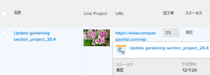

# 表示：列に文字列ではなく画像を表示

テキストモードを使用して、ビュー内のオブジェクトの名前を画像に置き換えることができます。また、置き換えるオブジェクトを開くためのリンクを画像に追加できます。

>[!NOTE]
>
>画像は実際の解像度で表示されるので、小さな画像を使用してください。



## アクセス要件

この記事の手順を実行するには、次のアクセス権が必要です。

<table style="table-layout:auto"> 
 <col> 
 <col> 
 <tbody> 
  <tr> 
   <td role="rowheader">Adobe Workfront プラン*</td> 
   <td> <p>任意</p> </td> 
  </tr> 
  <tr> 
   <td role="rowheader">Adobe Workfront ライセンス*</td> 
   <td> <p>表示の変更をリクエスト </p>
   <p>レポートを変更するためのプラン</p> </td> 
  </tr> 
  <tr> 
   <td role="rowheader">アクセスレベル設定*</td> 
   <td> <p>レポート、ダッシュボード、カレンダーへのアクセス権を編集して、レポートを変更できるようにします。</p> <p>フィルター、表示、グループ化へのアクセス権を編集して、表示を変更できるようにします。</p> <p><b>メモ</b>

まだアクセス権がない場合は、Workfront 管理者に問い合わせて、アクセスレベルに追加の制限が設定されているかどうかを確認してください。Workfront 管理者がアクセスレベルを変更する方法について詳しくは、<a href="../../../administration-and-setup/add-users/configure-and-grant-access/create-modify-access-levels.md" class="MCXref xref">カスタムアクセスレベルの作成または変更</a>を参照してください。</p> </td>
</tr> 
  <tr> 
   <td role="rowheader">オブジェクト権限</td> 
   <td> <p>レポートに対する権限を管理します。</p> <p>追加のアクセス権のリクエストについて詳しくは、<a href="../../../workfront-basics/grant-and-request-access-to-objects/request-access.md" class="MCXref xref">オブジェクトへのアクセス権のリクエスト</a>を参照してください。</p> </td> 
  </tr> 
 </tbody> 
</table>

&#42;保有するプラン、ライセンスタイプ、アクセス権を確認するには、Workfront 管理者に問い合わせてください。

## 例：プロジェクトビュー内のプロジェクトの名前を画像に置き換える。

1. Web サイトまたは Adobe Workfront 外部サーバーに画像をアップロードします。Web ブラウザーを使用して画像にアクセスできる必要があります。

   >[!TIP]
   >
   >* ブラウザーのタイプはそれぞれ異なりますが、すべて URL を表示できます。
   >* Workfront にアップロードされた画像は使用しないでください。Workfront に保存された画像は一般に使用できず、一定期間後に有効期限が切れるアクセスキーを持つので、時間の経過と共に、これらの画像はビューに表示されなくなります。
   >* お使いのコンピューターに保存された画像に固有の URL がありません。画像のホスティングを提供し、画像をホストするサイトを見つけます。組織は既にそのようなサイトを持っている可能性があります。

1. Web ブラウザーを使用して、保存した画像に移動します。
1. 次の手順を実行して、画像の URL を取得します。

   <!--
   <p data-mc-conditions="QuicksilverOrClassic.Draft mode">(NOTE: I used this blog post to document what kind of image we need for this: https://www.canto.com/blog/image-url/ (consulting uses this)) </p>
   -->

   1. ブラウザーに応じて「**画像の場所をコピー**」または「**リンクを取得**」を右クリックして選択します。これで、その特定の画像の URL が取得され、クリップボードから貼り付けることができます。
   1. そのリンクを持つユーザー全員がリンクに移動するだけで画像を表示する権限を持ち、そのリンクにアクセスするためにログインする必要がないことを確認します。

1. プロジェクトに移動し、プロジェクト名の横にある&#x200B;**その他**&#x200B;メニュー 、「**編集**」の順にクリックします。

1. 「**URL**」フィールドで、画像にリンクを追加します。
1. リストまたはレポートのプロジェクトビューに移動し、そのビューをカスタマイズします。
1. **プロジェクト名**&#x200B;の列の見出しをクリックし、次に「**テキストモードに切り替え**」をクリックします。

1. 既存のコードの列に次のコードを追加します。

   ```
   displayname=Link Project
   ```

   ```
   image.name=Link Project
   ```

   ```
   image.valuefield=URL
   ```

   ```
   link.linkproperty.0.name=projectID
   ```

   ```
   link.linkproperty.0.value=ID
   ```

   ```
   link.lookup=link.edit
   ```

   ```
   link.page=/view
   ```

   ```
   link.valuefield=objCode
   ```

   ```
   link.valueformat=val
   ```

   ```
   textmode=true
   ```

   ```
   type=image
   ```

   ```
   valueformat=
   ```

   選択したイメージは、プロジェクトビューのプロジェクト名に置き換えられ、そのイメージはプロジェクトへのリンクになります。

1. 「**ビューを保存**」をクリックします。
