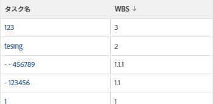

# 表示：タスクリストにタスクのインデントを表示

このタスクビューでは、[ タスク名 ] 列にコードを追加して、プロジェクトの [ 作業内容の分類構造 ] に従ってインデントされたタスクを表示できます。



## アクセス要件

この記事の手順を実行するには、次のアクセス権が必要です。

<table style="table-layout:auto"> 
 <col> 
 <col> 
 <tbody> 
  <tr> 
   <td role="rowheader">Adobe Workfront plan*</td> 
   <td> <p>任意</p> </td> 
  </tr> 
  <tr> 
   <td role="rowheader">Adobe Workfront license*</td> 
   <td> <p>ビューの変更をリクエスト </p>
   <p>レポートの変更計画</p> </td> 
  </tr> 
  <tr> 
   <td role="rowheader">アクセスレベル設定*</td> 
   <td> <p>レポート、ダッシュボード、カレンダーへのアクセスを編集して、レポートを変更します</p> <p>フィルター、ビュー、グループへのアクセスを編集してビューを変更します</p> <p><b>メモ</b>

まだアクセス権がない場合は、Workfront管理者に、アクセスレベルに追加の制限を設定しているかどうかを問い合わせてください。 Workfront管理者がアクセスレベルを変更する方法について詳しくは、 <a href="../../../administration-and-setup/add-users/configure-and-grant-access/create-modify-access-levels.md" class="MCXref xref">カスタムアクセスレベルの作成または変更</a>.</p> </td>
</tr> 
  <tr> 
   <td role="rowheader">オブジェクト権限</td> 
   <td> <p>レポートに対する権限の管理</p> <p>追加のアクセス権のリクエストについて詳しくは、 <a href="../../../workfront-basics/grant-and-request-access-to-objects/request-access.md" class="MCXref xref">オブジェクトへのアクセスのリクエスト </a>.</p> </td> 
  </tr> 
 </tbody> 
</table>

&#42;保有しているプラン、ライセンスの種類、アクセス権を確認するには、Workfront管理者に問い合わせてください。

## タスクリストの列にタスクのインデントを表示

1. タスクのリストに移動します。
1. 次の **表示** ドロップダウンメニューで、 **新しいビュー**.

1. クリック **列を追加** をクリックし、 **この列に表示** フィールドを選択し、リストに表示されるタイミングで選択します。

1. 新しい列で、 **テキストモードに切り替え**.
1. テキストモード領域の上にマウスポインターを置いて、 **クリックしてテキストを編集**.
1. 検索したテキストを

   ```
   valuefield=
   ```

   行を編集し、次のコードに置き換えます。

   ```
   valueexpression=IF({indent}<1,{name},IF({indent}<2,CONCAT(' - ',{name}),IF({indent}<3,CONCAT(' - - ',{name}),IF({indent}<4,CONCAT(' - - - ',{name}),CONCAT(' - - - - ',{name})))))
   ```

1. クリック **保存**&#x200B;を、 **ビューを保存**.
