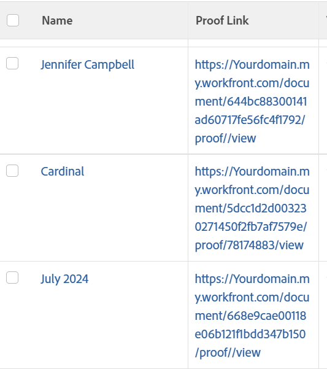

# ビュー：プルーフへのリンクを含むドキュメントレポート

<!--Audited: 11/2024-->

このドキュメントビューでは、ドキュメントの現在のバージョンのプルーフへのリンクを挿入できます。



## アクセス要件

+++ 展開すると、この記事の機能のアクセス要件が表示されます。 

<table style="table-layout:auto"> 
 <col> 
 <col> 
 <tbody> 
  <tr> 
   <td role="rowheader">Adobe Workfront パッケージ</td> 
   <td> <p>任意</p> </td> 
  </tr> 
  <tr> 
   <td role="rowheader">Adobe Workfront プラン</td> 
   <td> 
   <p>フィルターの変更をコントリビューターまたはリクエスト </p>
   <p>レポートを変更するための「標準」または「プラン」</p>
  </tr> 
  <tr> 
   <td role="rowheader">アクセスレベル設定</td> 
   <td> <p>レポート、ダッシュボード、カレンダーへのアクセス権を編集して、レポートを変更できるようにします。</p> <p>フィルターを変更する場合は、フィルター、ビュー、グループ化への編集アクセス権</p> </td> 
  </tr> 
  <tr> 
   <td role="rowheader">オブジェクト権限</td> 
   <td> <p>レポートに対する権限を管理します。</p>  </td> 
  </tr> 
 </tbody> 
</table>

この表の情報について詳しくは、[Workfront ドキュメントのアクセス要件](/help/quicksilver/administration-and-setup/add-users/access-levels-and-object-permissions/access-level-requirements-in-documentation.md)を参照してください。

+++

## プルーフへのリンクを含んだドキュメントレポートを表示

この表示を適用するには次の操作を行います。

1. ドキュメントのリストに移動します。
1. **表示**&#x200B;ドロップダウンメニューから、**新規ビュー**&#x200B;を選択します。
1. 「**列を追加**」をクリックします。
1. **[テキストモードに切り替える]**&#x200B;をクリックし、**[テキストモードの編集]**&#x200B;をクリックします。
1. **[テキストモードの編集]**&#x200B;ボックスで見つかったテキストを削除し、次のコードで置き換えます：

   ```
   displayname=Proof Link
   shortview=true
   textmode=true
   valueexpression=CONCAT("https://Your domain.my.workfront.com/document/",{currentVersion}.{ID},"/proof/",{currentVersion}.{proofID},"/view")
   valueformat=HTML
   ```

   >[!TIP]
   >
   >「Your domain」を実際の Workfront ドメインに置き換えます。例えば、会社の Workfront URL が *Company.my.workfront.com* の場合、ドメインは「Company」です。

1. 「**完了**」をクリックしてから、「**ビューを保存**」をクリックします。
1. （オプション）ビュー名を更新し、**[ビューの保存]**&#x200B;をクリックします。
1. （オプション）プルーフを含んだドキュメントのみを表示するには、次の手順に従ってフィルターを追加します。

   1. **フィルター**&#x200B;ドロップダウンメニューをクリックし、次に「**新規フィルター**」をクリックします。
   1. **[フィルタールールの追加]**&#x200B;をクリックして「所有者の証明」と入力し、一覧に表示されたら&#x200B;**所有者IDの証明**&#x200B;を選択します。
   1. フィルター修飾子に「**ブランクでない**」を選択します。
   1. 「**フィルターの保存**」をクリックします。
   1. （オプション）フィルター名を更新し、**[フィルターの保存]**&#x200B;をクリックします。

1. 「プルーフ リンク」列のリンクをクリックして、ドキュメントの最後のバージョンのプルーフにアクセスします。
