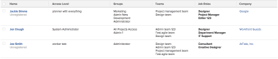

# ビュー：ユーザーの詳細の展開

このユーザービューでは、ユーザーに関する情報が表示されます。名前、アクセスレベル、会社に加えて、グループ、チーム、担当業務のリストが表示されます。

## アクセス要件

この記事の手順を実行するには、次のアクセス権が必要です。

<table style="table-layout:auto"> 
 <col> 
 <col> 
 <tbody> 
  <tr> 
   <td role="rowheader">Adobe Workfront プラン*</td> 
   <td> 
任意
 </td> 
  </tr> 
  <tr> 
   <td role="rowheader">Adobe Workfront ライセンス*</td> 
   <td> 
表示の変更をリクエスト 

   
レポートを変更するためのプラン
 </td> 
  </tr> 
  <tr> 
   <td role="rowheader">アクセスレベル設定*</td> 
   <td> 
レポート、ダッシュボード、カレンダーへのアクセス権を編集して、レポートを変更できるようにします。
 
フィルター、表示、グループ化へのアクセス権を編集して、表示を変更できるようにします。
 
<b>メモ</b>

まだアクセス権がない場合は、Workfront 管理者に問い合わせて、アクセスレベルに追加の制限が設定されているかどうかを確認してください。Workfront 管理者がアクセスレベルを変更する方法について詳しくは、<a href="../../../administration-and-setup/add-users/configure-and-grant-access/create-modify-access-levels.md" class="MCXref xref">カスタムアクセスレベルの作成または変更</a>を参照してください。
 </td>
</tr> 
  <tr> 
   <td role="rowheader">オブジェクト権限</td> 
   <td> 
レポートに対する権限を管理します。
 
追加のアクセス権のリクエストについて詳しくは、<a href="../../../workfront-basics/grant-and-request-access-to-objects/request-access.md" class="MCXref xref">オブジェクトへのアクセス権のリクエスト</a>を参照してください。
 </td> 
  </tr> 
 </tbody> 
</table>

&#42;保有するプラン、ライセンスタイプ、アクセス権を確認するには、Workfront 管理者に問い合わせてください。

## ユーザーの詳細の展開を表示

この表示を適用するには次の操作を行います。

1. ユーザーのリストに移動します。
1. **表示**&#x200B;ドロップダウンメニューから、**新規表示**&#x200B;を選択します。

1. **列のプレビュー**&#x200B;エリアで、1 つを除くすべての列を削除します。
1. 残りの列のヘッダーをクリックし、「**テキストモードに切り替え**」を選択します。
1. テキストモードエリアにカーソルを置き、「**クリックしてテキストを編集**」をクリックします。
1. 「**テキストモード**」ボックスにあるテキストを削除し、次のコードに置き換えます。

   <!--
   <MadCap:conditionalText data-mc-conditions="QuicksilverOrClassic.Draft mode">
   (NOTE: extra tag here that adds extra spaces in Preview)
   </MadCap:conditionalText>
   -->

   <pre>column.0.descriptionkey=name  column.0.link.linkproperty.0.name=ID column.0.link.linkproperty.0.valuefield=ID column.0.link.linkproperty.0.valueformat=int column.0.link.lookup=link.view column.0.link.valuefield=objCode column.0.link.valueformat=val column.0.linkedname=direct column.0.listsort=string(name) column.0.namekey=name.abbr column.0.querysort=name column.0.shortview=false column.0.stretch=0 column.0.valuefield=name column.0.valueformat=HTML column.0.width=150 column.1.descriptionkey=accesslevel column.1.link.linkproperty.0.name=ID column.1.link.linkproperty.0.valuefield=accessLevel:ID column.1.link.linkproperty.0.valueformat=int column.1.link.lookup=link.view column.1.link.valuefield=accessLevel:objCode column.1.link.valueformat=val column.1.linkedname=accessLevel column.1.listsort=string(displayName) column.1.namekey=accesslevel column.1.querysort=name column.1.shortview=false column.1.stretch=0 column.1.valuefield=accessLevel:displayName column.1.valueformat=HTML column.1.viewalias=accessLevel:displayName column.1.width=100 column.2.link.linkproperty.0.name=ID column.2.link.linkproperty.0.valuefield=ID column.2.link.linkproperty.0.valueformat=int column.2.link.lookup=link.view column.2.link.value=val(objCode) column.2.listdelimiter= column.2.listmethod=nested(userGroups).lists column.2.namekey=group.plural column.2.stretch=50 column.2.type=iterate column.2.valuefield=group:name column.2.valueformat=HTML column.2.width=150 column.3.displayname=Teams column.3.listdelimiter= column.3.listmethod=nested(teams).lists column.3.textmode=true column.3.type=iterate column.3.valueexpression={name} column.3.valueformat=HTML column.4.link.linkproperty.0.name=ID column.4.link.linkproperty.0.valuefield=ID column.4.link.linkproperty.0.valueformat=int column.4.link.lookup=link.view column.4.link.value=val(objCode) column.4.listdelimiter= column.4.listmethod=nested(userRoles).lists column.4.namekey=jobrole.plural column.4.stretch=50 column.4.type=iterate column.4.valuefield=role:name column.4.valueformat=HTML column.4.width=150 column.5.descriptionkey=company column.5.link.linkproperty.0.name=ID column.5.link.linkproperty.0.valuefield=company:ID column.5.link.linkproperty.0.valueformat=int column.5.link.lookup=link.view column.5.link.valuefield=company:objCode column.5.link.valueformat=val column.5.linkedname=company column.5.listsort=nested(company).string(name) column.5.namekey=company column.5.querysort=company:name column.5.shortview=false column.5.stretch=0 column.5.valuefield=company:name column.5.valueformat=HTML column.5.width=150</pre>

1. 「**ビューを保存**」をクリックします。
