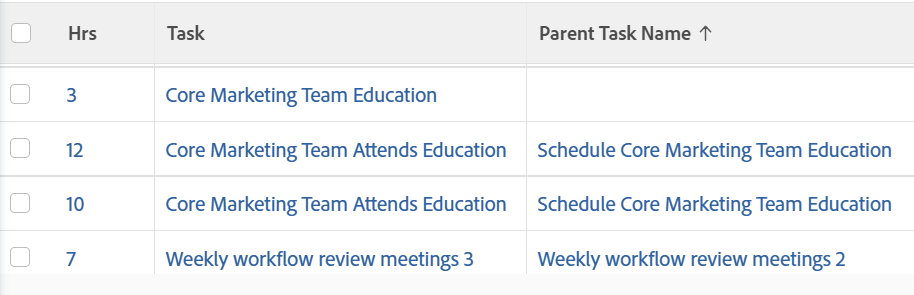

# 表示：親タスク情報の時間

この時間ビューには、時間が記録されたタスクの名前と親タスクの名前が表示されます。

## アクセス要件

この記事の手順を実行するには、次のアクセス権が必要です。

<table style="table-layout:auto"> 
 <col> 
 <col> 
 <tbody> 
  <tr> 
   <td role="rowheader">Adobe Workfront plan*</td> 
   <td> 
任意
 </td> 
  </tr> 
  <tr> 
   <td role="rowheader">Adobe Workfront license*</td> 
   <td> 
ビューの変更をリクエスト 

   
レポートの変更計画
 </td> 
  </tr> 
  <tr> 
   <td role="rowheader">アクセスレベル設定*</td> 
   <td> 
レポート、ダッシュボード、カレンダーへのアクセスを編集して、レポートを変更します
 
フィルター、ビュー、グループへのアクセスを編集してビューを変更します
 
<b>メモ</b>

まだアクセス権がない場合は、Workfront管理者に、アクセスレベルに追加の制限を設定しているかどうかを問い合わせてください。 Workfront管理者がアクセスレベルを変更する方法について詳しくは、 <a href="../../../administration-and-setup/add-users/configure-and-grant-access/create-modify-access-levels.md" class="MCXref xref">カスタムアクセスレベルの作成または変更</a>.
 </td>
</tr>  
  <tr> 
   <td role="rowheader">オブジェクト権限</td> 
   <td> 
レポートに対する権限の管理
 
追加のアクセス権のリクエストについて詳しくは、 <a href="../../../workfront-basics/grant-and-request-access-to-objects/request-access.md" class="MCXref xref">オブジェクトへのアクセスのリクエスト </a>.
 </td> 
  </tr> 
 </tbody> 
</table>

&#42;保有しているプラン、ライセンスの種類、アクセス権を確認するには、Workfront管理者に問い合わせてください。

## 時間と親タスク情報を表示

1. 時間のリストに移動します。
1. 次の **表示** ドロップダウンメニューで、「 **新しいビュー**.

1. 内&#x200B;**列のプレビュー** 領域を選択し、1 つ以外のすべての列を削除します。
1. 残りの列のヘッダーをクリックし、 **テキストモードに切り替え**.
1. テキストモード領域の上にマウスを移動し、 **クリックしてテキストを編集**.
1. 検索したテキストを **テキストモード** 」ボックスに置き換えて、次のコードに置き換えます。
   <pre>column.0.aggregator.displayformat=doubleAsString column.0.aggregator.function=SUM column.0.aggregator.namekey=hours column.0.aggregator.valuefield=hours column.0.aggregator.valueformat=doubleAsDouble column.0.descriptionkey=hours column.0.link.linkproperty.0.name=ID column.0.link.linkproperty.0.valuefield=ID column.0.link.linkproperty.0.valueformat=int column.0.link.lookup=link.view column.0.link.valuefield=objCode column.0.link.valueformat=val column.0.linkedname=direct column.0.listsort=doubleAsDouble(hours) column.0.namekey=hours.abbr column.0.querysort=hours column.0.shortview=false column.0.stretch=100 column.0.valuefield=hours column.0.valueformat=doubleAsString column.0.width=150 column.1.descriptionkey=task column.1.link.linkproperty.0.name=ID column.1.link.linkproperty.0.valuefield=task:ID column.1.link.linkproperty.0.valueformat=int column.1.link.lookup=link.view column.1.link.valuefield=task:objCode column.1.link.valueformat=val column.1.linkedname=task column.1.listsort=nested(task).string(name) column.1.namekey=task column.1.querysort=task:name column.1.shortview=false column.1.stretch=0 column.1.valuefield=task:name column.1.valueformat=HTML column.1.width=150 column.2.description=親タスク名 column.2.link.linkproperty.0.name=ID column.2.link.linkproperty.0.valuefield=task:parent:ID column.2.link.linkproperty.0.valueformat=int column.2.link.lookup=link.view column.2.link.valuefield=task:objCode column.2.link.valueformat=val column.2.linkedname=task column.2.listsort=nested(task:parent).string(name) column.2.name=親タスク名 column.2.querysort=task:parent:名前 column.2.shortview=false column.2.stretch=0 column.2.valuefield=task:parent:名前 column.2.valueformat=HTML column.2.width=150</pre>

1. クリック **ビューを保存**.
