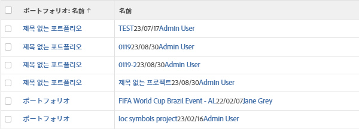
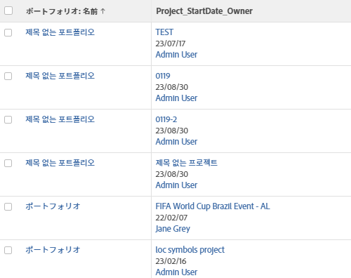

# 表示：1 つの共有列の複数の列から情報を結合

<!-- Audited: 1/2024 -->

複数の異なる列に表示される情報を結合し、1 つの共有列に表示できます。

## アクセス要件

この記事の手順を実行するには、次のアクセス権が必要です。

<table style="table-layout:auto"> 
 <col> 
 <col> 
 <tbody> 
  <tr> 
   <td role="rowheader">Adobe Workfrontプラン</td> 
   <td> 
任意
 </td> 
  </tr> 
  <tr> 
   <td role="rowheader">Adobe Workfrontライセンス</td> 
   <td> 
 現在： 
   <ul>
   <li>ビューの変更をリクエスト</li> 
   <li>レポートを変更する計画</li>
   </ul>
     

     
 新規： 
   <ul>
   <li>ビューを変更する寄稿者</li> 
   <li>レポートを変更するための標準</li>
   </ul>
     

    </td> 
  </tr> 
  <tr> 
   <td role="rowheader">アクセスレベル設定*</td> 
   <td> 
レポート、ダッシュボード、カレンダーへのアクセスを編集して、レポートを変更します
 
フィルター、ビュー、グループへのアクセスを編集してビューを変更します
 </td> 
  </tr> 
  <tr> 
   <td role="rowheader">オブジェクトの権限</td> 
   <td> 
レポートに対する権限の管理
 </td> 
  </tr> 
 </tbody> 
</table>

この表の情報の詳細については、 [Workfrontドキュメントのアクセス要件](/help/quicksilver/administration-and-setup/add-users/access-levels-and-object-permissions/access-level-requirements-in-documentation.md).

## 列を共有または結合する際の考慮事項

* 隣接する 2 つの列を結合して、改行で区切られた各列の情報を表示するか、隣接する 2 つの列に情報を結合して、各列の情報を区切らずに表示できます。
* この記事で説明する同じ構文を既に共有されている列と隣接する列に適用すると、2 つ以上の列の情報を結合できます。
* The `valueformat=HTML` 行は共有列で必須です。 そうしないと、レポートがAdobe Workfrontからエクスポートされる際に、列に情報が含まれません（空白になります）。
* 条件付き書式は、結合された列ではサポートされない場合があります。

  次の例外が存在します。

   * Workfrontで情報を表示する場合、結合された列を構成する列の形式が互いに異なる場合、最初の列の形式は維持され、他のすべての列の形式は無視されます。
   * ビューをPDFファイルにエクスポートする場合、条件付き書式はマージされた列の最初の列に適用されます。
   * ビューを Excel ファイルにエクスポートする場合、マージされた列は別々の列として表示されます。 個々の列には、それぞれの条件付き書式ルールも表示されます。

* 次を含む列： **viewalias** 属性は、結合できる列の数を制限できます。 これらの制限を回避するには、 **viewalias** 属性。 次を含める必要がある場合、 **viewalias** 属性を指定し、それが列の最後の項目であることを確認します。

* 共有列を含むリストを Excel またはタブ区切り形式で書き出す場合、これらの列は書き出されたファイル内に分割されます。

* いずれかの列または両方に `tile` 「 」フィールドを指定すると、強制改行がマージされた列に自動的に挿入されます。 例えば、書式設定が適用されたテキストフィールドは次のようになります。 `tile` フィールドを入力します。 この場合、 `type=tile` （テキストモードで列を表示する場合）

## 改行のない 2 つの列のデータを結合する

複数の異なる列のデータを結合して、各列の値の間に改行やスペースを入れずに 1 つの列に表示できます。

>[!TIP]
>
>同じレコードの値を同時に表示できない 2 つの列を結合する場合は、この方法をお勧めします。 たとえば、作業項目レポートでは、[ タスク名 ] 列と [ タスク名 ] 列を結合できます。これは、作業項目には [ タスク名 ] と [ タスク名 ] を同時に含めることができないためです。 作業項目は、Workfrontの [ タスク ] または [ タスク ] にすることができます。

改行のない 2 つの列のデータを結合するには、次の手順を実行します。

1. ビューのテキストモードを使用して、結合する最初の列に次のテキストを追加します。

   `sharecol=true`

   リストまたはレポートの最初の 2 列を結合すると、最初の列のオブジェクトに関する情報を含むテキストの各行の前に、Workfrontが `column.0.` 2 列目に関する情報を含むテキスト行 `column.1.` .

   最初の列の列番号の前に、その列の番号を付ける必要があります。 列のカウントは、常に、というラベルの付いたリストまたはレポートの左端の列から開始します。 `column.0.`.

   複数の列を共有する場合は、各列の共有情報を含むコード行に列番号を必ず追加してください。

   **例：** 次に、リストの 2 列目から始まる、3 つの異なる列を含む結合された列のテキストモードコードを示します。 マージされた値は、プロジェクト名、計画開始日およびプロジェクト所有者の名前で、次の 3 つの値の間に区切りはありません。

   `column.1.valuefield=name`

   `column.1.valueformat=HTML`

   `column.1.sharecol=true`

   `column.2.valuefield=plannedStartDate`

   `column.2.valueformat=atDate`

   `column.2.sharecol=true`

   `column.3.valuefield=owner:name`

   `column.3.valueformat=HTML`

1. クリック **保存**&#x200B;を、 **ビューを保存**.

## 改行付きの 2 列のデータを結合する

複数の列のデータを結合して、1 つの共通列に表示し、各列の値を改行するには、次の手順を実行します。

1. 結合する 2 つの列の間に 3 番目の列を追加します。

   >[!TIP]
   >
   >* 結合する列は、互いに隣接している必要があります。
   >* 結合する最初の列をクリックする必要があります。

1. クリック **テキストモードに切り替え** をクリックし、手順 1 で追加した中央の列に次のコードを追加します。

   `value= `

   `valueformat=HTML`

   `width=1`

   `sharecol=true`

1. 最初の列をクリックし、 **テキストモードに切り替え**&#x200B;次に、列に次のテキストを追加します。

   `sharecol=true`

   リストまたはレポートの最初の 2 列を結合すると、最初の列のオブジェクトに関する情報を含むテキストの各行の前に、Workfrontが `column.0.`（との共有情報を含む） `column.1.`、および 2 番目の列に関する情報を含むテキスト行 `column.2.`.

   組み合わせ列がビューの中央にある場合は、ビュー内の位置に応じて列に番号が付けられます。 列のカウントは、常に、というラベルの付いたリストまたはレポートの左端の列から開始します。 `column.0.`.

   複数の列を共有する場合は、共有情報を含むコード行に列番号を必ず追加してください。

   **例：** 次に、プロジェクト名、計画開始日、および改行付きのプロジェクト所有者名を含む共有列のテキストモードコードを示します。 共有列は、プロジェクトビューの 2 番目の列です。

   `column.1.displayname=Project_StartDate_Owner`

   `column.1.sharecol=true`

   `column.1.textmode=true`

   `column.1.valuefield=name`

   `column.1.valueformat=HTML`

   `column.2.value= `

   `column.2.width=1`

   `column.2.valueformat=HTML`

   `column.2.sharecol=true`

   `column.3.valuefield=plannedStartDate`

   `column.3.valueformat=atDate`

   `column.3.sharecol=true`

   `column.4.value= `

   `column.4.width=1`

   `column.4.valueformat=HTML`

   `column.4.sharecol=true`

   `column.5.textmode=true`

   `column.5.valuefield=owner:name`

   `column.5.valueformat=HTML`

   

1. クリック **保存**&#x200B;を、 **ビューを保存**.
