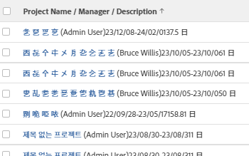

# 表示：複数行のプロジェクトビュー

このプロジェクトビューでは、次の操作を実行できます。

* プロジェクト情報を複数行の形式で表示します。\
   このビューでは、

   ```
   sharecol=true
   ```

   タグを使用して、同じ列ヘッダーの下にある複数のフィールドを組み合わせることができます。 このタグについて詳しくは、 [表示：1 つの共有列の複数の列から情報を結合](../../../reports-and-dashboards/reports/custom-view-filter-grouping-samples/view-merge-columns.md).

* プレースホルダー列を使用して、HTML改行タグ (

   ```
   <br>
   ```

   ) をクリックして、例えばプロジェクト名の下に説明を強制的に表示します。
* プロジェクト名の後の丸括弧でプロジェクト所有者を表示します。
* プロジェクト名をプロジェクトへのリンクとして表示します。



## アクセス要件

この記事の手順を実行するには、次のアクセス権が必要です。

<table style="table-layout:auto"> 
 <col> 
 <col> 
 <tbody> 
  <tr> 
   <td role="rowheader">Adobe Workfront plan*</td> 
   <td> <p>任意</p> </td> 
  </tr> 
  <tr> 
   <td role="rowheader">Adobe Workfront license*</td> 
   <td> <p>計画 </p> </td> 
  </tr> 
  <tr> 
   <td role="rowheader">アクセスレベル設定*</td> 
   <td> <p>レポート、ダッシュボード、カレンダーへのアクセスを編集</p> <p>フィルター、ビュー、グループへのアクセスを編集</p> <p>注意：まだアクセス権がない場合は、Workfront管理者に、アクセスレベルに追加の制限を設定しているかどうかを問い合わせてください。 Workfront管理者がアクセスレベルを変更する方法について詳しくは、 <a href="../../../administration-and-setup/add-users/configure-and-grant-access/create-modify-access-levels.md" class="MCXref xref">カスタムアクセスレベルの作成または変更</a>.</p> </td> 
  </tr> 
  <tr> 
   <td role="rowheader">オブジェクト権限</td> 
   <td> <p>レポートに対する権限の管理</p> <p>追加のアクセス権のリクエストについて詳しくは、 <a href="../../../workfront-basics/grant-and-request-access-to-objects/request-access.md" class="MCXref xref">オブジェクトへのアクセスのリクエスト </a>.</p> </td> 
  </tr> 
 </tbody> 
</table>

&#42;保有しているプラン、ライセンスの種類、アクセス権を確認するには、Workfront管理者に問い合わせてください。

## 複数行のプロジェクトビューの作成

1. 新しいプロジェクトビューを作成します。 新しいビューの作成方法について詳しくは、 [Adobe Workfrontの概要を表示](../../../reports-and-dashboards/reports/reporting-elements/views-overview.md).
1. ビューの作成時に、1 つを除くすべての列を削除します。
1. 残りの列を選択し、 **テキストモードに切り替え**.
1. 以下のテキストモードをコピーして列内に貼り付けます。
   <pre>column.0.linkedname=direct<br>column.0.link.valueformat=val<br>column.0.link.linkproperty.0.name=ID<br>column.0.link.linkproperty.0.valuefield=ID<br>column.0.link.linkproperty.0.valueformat=int<br>column.0.link.valuefield=objCode<br>column.0.link.lookup=link.view<br>column.0.sharecol=true<br>column.0.descriptionkey=name<br>column.0.width=150<br>column.0.querysort=name<br>column.0.valuefield=name<br>column.0.name=プロジェクト名/マネージャ/説明<br>column.0.shortview=false<br>column.0.stretch=100<br>column.0.textmode=true<br>column.0.listsort=string(name)<br>column.0.valueformat=HTML<br>column.1.valueexpression=CONCAT(" (",{owner}.{name},")")<br>column.1.listsort=nested(owner).string(name)<br>column.1.width=1<br>column.1.linkedname=direct<br>column.1.querysort=owner:name<br>column.1.textmode=true<br>column.1.shortview=false<br>column.1.stretch=0<br>column.1.valueformat=HTML<br>column.1.sharecol=true<br>column.2.width=1<br>column.2.value=<br><br>column.2.shortview=false<br>column.2.sharecol=true<br>column.2.stretch=0<br>column.2.textmode=true<br>column.2.valueformat=HTML<br>column.3.styledef.style=font-color:#ccc;<br>column.3.descriptionkey=description<br>column.3.linkedname=direct<br>column.3.valuefield=description<br>column.3.listsort=string(description)<br>column.3.querysort=description<br>column.3.namekey=description.abbr<br>column.3.textmode=true<br>column.3.sharecol=true<br>column.3.stretch=0<br>column.3.shortview=false<br>column.3.valueformat=HTML<br>column.3.width=1<br>column.4.shortview=false<br>column.4.value=<br><br>column.4.sharecol=true<br>column.4.width=1<br>column.4.textmode=true<br>column.4.valueformat=HTML\<br>column.4.stretch=0<br>column.5.name=計画日/期間<br>column.5.width=150<br>column.5.querysort=plannedStartDate<br>column.5.sharecol=true<br>column.5.stretch=0<br>column.5.textmode=true<br>column.5.shortview=false<br>column.5.linkedname=direct<br>column.5.listsort=atDateAsAtDate(plannedStartDate)<br>column.5.valuefield=plannedStartDate<br>column.5.valueformat=atDate<br>column.6.sharecol=true<br>column.6.stretch=0<br>column.6.width=1<br>column.6.textmode=true<br>column.6.value=-<br>column.6.valueformat=HTML<br>column.6.shortview=false<br>column.7.namekey=plannedcompletiondate.abbr<br>column.7.width=1<br>column.7.sharecol=true<br>column.7.shortview=false<br>column.7.stretch=0<br>column.7.listsort=atDateAsAtDate(plannedCompletionDate)<br>column.7.linkedname=direct<br>column.7.descriptionkey=plannedcompletiondate<br>column.7.textmode=true<br>column.7.querysort=plannedCompletionDate<br>column.7.valueformat=atDate<br>column.7.valuefield=plannedCompletionDate<br>column.8.value=<br><br>column.8.width=1<br>column.8.textmode=true<br>column.8.sharecol=true<br>column.8.valueformat=HTML<br>column.8.stretch=0<br>column.9.textmode=true<br>column.9.listsort=intAsInt(durationMinutes)<br>column.9.stretch=0<br>column.9.valuefield=durationFieldLong<br>column.9.descriptionkey=duration<br>column.9.viewalias=duration<br>column.9.querysort=durationMinutes<br>column.9.sharecol=true<br>column.9.width=100<br>column.9.shortview=false<br>column.9.namekey=duration.abbr<br>column.9.linkedname=direct<br>column.9.valueformat=compound<br>column.10.textmode=true<br>column.10.stretch=0</pre>

1. クリック **ビューを保存**.
