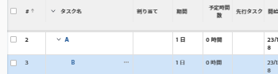

# 表示：タスクをインデントして、タスク内に親子関係を表示する

タスクリストにカスタムビューを追加し、リストをエクスポートする前にこのビューが選択されていることを確認することで、エクスポートしたタスクリストで親と子の関係の区別を維持できます。



## アクセス要件

この記事の手順を実行するには、次のアクセス権が必要です。

<table style="table-layout:auto"> 
 <col> 
 <col> 
 <tbody> 
  <tr> 
   <td role="rowheader">Adobe Workfront plan*</td> 
   <td> <p>任意</p> </td> 
  </tr> 
  <tr> 
   <td role="rowheader">Adobe Workfront license*</td> 
   <td> <p>ビューの変更をリクエスト </p>
   <p>レポートの変更計画</p> </td> 
  </tr> 
  <tr> 
   <td role="rowheader">アクセスレベル設定*</td> 
   <td> <p>レポート、ダッシュボード、カレンダーへのアクセスを編集して、レポートを変更します</p> <p>フィルター、ビュー、グループへのアクセスを編集してビューを変更します</p> <p><b>メモ</b>

まだアクセス権がない場合は、Workfront管理者に、アクセスレベルに追加の制限を設定しているかどうかを問い合わせてください。 Workfront管理者がアクセスレベルを変更する方法について詳しくは、 <a href="../../../administration-and-setup/add-users/configure-and-grant-access/create-modify-access-levels.md" class="MCXref xref">カスタムアクセスレベルの作成または変更</a>.</p> </td>
</tr>  
  <tr> 
   <td role="rowheader">オブジェクト権限</td> 
   <td> <p>レポートに対する権限の管理</p> <p>追加のアクセス権のリクエストについて詳しくは、 <a href="../../../workfront-basics/grant-and-request-access-to-objects/request-access.md" class="MCXref xref">オブジェクトへのアクセスのリクエスト </a>.</p> </td> 
  </tr> 
 </tbody> 
</table>

&#42;保有しているプラン、ライセンスの種類、アクセス権を確認するには、Workfront管理者に問い合わせてください。

## タスクをインデントして、タスク内に親子関係を表示します

1. 書き出すタスクリストが含まれるプロジェクトに移動します。
1. 次をクリック： **表示** ドロップダウンメニューで、 **新しいビュー**.

1. 画面の左上隅でフィルターに名前を付けます。
1. をクリックします。 **タスク名** 列ヘッダー。

1. 選択 **テキストモードに切り替え** をクリックします。
1. テキストボックス内の任意の場所をクリックして、テキストを編集し、既存のテキストをすべて削除します。
1. 次のテキストを貼り付けます。

   ```
   displayname=<br>linkedname=direct<br>namekey=name<br>querysort=name<br>textmode=true<br>valueexpression=IF({indent}<1,{name},IF({indent}<2,CONCAT(" - ",{name}),IF({indent}<3,CONCAT(" - - ",{name}),IF({indent}<4,CONCAT(" - - - ",{name}),CONCAT(" - - - - ",{name})))))<br>valueformat=HTML
   ```

1. 「**保存**」をクリックします。
1. クリック **ビューを保存**.
