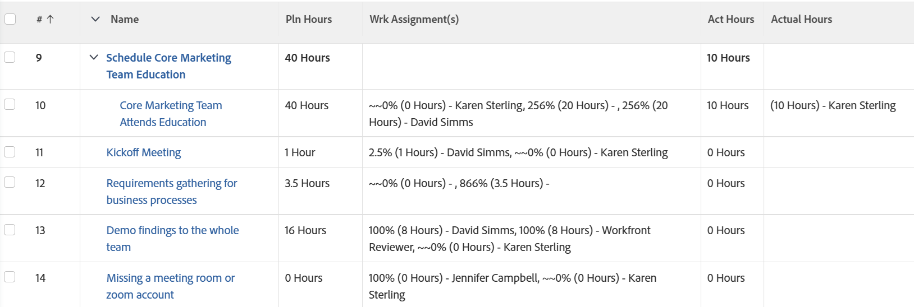

# 表示：タスクビューの割り当てあたりの計画時間数と実績時間数

このタスクビューには、タスクの計画時間の合計、各担当者に割り当てられた計画時間の数、実績時間の合計、各担当者が記録した実績時間の数が表示されます。



## アクセス要件

この記事の手順を実行するには、次のアクセス権が必要です。

<table style="table-layout:auto"> 
 <col> 
 <col> 
 <tbody> 
  <tr> 
   <td role="rowheader">Adobe Workfront plan*</td> 
   <td> <p>任意</p> </td> 
  </tr> 
  <tr> 
   <td role="rowheader">Adobe Workfront license*</td> 
   <td> <p>計画 </p> </td> 
  </tr> 
  <tr> 
   <td role="rowheader">アクセスレベル設定*</td> 
   <td> <p>レポート、ダッシュボード、カレンダーへのアクセスを編集</p> <p>フィルター、ビュー、グループへのアクセスを編集</p> <p>注意：まだアクセス権がない場合は、Workfront管理者に、アクセスレベルに追加の制限を設定しているかどうかを問い合わせてください。 Workfront管理者がアクセスレベルを変更する方法について詳しくは、 <a href="../../../administration-and-setup/add-users/configure-and-grant-access/create-modify-access-levels.md" class="MCXref xref">カスタムアクセスレベルの作成または変更</a>.</p> </td> 
  </tr> 
  <tr> 
   <td role="rowheader">オブジェクト権限</td> 
   <td> <p>レポートに対する権限の管理</p> <p>追加のアクセス権のリクエストについて詳しくは、 <a href="../../../workfront-basics/grant-and-request-access-to-objects/request-access.md" class="MCXref xref">オブジェクトへのアクセスのリクエスト </a>.</p> </td> 
  </tr> 
 </tbody> 
</table>

&#42;保有しているプラン、ライセンスの種類、アクセス権を確認するには、Workfront管理者に問い合わせてください。

## タスクビューでの割り当てあたりの計画時間と実績時間の表示

1. タスクのリストに移動します。
1. 次の **表示** ドロップダウンメニューで、「 **新しいビュー**.

1. 内&#x200B;**列のプレビュー** 領域を選択し、1 つ以外のすべての列を削除します。
1. 残りの列のヘッダーをクリックし、 **テキストモードに切り替え**.
1. テキストモード領域の上にマウスを移動し、 **クリックしてテキストを編集**.
1. 検索したテキストを **テキストモード** 」ボックスに置き換えて、次のコードに置き換えます。

   ```
   column.0.descriptionkey=name<br>column.0.isInlineEditable=false<br>column.0.link.linkproperty.0.name=ID<br>column.0.link.linkproperty.0.valuefield=ID<br>column.0.link.linkproperty.0.valueformat=int<br>column.0.link.lookup=link.view<br>column.0.link.valuefield=objCode<br>column.0.link.valueformat=val<br>column.0.linkedname=direct<br>column.0.listsort=string(name)<br>column.0.namekey=name.abbr<br>column.0.querysort=name<br>column.0.section=0<br>column.0.shortview=false<br>column.0.stretch=0<br>column.0.valuefield=name<br>column.0.valueformat=HTML<br>column.0.width=150<br>column.1.descriptionkey=workrequired<br>column.1.isInlineEditable=false<br>column.1.linkedname=direct<br>column.1.listsort=doubleAsDouble(workRequired)<br>column.1.namekey=workrequired.abbr<br>column.1.querysort=workRequired<br>column.1.section=0<br>column.1.shortview=false<br>column.1.stretch=0<br>column.1.valuefield=workFieldLong<br>column.1.valueformat=compound<br>column.1.viewalias=workrequired<br>column.1.width=100<br>column.2.listdelimiter=<br>column.2.listmethod=nested(assignments).lists<br>column.2.name=Wrk Assignment(s)<br>column.2.stretch=0<br>column.2.type=iterate<br>column.2.valueexpression=CONCAT(right(CONCAT('~~~',{assignmentPercent}),3),'% (', {workRequired}/60 ,' Hours) - ',{assignedTo}.{name})<br>column.2.valueformat=HTML<br>column.2.width=300<br>column.3.descriptionkey=actualworkrequired<br>column.3.isInlineEditable=false<br>column.3.linkedname=direct<br>column.3.listsort=intAsInt(actualWorkRequired)<br>column.3.namekey=actualworkrequired.abbr<br>column.3.querysort=actualWork<br>column.3.section=0<br>column.3.shortview=false<br>column.3.stretch=100<br>column.3.valuefield=actualWorkFieldLong<br>column.3.valueformat=compound<br>column.3.viewalias=actualworkrequired<br>column.3.width=100<br>column.4.listdelimiter=<br>column.4.listmethod=nested(hours).lists<br>column.4.name=Actual Hours<br>column.4.stretch=0<br>column.4.type=iterate<br>column.4.valueexpression=CONCAT('(', {hours} ,' Hours) - ',{owner}.{name})<br>column.4.valueformat=HTML<br>column.4.width=300
   ```

1. クリック **ビューを保存**.
