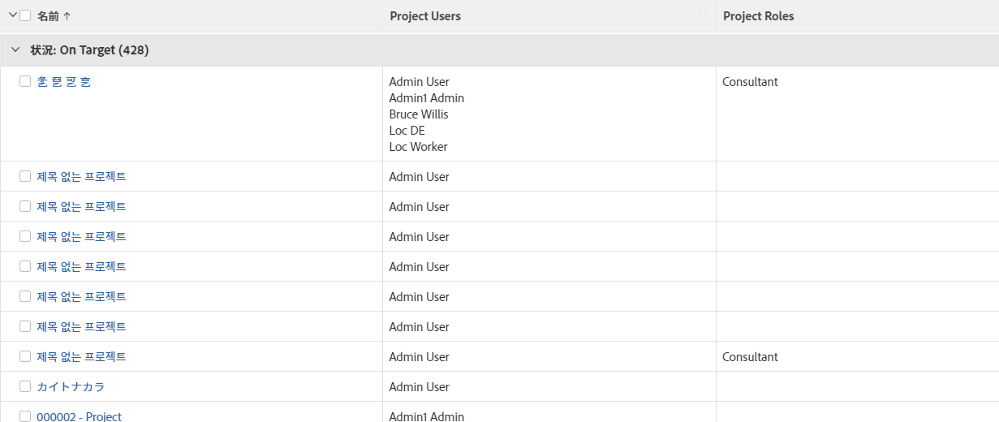

# 表示：担当業務を持つプロジェクトユーザーのリスト

このビューをプロジェクトリストまたはレポートに適用して、プロジェクトに関連付けられているユーザーのリストと、プロジェクトで実行する担当業務のリストを表示できます。

このレポートの情報は、プロジェクトのユーザーエリアにも表示されます。

>[!TIP]
>
>ユーザーの担当業務がリストされていないが、ユーザープロファイルで担当業務に関連付けられていることがわかっている場合は、ユーザーがタスクやイシューに割り当てられていても、そのタスクやイシューの担当業務に関連付けられていない、またはレポートにリストされているユーザーがタスクやイシューの担当者ではなく、プロジェクトの他の役割を実行している可能性があります（所有者やスポンサーなど）。

## アクセス要件

この記事の手順を実行するには、次のアクセス権が必要です。

<table style="table-layout:auto"> 
 <col> 
 <col> 
 <tbody> 
  <tr> 
   <td role="rowheader">Adobe Workfront プラン*</td> 
   <td> 
任意
 </td> 
  </tr> 
  <tr> 
   <td role="rowheader">Adobe Workfront ライセンス*</td> 
   <td> 
表示の変更をリクエスト 

   
レポートを変更するためのプラン
 </td> 
  </tr> 
  <tr> 
   <td role="rowheader">アクセスレベル設定*</td> 
   <td> 
レポート、ダッシュボード、カレンダーへのアクセス権を編集して、レポートを変更できるようにします。
 
フィルター、表示、グループ化へのアクセス権を編集して、表示を変更できるようにします。
 
<b>メモ</b>

まだアクセス権がない場合は、Workfront 管理者に問い合わせて、アクセスレベルに追加の制限が設定されているかどうかを確認してください。Workfront 管理者がアクセスレベルを変更する方法について詳しくは、<a href="../../../administration-and-setup/add-users/configure-and-grant-access/create-modify-access-levels.md" class="MCXref xref">カスタムアクセスレベルの作成または変更</a>を参照してください。
 </td>
</tr>  
  <tr> 
   <td role="rowheader">オブジェクト権限</td> 
   <td> 
レポートに対する権限を管理します。
 
追加のアクセス権のリクエストについて詳しくは、<a href="../../../workfront-basics/grant-and-request-access-to-objects/request-access.md" class="MCXref xref">オブジェクトへのアクセス権のリクエスト</a>を参照してください。
 </td> 
  </tr> 
 </tbody> 
</table>

&#42;保有するプラン、ライセンスタイプ、アクセス権を確認するには、Workfront 管理者に問い合わせてください。

## 担当業務を持つプロジェクトユーザーのリストを表示する

1. プロジェクトのリストに移動します。
1. **ビュー**&#x200B;ドロップダウンメニューから、「**新規ビュー**」を選択します。

1. **列のプレビュー**&#x200B;エリアで、1 つを除くすべての列を削除します。
1. 残りの列のヘッダーをクリックし、「**テキストモードに切り替え**」を選択します。
1. テキストモードエリアの上にマウスを移動し、「**クリックしてテキストを編集**」をクリックします。
1. 「**テキストモード**」ボックスにあるテキストを削除し、次のコードに置き換えます。
   <pre>column.0.link.valueformat=val column.0.linkedname=direct column.0.listsort=string(name) column.0.namekey=name.abbr column.0.querysort=name column.0.section=0 column.0.shortview=false column.0.stretch=100 column.0.valuefield=name column.0.valueformat=HTML column.0.width=200 column.1.displayname=Project Users column.1.listdelimiter=&lt;br&gt; column.1.listmethod=nested(projectUsers).lists column.1.textmode=true column.1.type=iterate column.1.valueexpression={user}.{name} column.1.valueformat=HTML column.2.displayname=Project Roles column.2.listdelimiter=&lt;br&gt; column.2.listmethod=nested(projectUserRoles).lists column.2.textmode=true column.2.type=iterate column.2.valueexpression={role}.{name} column.2.valueformat=HTML</pre>

1. 「**ビューを保存**」をクリックします。
