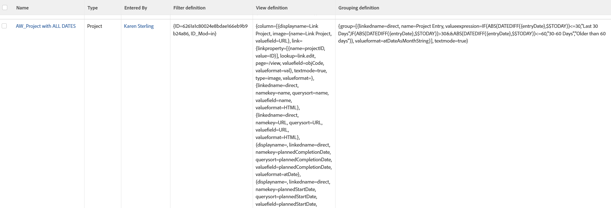

# ビュー：レポートで使用されるレポート要素

<!--Audited: 11/2024-->

このビューには、Adobe Workfront で各レポートをレポートのリストで使用する際に、レポートを作成するために使用されるビュー、フィルター、グループ化が表示されます。

レポートのすべての要素で使用されている`valuefields`または`valueexpressions`を確認できます。



## アクセス要件

+++ 展開すると、この記事の機能のアクセス要件が表示されます。

<table style="table-layout:auto"> 
 <col> 
 <col> 
 <tbody> 
  <tr> 
   <td role="rowheader">Adobe Workfront パッケージ</td> 
   <td> <p>任意</p> </td> 
  </tr> 
  <tr> 
   <td role="rowheader">Adobe Workfront プラン</td> 
   <td> 
   <p>ビューを変更するコントリビューターまたはリクエスト </p>
   <p>レポートを修正する標準または計画</p>
  </tr> 
  <tr> 
   <td role="rowheader">アクセスレベル設定</td> 
   <td> <p>レポート、ダッシュボード、カレンダーへのアクセス権を編集して、レポートを変更できるようにします。</p> <p>フィルター、表示、グループ化へのアクセス権を編集して、表示を変更できるようにします。</p> </td> 
  </tr> 
  <tr> 
   <td role="rowheader">オブジェクト権限</td> 
   <td> <p>レポートに対する権限を管理します。</p>  </td> 
  </tr> 
 </tbody> 
</table>

この表の情報について詳しくは、[Workfront ドキュメントのアクセス要件](/help/quicksilver/administration-and-setup/add-users/access-levels-and-object-permissions/access-level-requirements-in-documentation.md)を参照してください。


+++

## レポートで使用されるレポート要素の表示

1. レポートのリストに移動します。
1. **表示**&#x200B;ドロップダウンメニューから、**新規表示**&#x200B;を選択します。
1. **列プレビュー**&#x200B;領域で、1列を除くすべての列を削除します。
1. 残りの列のヘッダーをクリックし、**テキストモードに切り替え**/**テキストモードを編集**&#x200B;をクリックします。
1. 「**テキストモードを編集**」ボックスにあるテキストを削除し、次のコードに置き換えます。


   ```
   column.0.descriptionkey=name
   column.0.link.linkproperty.0.name=ID
   column.0.link.linkproperty.0.valuefield=ID
   column.0.link.linkproperty.0.valueformat=string
   column.0.link.lookup=link.run
   column.0.link.value=val(objCode)
   column.0.listsort=string(name)
   column.0.namekey=name.abbr
   column.0.querysort=name
   column.0.valuefield=name
   column.0.valueformat=HTML
   column.0.width=200
   column.1.descriptionkey=objecttype
   column.1.listsort=nested(view).string(uiObjCode)
   column.1.namekey=objecttype.abbr
   column.1.querysort=uiObjCode
   column.1.valuefield=uiObjCode
   column.1.valueformat=objCodeMessage
   column.1.width=80
   column.2.descriptionkey=enteredby
   column.2.listsort=nested(enteredBy).string(lastName)
   column.2.namekey=enteredby.abbr
   column.2.querysort=enteredBy:lastName
   column.2.valuefield=enteredBy:name
   column.2.valueformat=HTML
   column.2.width=130
   column.3.displayname=Filter definition
   column.3.textmode=true
   column.3.valuefield=filter:definition
   column.3.valueformat=HTML
   column.4.displayname=View definition
   column.4.textmode=true
   column.4.valuefield=view:definition
   column.4.valueformat=HTML
   column.5.displayname=Grouping definition
   column.5.textmode=true
   column.5.valuefield=groupBy:definition
   column.5.valueformat=HTML
   ```

1. **完了** / **ビューを保存**&#x200B;をクリックします。
