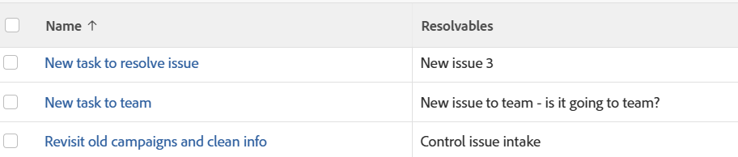

# ビュー：タスクまたはプロジェクトレポート内の解決可能なオブジェクト

<!--Audited: 11/2024-->

すべての解決可能オブジェクトのリストを、プロジェクト、タスクビューまたはレポートに表示できます。

解決可能オブジェクトについて詳しくは、[解決オブジェクトと解決可能オブジェクトの概要](../../../manage-work/issues/convert-issues/resolving-and-resolvable-objects.md)を参照してください。



このビューの適用方法は、タスクとプロジェクトで同じです。

## アクセス要件

+++ 展開すると、この記事の機能のアクセス要件が表示されます。

<table style="table-layout:auto"> 
 <col> 
 <col> 
 <tbody> 
  <tr> 
   <td role="rowheader">Adobe Workfront パッケージ</td> 
   <td> <p>任意</p> </td> 
  </tr> 
  <tr> 
   <td role="rowheader">Adobe Workfront プラン</td> 
   <td> 
   <p>ビューを変更するコントリビューターまたはリクエスト </p>
   <p>レポートを修正する標準または計画</p>
  </tr> 
  <tr> 
   <td role="rowheader">アクセスレベル設定</td> 
   <td> <p>レポート、ダッシュボード、カレンダーへのアクセス権を編集して、レポートを変更できるようにします。</p> <p>フィルター、表示、グループ化へのアクセス権を編集して、表示を変更できるようにします。</p> </td> 
  </tr> 
  <tr> 
   <td role="rowheader">オブジェクト権限</td> 
   <td> <p>レポートに対する権限を管理します。</p>  </td> 
  </tr> 
 </tbody> 
</table>

この表の情報について詳しくは、[Workfront ドキュメントのアクセス要件](/help/quicksilver/administration-and-setup/add-users/access-levels-and-object-permissions/access-level-requirements-in-documentation.md)を参照してください。


+++

## タスクまたはプロジェクトレポートでの解決可能オブジェクトの表示

1. イシューから変換されたタスクまたはプロジェクトのリストに移動します。
1. **表示**&#x200B;ドロップダウンメニューで、「**新規ビュー**」をクリックします。

1. **列プレビュー**&#x200B;領域で、**列を追加**&#x200B;をクリックします。

1. 新しい列のヘッダーをクリックし、**テキストモードに切り替え**/**テキストモードを編集**&#x200B;をクリックします。
1. 「**テキストモードを編集**」ボックスにあるテキストを削除し、次のコードに置き換えます。

   ```
   displayname=Resolvables
   listdelimiter=<br>
   listmethod=nested(resolvables).lists
   textmode=true
   type=iterate
   valuefield=name
   valueformat=HTML
   ```

1. **完了** / **ビューを保存**&#x200B;をクリックします。\
   新しい列に、すべての解決可能オブジェクトのリストが表示されます。 リスト内のオブジェクトの名前は、オブジェクトに直接リンクできません。
