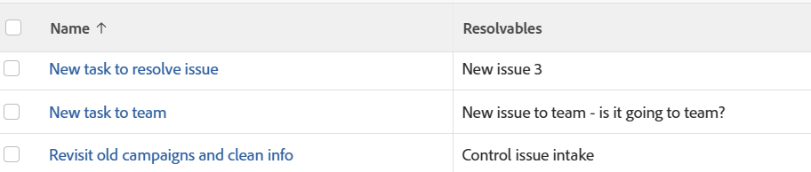

# ビュー：タスクまたはプロジェクトレポート内の解決可能なオブジェクト

すべての解決可能オブジェクトのリストを、プロジェクト、タスクビューまたはレポートに表示できます。

解決可能オブジェクトについて詳しくは、[解決オブジェクトと解決可能オブジェクトの概要](../../../manage-work/issues/convert-issues/resolving-and-resolvable-objects.md)を参照してください。

このビューの適用方法は、タスクとプロジェクトで同じです。

## アクセス要件

この記事の手順を実行するには、次のアクセス権が必要です。

<table style="table-layout:auto"> 
 <col> 
 <col> 
 <tbody> 
  <tr> 
   <td role="rowheader">Adobe Workfront プラン*</td> 
   <td> 
任意
 </td> 
  </tr> 
  <tr> 
   <td role="rowheader">Adobe Workfront ライセンス*</td> 
   <td> 
表示の変更をリクエスト 

   
レポートを変更するためのプラン
 </td> 
  </tr> 
  <tr> 
   <td role="rowheader">アクセスレベル設定*</td> 
   <td> 
レポート、ダッシュボード、カレンダーへのアクセス権を編集して、レポートを変更できるようにします。
 
フィルター、表示、グループ化へのアクセス権を編集して、表示を変更できるようにします。
 
<b>メモ</b>

まだアクセス権がない場合は、Workfront 管理者に問い合わせて、アクセスレベルに追加の制限が設定されているかどうかを確認してください。Workfront 管理者がアクセスレベルを変更する方法について詳しくは、<a href="../../../administration-and-setup/add-users/configure-and-grant-access/create-modify-access-levels.md" class="MCXref xref">カスタムアクセスレベルの作成または変更</a>を参照してください。
 </td>
</tr>  
  <tr> 
   <td role="rowheader">オブジェクト権限</td> 
   <td> 
レポートに対する権限を管理します。
 
追加のアクセス権のリクエストについて詳しくは、<a href="../../../workfront-basics/grant-and-request-access-to-objects/request-access.md" class="MCXref xref">オブジェクトへのアクセス権のリクエスト</a>を参照してください。
 </td> 
  </tr> 
 </tbody> 
</table>

&#42;保有するプラン、ライセンスタイプ、アクセス権を確認するには、Workfront 管理者に問い合わせてください。

## タスクまたはプロジェクトレポートでの解決可能オブジェクトの表示

1. イシューから変換されたタスクのリストに移動します。
1. **ビュー**&#x200B;ドロップダウンメニューから、「**新規ビュー**」を選択します。

1. **列プレビュー**&#x200B;エリアで、「**列を追加**」をクリックします。

1. 残りの列のヘッダーをクリックし、「**テキストモードに切り替え**」を選択します。
1. テキストモードエリアにポインタを合わせ、「**クリックしてテキストを編集**」をクリックします。
1. 「**テキストモード**」ボックスにあるテキストを削除し、次のコードに置き換えます。
   <pre>displayname=Resolvables listdelimiter=  listmethod=nested(resolvables).lists textmode=true type=iterate valuefield=name valueformat=HTML </pre>

1. 「**ビューを保存**」をクリックします。\
   新しい列に、すべての解決可能オブジェクトのリストが表示されます。リスト内のオブジェクトの名前は、オブジェクトに直接リンクできません。
