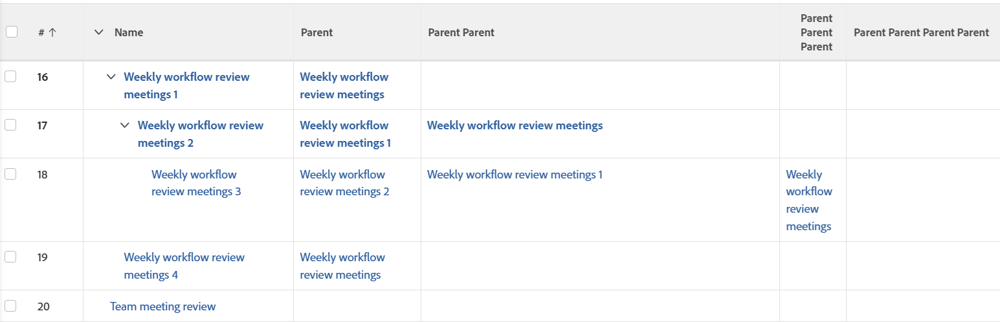

# ビュー：最大 4 レベルの深さまで親タスクを表示

<!--Audited: 11/2024-->

このタスクビューでは、最初の列にタスク名が表示され、（存在する場合は）同じリスト内の別の列に最大 4 つの親タスクが表示されます。



## アクセス要件

+++ 展開すると、この記事の機能のアクセス要件が表示されます。

<table style="table-layout:auto"> 
 <col> 
 <col> 
 <tbody> 
  <tr> 
   <td role="rowheader">Adobe Workfront パッケージ</td> 
   <td> <p>任意</p> </td> 
  </tr> 
  <tr> 
   <td role="rowheader">Adobe Workfront プラン</td> 
   <td> 
   <p>ビューを変更するコントリビューターまたはリクエスト </p>
   <p>レポートを修正する標準または計画</p>
  </tr> 
  <tr> 
   <td role="rowheader">アクセスレベル設定</td> 
   <td> <p>レポート、ダッシュボード、カレンダーへのアクセス権を編集して、レポートを変更できるようにします。</p> <p>フィルター、表示、グループ化へのアクセス権を編集して、表示を変更できるようにします。</p> </td> 
  </tr> 
  <tr> 
   <td role="rowheader">オブジェクト権限</td> 
   <td> <p>レポートに対する権限を管理します。</p>  </td> 
  </tr> 
 </tbody> 
</table>

この表の情報について詳しくは、[Workfront ドキュメントのアクセス要件](/help/quicksilver/administration-and-setup/add-users/access-levels-and-object-permissions/access-level-requirements-in-documentation.md)を参照してください。


+++

## 最大 4 レベルの深さまで親タスクを表示

1. タスクのリストに移動します。
1. **ビュー**&#x200B;ドロップダウンメニューから、**新規ビュー**&#x200B;を選択します。
1. **列プレビュー**&#x200B;領域で、1列を除くすべての列を削除します。
1. 残りの列のヘッダーをクリックし、**テキストモードに切り替え**/**テキストモードを編集**&#x200B;をクリックします。
1. 「**テキストモード**」ボックスにあるテキストを削除し、次のコードに置き換えます。


   ```
   column.0.descriptionkey=name
   column.0.link.linkproperty.0.name=ID
   column.0.link.linkproperty.0.valuefield=ID
   column.0.link.linkproperty.0.valueformat=int
   column.0.link.lookup=link.view
   column.0.link.valuefield=objCode
   column.0.link.valueformat=val
   column.0.linkedname=direct
   column.0.listsort=string(name)
   column.0.namekey=name.abbr
   column.0.querysort=name
   column.0.shortview=false
   column.0.valuefield=name
   column.0.valueformat=HTML
   column.0.width=150
   column.1.descriptionkey=parent
   column.1.link.linkproperty.0.name=ID
   column.1.link.linkproperty.0.valuefield=parent:ID
   column.1.link.linkproperty.0.valueformat=int
   column.1.link.lookup=link.view
   column.1.link.valuefield=parent:objCode
   column.1.link.valueformat=val
   column.1.linkedname=parent
   column.1.listsort=nested(parent).string(name)
   column.1.namekey=parent
   column.1.querysort=parent:name
   column.1.shortview=false
   column.1.stretch=0
   column.1.valuefield=parent:name
   column.1.valueformat=HTML
   column.1.width=150
   column.2.description=Parent Parent
   column.2.link.linkproperty.0.name=ID
   column.2.link.linkproperty.0.valuefield=parent:parent:ID
   column.2.link.linkproperty.0.valueformat=int
   column.2.link.lookup=link.view
   column.2.link.valuefield=parent:parent:objCode
   column.2.link.valueformat=val
   column.2.linkedname=parent
   column.2.listsort=nested(parent:parent).string(name)
   column.2.name=Parent Parent
   column.2.querysort=parent:parent:name
   column.2.shortview=false
   column.2.stretch=0
   column.2.valuefield=parent:parent:name
   column.2.valueformat=HTML
   column.2.width=150
   column.3.description=Parent Parent Parent
   column.3.link.linkproperty.0.name=ID
   column.3.link.linkproperty.0.valuefield=parent:parent:parent:ID
   column.3.link.linkproperty.0.valueformat=int
   column.3.link.lookup=link.view
   column.3.link.valuefield=parent:parent:parent:objCode
   column.3.link.valueformat=val
   column.3.linkedname=parent
   column.3.listsort=nested(parent:parent:parent).string(name)
   column.3.name=Parent Parent Parent
   column.3.querysort=parent:parent:parent:name
   column.3.shortview=false
   column.3.stretch=0
   column.3.valuefield=parent:parent:parent:name
   column.3.valueformat=HTML
   column.3.width=150
   column.4.description=Parent Parent Parent Parent
   column.4.link.linkproperty.0.name=ID
   column.4.link.linkproperty.0.valuefield=parent:parent:parent:parent:ID
   column.4.link.linkproperty.0.valueformat=int
   column.4.link.lookup=link.view
   column.4.link.valuefield=parent:parent:parent:parent:objCode
   column.4.link.valueformat=val
   column.4.linkedname=parent
   column.4.listsort=nested(parent:parent:parent:parent).string(name)
   column.4.name=Parent Parent Parent Parent
   column.4.querysort=parent:parent:parent:parent:name
   column.4.shortview=false
   column.4.stretch=100
   column.4.valuefield=parent:parent:parent:parent:name
   column.4.valueformat=HTML
   column.4.width=150
   ```

1. **完了** / **ビューを保存**&#x200B;をクリックします。

   タスクの名前が最初の列に表示され、タスクに親がある場合は、残りの列に最大 4 つの親が表示されます。
