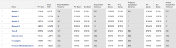

# ビュー：「すべての日付」の差異を含むタスク

このタスクビューは、Adobe Workfront アカウントで提供される「すべての日付」ビューに似ています。このビューには、次の日付の間の日数の差を計算する&#x200B;*差異*&#x200B;列が含まれています。

* 開始予定日と見込み開始日
* 開始予定日と実際の開始日
* 完了予定日と見込み完了日
* 完了予定日と実際の完了日

このビューは、2 つの異なる列の値を入手して計算することで、3 つ目の値が取得される計算列の例を表します。ここでは、日付 2 から日付 1 が差し引かれます。

ビューでの計算の使用について詳しくは、[テキストモードの一般的な使用の概要](../../../reports-and-dashboards/reports/text-mode/understand-common-uses-text-mode.md)の[テキストモードの一般的な使用の概要](../../../reports-and-dashboards/reports/text-mode/understand-common-uses-text-mode.md)を参照してください。

## アクセス要件

この記事の手順を実行するには、次のアクセス権が必要です。

<table style="table-layout:auto"> 
 <col> 
 <col> 
 <tbody> 
  <tr> 
   <td role="rowheader">Adobe Workfront プラン*</td> 
   <td> 
任意
 </td> 
  </tr> 
  <tr> 
   <td role="rowheader">Adobe Workfront ライセンス*</td> 
   <td> 
表示の変更をリクエスト 

   
レポートを変更するためのプラン
 </td> 
  </tr> 
  <tr> 
   <td role="rowheader">アクセスレベル設定*</td> 
   <td> 
レポート、ダッシュボード、カレンダーへのアクセス権を編集して、レポートを変更できるようにします。
 
フィルター、表示、グループ化へのアクセス権を編集して、表示を変更できるようにします。
 
<b>メモ</b>

まだアクセス権がない場合は、Workfront 管理者に問い合わせて、アクセスレベルに追加の制限が設定されているかどうかを確認してください。Workfront 管理者がアクセスレベルを変更する方法について詳しくは、<a href="../../../administration-and-setup/add-users/configure-and-grant-access/create-modify-access-levels.md" class="MCXref xref">カスタムアクセスレベルの作成または変更</a>を参照してください。
 </td>
</tr>   
  <tr> 
   <td role="rowheader">オブジェクト権限</td> 
   <td> 
レポートに対する権限を管理します。
 
追加のアクセス権のリクエストについて詳しくは、<a href="../../../workfront-basics/grant-and-request-access-to-objects/request-access.md" class="MCXref xref">オブジェクトへのアクセス権のリクエスト</a>を参照してください。
 </td> 
  </tr> 
 </tbody> 
</table>

&#42;自分のプラン、ライセンスタイプ、アクセス権を確認するには、Workfront 管理者に問い合わせてください。

## すべての日付の差異を含むタスクの表示

1. タスクのリストに移動します。
1. **ビュー**&#x200B;ドロップダウンメニューから、**新規ビュー**&#x200B;を選択します。

1. **列のプレビュー**&#x200B;領域で、1 つを除くすべての列を削除します。
1. 残りの列のヘッダーをクリックし、「**テキストモードに切り替え**」をクリックします。
1. テキストモード領域にカーソルを置き、「**クリックしてテキストを編集**」をクリックします。
1. 「**テキストモード**」ボックスにあるテキストを削除し、次のコードに置き換えます。
   <pre>column.1.descriptionkey=name column.1.link.linkproperty.0.name=ID column.1.link.linkproperty.0.valuefield=ID column.1.link.linkproperty.0.valueformat=int column.1.link.lookup=link.view column.1.link.valuefield=objCode column.1.link.valueformat=val column.1.linkedname=direct column.1.listsort=string(name) column.1.namekey=name.abbr column.1.querysort=name column.1.shortview=false column.1.stretch=95 column.1.styledef.case.0.comparison.attribute=css column.1.styledef.case.0.comparison.isrowcase=true column.1.styledef.case.0.comparison.leftmethod=intAsInt(numberOfChildren) column.1.styledef.case.0.comparison.lefttext=numberOfChildren column.1.styledef.case.0.comparison.operator=gt column.1.styledef.case.0.comparison.operatortype=int column.1.styledef.case.0.comparison.righttext=0 column.1.styledef.case.0.comparison.trueproperty.0.name=fontstyle column.1.styledef.case.0.comparison.trueproperty.0.value=bold column.1.styledef.case.0.comparison.truetext= column.1.styledef.case.0.comparison.usefield=false column.1.valuefield=name column.1.valueformat=HTML column.1.width=150 column.2.descriptionkey=plannedstartdate column.2.linkedname=direct column.2.listsort=atDateAsAtDate(plannedStartDate) column.2.namekey=plannedstartdate.abbr column.2.querysort=plannedStartDate column.2.shortview=false column.2.stretch=0 column.2.valuefield=plannedStartDate column.2.valueformat=atDate column.2.width=75 column.3.descriptionkey=projectedstartdate column.3.linkedname=direct column.3.listsort=atDateAsAtDate(projectedStartDate) column.3.namekey=projectedstartdate.abbr column.3.querysort=projectedStartDate column.3.shortview=false column.3.stretch=0 column.3.valuefield=projectedStartDate column.3.valueformat=atDate column.3.width=75 column.4.descriptionkey=plannedstartdate column.4.displayname=Projected Start Variance column.4.linkedname=direct column.4.listsort=atDateAsAtDate(plannedStartDate) column.4.namekey=plannedstartdate.abbr column.4.querysort=plannedStartDate column.4.shortview=false column.4.stretch=0 column.4.styledef.case.0.comparison.attribute=css column.4.styledef.case.0.comparison.isrowcase=false column.4.styledef.case.0.comparison.leftmethod=atDateAsAtDate(plannedStartDate) column.4.styledef.case.0.comparison.lefttext=plannedStartDate column.4.styledef.case.0.comparison.operator=notnull column.4.styledef.case.0.comparison.operatortype=date column.4.styledef.case.0.comparison.righttext= column.4.styledef.case.0.comparison.trueproperty.0.name=bgcolor column.4.styledef.case.0.comparison.trueproperty.0.value=E1E1E1 column.4.styledef.case.0.comparison.truetext= column.4.styledef.case.0.comparison.usefield=false column.4.valueexpression=ROUND(DATEDIFF({projectedStartDate},{plannedStartDate})) column.4.valueformat=HTML column.4.width=75 column.5.descriptionkey=plannedstartdate column.5.linkedname=direct column.5.listsort=atDateAsAtDate(plannedStartDate) column.5.namekey=plannedstartdate.abbr column.5.querysort=plannedStartDate column.5.shortview=false column.5.stretch=0 column.5.valuefield=plannedStartDate column.5.valueformat=atDate column.5.width=75 column.6.descriptionkey=actualstartdate column.6.linkedname=direct column.6.listsort=atDateAsAtDate(actualStartDate) column.6.namekey=actualstartdate.abbr column.6.querysort=actualStartDate column.6.shortview=false column.6.stretch=0 column.6.valuefield=actualStartDate column.6.valueformat=atDate column.6.width=75 column.7.descriptionkey=plannedstartdate column.7.displayname=Actual Start Variance column.7.linkedname=direct column.7.listsort=atDateAsAtDate(plannedStartDate) column.7.namekey=plannedstartdate.abbr column.7.querysort=plannedStartDate column.7.shortview=false column.7.stretch=0 column.7.styledef.case.0.comparison.attribute=css column.7.styledef.case.0.comparison.isrowcase=false column.7.styledef.case.0.comparison.leftmethod=atDateAsAtDate(plannedStartDate) column.7.styledef.case.0.comparison.lefttext=plannedStartDate column.7.styledef.case.0.comparison.operator=notnull column.7.styledef.case.0.comparison.operatortype=date column.7.styledef.case.0.comparison.righttext= column.7.styledef.case.0.comparison.trueproperty.0.name=bgcolor column.7.styledef.case.0.comparison.trueproperty.0.value=E1E1E1 column.7.styledef.case.0.comparison.truetext= column.7.styledef.case.0.comparison.usefield=false column.7.valueexpression=ROUND(DATEDIFF({actualStartDate},{plannedStartDate})) column.7.valueformat=HTML column.7.width=75 column.8.descriptionkey=plannedcompletiondate column.8.linkedname=direct column.8.listsort=atDateAsAtDate(plannedCompletionDate) column.8.namekey=plannedcompletiondate.abbr column.8.querysort=plannedCompletionDate column.8.shortview=false column.8.stretch=0 column.8.valuefield=plannedCompletionDate column.8.valueformat=atDate column.8.width=75 column.9.descriptionkey=projectedcompletiondate column.9.linkedname=direct column.9.listsort=atDateAsAtDate(projectedCompletionDate) column.9.namekey=projectedcompletiondate.abbr column.9.querysort=projectedCompletionDate column.9.shortview=false column.9.stretch=0 column.9.valuefield=projectedCompletionDate column.9.valueformat=atDate column.9.width=75 column.10.descriptionkey=plannedcompletiondate column.10.displayname=Projected Completion Variance column.10.linkedname=direct column.10.listsort=atDateAsAtDate(plannedCompletionDate) column.10.namekey=plannedcompletiondate.abbr column.10.querysort=plannedCompletionDate column.10.shortview=false column.10.stretch=0 column.10.styledef.case.0.comparison.attribute=css column.10.styledef.case.0.comparison.isrowcase=false column.10.styledef.case.0.comparison.leftmethod=atDateAsAtDate(plannedCompletionDate) column.10.styledef.case.0.comparison.lefttext=plannedCompletionDate column.10.styledef.case.0.comparison.operator=notnull column.10.styledef.case.0.comparison.operatortype=date column.10.styledef.case.0.comparison.righttext= column.10.styledef.case.0.comparison.trueproperty.0.name=bgcolor column.10.styledef.case.0.comparison.trueproperty.0.value=E1E1E1 column.10.styledef.case.0.comparison.truetext= column.10.styledef.case.0.comparison.usefield=false column.10.valueexpression=ROUND(DATEDIFF({projectedCompletionDate},{plannedCompletionDate})) column.10.valueformat=HTML column.10.width=75 column.11.descriptionkey=plannedcompletiondate column.11.linkedname=direct column.11.listsort=atDateAsAtDate(plannedCompletionDate) column.11.namekey=plannedcompletiondate.abbr column.11.querysort=plannedCompletionDate column.11.shortview=false column.11.stretch=0 column.11.valuefield=plannedCompletionDate column.11.valueformat=atDate column.11.width=75 column.12.descriptionkey=actualcompletiondate column.12.linkedname=direct column.12.listsort=atDateAsAtDate(actualCompletionDate) column.12.namekey=actualcompletiondate.abbr column.12.querysort=actualCompletionDate column.12.shortview=false column.12.stretch=0 column.12.valuefield=actualCompletionDate column.12.valueformat=atDate column.12.width=75 column.13.descriptionkey=plannedcompletiondate column.13.displayname=Actual Completion Variance column.13.linkedname=direct column.13.listsort=atDateAsAtDate(plannedCompletionDate) column.13.namekey=plannedcompletiondate.abbr column.13.querysort=plannedCompletionDate column.13.shortview=false column.13.stretch=0 column.13.styledef.case.0.comparison.attribute=css column.13.styledef.case.0.comparison.isrowcase=false column.13.styledef.case.0.comparison.leftmethod=atDateAsAtDate(plannedCompletionDate) column.13.styledef.case.0.comparison.lefttext=plannedCompletionDate column.13.styledef.case.0.comparison.operator=notnull column.13.styledef.case.0.comparison.operatortype=date column.13.styledef.case.0.comparison.righttext= column.13.styledef.case.0.comparison.trueproperty.0.name=bgcolor column.13.styledef.case.0.comparison.trueproperty.0.value=E1E1E1 column.13.styledef.case.0.comparison.truetext= column.13.styledef.case.0.comparison.usefield=false column.13.valueexpression=ROUND(DATEDIFF({actualCompletionDate},{plannedCompletionDate})) column.13.valueformat=HTML column.13.width=75 row.0.styledef.applyallcases=true row.0.styledef.case.0.comparison.attribute=css row.0.styledef.case.0.comparison.isrowcase=true row.0.styledef.case.0.comparison.leftmethod=intAsInt(numberOfChildren) row.0.styledef.case.0.comparison.lefttext=numberOfChildren row.0.styledef.case.0.comparison.operator=gt row.0.styledef.case.0.comparison.operatortype=int row.0.styledef.case.0.comparison.righttext=0 row.0.styledef.case.0.comparison.trueproperty.0.name=fontstyle row.0.styledef.case.0.comparison.trueproperty.0.value=bold row.0.styledef.case.0.comparison.truetext= row.0.styledef.case.0.comparison.usefield=false</pre>

1. 「**ビューの保存**」をクリックします。
