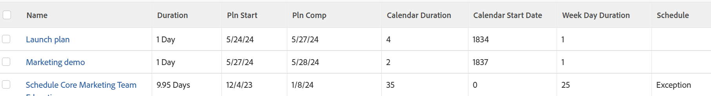

# ビュー：スケジュール例外の影響を受けるタスク

<!--Audited: 11/2024-->

このタスクビューは、週末、個人の休暇またはその他のスケジュール例外が発生した場合に、完了が遅れるタスクを特定します。

このビューには、次の情報が表示されます。

* タスクの期間
* タスクの予定開始日と予定完了日
* タスクの予定開始日から予定完了日までの日数に従ったタスクの期間（カレンダー期間）
* プロジェクトのスケジュール上でタスクを開始する日の番号（カレンダー開始日）
* タスクの予定開始日から予定完了日までの平日数に従ったタスクの平日期間（平日期間）
* 週の日の期間がタスクの期間よりも大きい場合、タスクの期間に例外の日があることを示唆している場合、タスクは「例外」としてマークされます。\
  

## アクセス要件

+++ 展開すると、この記事の機能のアクセス要件が表示されます。

<table style="table-layout:auto"> 
 <col> 
 <col> 
 <tbody> 
  <tr> 
   <td role="rowheader">Adobe Workfront パッケージ</td> 
   <td> <p>任意</p> </td> 
  </tr> 
  <tr> 
   <td role="rowheader">Adobe Workfront プラン</td> 
   <td> 
   <p>ビューを変更するコントリビューターまたはリクエスト </p>
   <p>レポートを修正する標準または計画</p>
  </tr> 
  <tr> 
   <td role="rowheader">アクセスレベル設定</td> 
   <td> <p>レポート、ダッシュボード、カレンダーへのアクセス権を編集して、レポートを変更できるようにします。</p> <p>フィルター、表示、グループ化へのアクセス権を編集して、表示を変更できるようにします。</p> </td> 
  </tr> 
  <tr> 
   <td role="rowheader">オブジェクト権限</td> 
   <td> <p>レポートに対する権限を管理します。</p>  </td> 
  </tr> 
 </tbody> 
</table>

この表の情報について詳しくは、[Workfront ドキュメントのアクセス要件](/help/quicksilver/administration-and-setup/add-users/access-levels-and-object-permissions/access-level-requirements-in-documentation.md)を参照してください。


+++

## スケジュール例外の影響を受けるタスクを表示

1. タスクのリストに移動します。
1. **ビュー**&#x200B;ドロップダウンメニューから、**新規ビュー**&#x200B;を選択します。
1. **列のプレビュー**&#x200B;領域で、1 つを除くすべての列を削除します。
1. 残りの列のヘッダーをクリックし、**テキストモードに切り替え**/**テキストモードを編集**&#x200B;をクリックします。
1. 「**テキストモードを編集**」ボックスにあるテキストを削除し、次のコードに置き換えます。

   ```
   column.0.descriptionkey=name
   column.0.link.linkproperty.0.name=ID
   column.0.link.linkproperty.0.valuefield=ID
   column.0.link.linkproperty.0.valueformat=int
   column.0.link.lookup=link.view
   column.0.link.valuefield=objCode
   column.0.link.valueformat=val
   column.0.linkedname=direct
   column.0.listsort=string(name)
   column.0.namekey=name.abbr
   column.0.querysort=name
   column.0.shortview=false
   column.0.stretch=100
   column.0.valuefield=name
   column.0.valueformat=HTML
   column.0.width=150
   column.1.descriptionkey=duration
   column.1.linkedname=direct
   column.1.listsort=intAsInt(durationMinutes)
   column.1.namekey=duration.abbr
   column.1.querysort=durationMinutes
   column.1.shortview=false
   column.1.stretch=0
   column.1.valuefield=durationFieldLong
   column.1.valueformat=compound
   column.1.viewalias=duration
   column.1.width=80
   column.2.descriptionkey=plannedstartdate
   column.2.linkedname=direct
   column.2.listsort=atDateAsAtDate(plannedStartDate)
   column.2.namekey=plannedstartdate.abbr
   column.2.querysort=plannedStartDate
   column.2.shortview=false
   column.2.stretch=0
   column.2.valuefield=plannedStartDate
   column.2.valueformat=atDate
   column.2.width=80
   column.3.descriptionkey=plannedcompletiondate
   column.3.linkedname=direct
   column.3.listsort=atDateAsAtDate(plannedCompletionDate)
   column.3.namekey=plannedcompletiondate.abbr
   column.3.querysort=plannedCompletionDate
   column.3.shortview=false
   column.3.stretch=0
   column.3.valuefield=plannedCompletionDate
   column.3.valueformat=atDate
   column.3.width=80
   column.4.aggregator.displayformat=int
   column.4.aggregator.function=SUM
   column.4.aggregator.namekey=id
   column.4.aggregator.valueexpression=DATEDIFF({plannedCompletionDate},
   {plannedStartDate})+1
   column.4.aggregator.valueformat=intAsInt
   column.4.descriptionkey=id
   column.4.linkedname=direct
   column.4.listsort=intAsInt(ID)
   column.4.name=Calendar Duration
   column.4.querysort=ID
   column.4.shortview=false
   column.4.stretch=0
   column.4.valueexpression=DATEDIFF({plannedCompletionDate},{plannedStartDate})+1
   column.4.valueformat=int
   column.4.width=80
   column.5.aggregator.displayformat=int
   column.5.aggregator.function=SUM
   column.5.aggregator.namekey=id
   column.5.aggregator.valueexpression=DATEDIFF({plannedStartDate},{project}.
   {plannedStartDate})+0
   column.5.aggregator.valueformat=intAsInt
   column.5.descriptionkey=id
   column.5.linkedname=direct
   column.5.listsort=intAsInt(ID)
   column.5.name=Calendar Start Date
   column.5.querysort=ID
   column.5.shortview=false
   column.5.stretch=0
   column.5.valueexpression=DATEDIFF({plannedStartDate},{project}.{plannedStartDate})+0
   column.5.valueformat=int
   column.5.width=80
   column.6.aggregator.displayformat=int
   column.6.aggregator.function=SUM
   column.6.aggregator.namekey=id
   column.6.aggregator.valueexpression=WEEKDAYDIFF({plannedStartDate},
   {plannedCompletionDate})+0
   column.6.aggregator.valueformat=HTML
   column.6.descriptionkey=id
   column.6.linkedname=direct
   column.6.listsort=intAsInt(ID)
   column.6.name=Week Day Duration
   column.6.querysort=ID
   column.6.shortview=false
   column.6.stretch=0
   column.6.valueexpression=WEEKDAYDIFF({plannedStartDate},{plannedCompletionDate})+0
   column.6.valueformat=int
   column.6.width=80
   column.7.aggregator.displayformat=int
   column.7.aggregator.expression=IF((WEEKDAYDIFF({plannedStartDate},{plannedCompletionDate}))>({duration}/480),"Exception","")
   column.7.aggregator.function=SUM
   column.7.aggregator.namekey=id
   column.7.aggregator.valueformat=HTML
   column.7.linkedname=direct
   column.7.listsort=intAsInt(ID)
   column.7.name=Schedule
   column.7.querysort=ID
   column.7.shortview=false
   column.7.stretch=0
   column.7.valueexpression=IF((WEEKDAYDIFF({plannedStartDate},{plannedCompletionDate}))>({duration}/480),"Exception","")
   column.7.valueformat=HTML
   column.7.width=80
   ```

1. **完了** / **ビューを保存**&#x200B;をクリックします。
