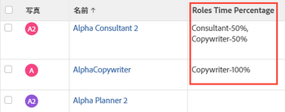

# 表示：ユーザージョブの役割の FTE 可用性の割合

ユーザー・リストのビューに列を追加して、ユーザーが関連付けられているジョブ・ロールのリストと、ユーザー・プロファイルで定義されている各ジョブ・ロールの FTE 可用性の割合を表示できます。

ユーザーの FTE 可用性の割合の定義について詳しくは、 [ユーザーのプロファイルの編集](../../../administration-and-setup/add-users/create-and-manage-users/edit-a-users-profile.md).

## アクセス要件

この記事の手順を実行するには、次のアクセス権が必要です。

<table style="table-layout:auto"> 
 <col> 
 <col> 
 <tbody> 
  <tr> 
   <td role="rowheader">Adobe Workfront plan*</td> 
   <td> 
任意
 </td> 
  </tr> 
  <tr> 
   <td role="rowheader">Adobe Workfront license*</td> 
   <td> 
ビューの変更をリクエスト 

   
レポートの変更計画
 </td> 
  </tr> 
  <tr> 
   <td role="rowheader">アクセスレベル設定*</td> 
   <td> 
レポート、ダッシュボード、カレンダーへのアクセスを編集して、レポートを変更します
 
フィルター、ビュー、グループへのアクセスを編集してビューを変更します
 
<b>メモ</b>

まだアクセス権がない場合は、Workfront管理者に、アクセスレベルに追加の制限を設定しているかどうかを問い合わせてください。 Workfront管理者がアクセスレベルを変更する方法について詳しくは、 <a href="../../../administration-and-setup/add-users/configure-and-grant-access/create-modify-access-levels.md" class="MCXref xref">カスタムアクセスレベルの作成または変更</a>.
 </td>
</tr>   
  <tr> 
   <td role="rowheader">オブジェクト権限</td> 
   <td> 
レポートに対する権限の管理
 
追加のアクセス権のリクエストについて詳しくは、 <a href="../../../workfront-basics/grant-and-request-access-to-objects/request-access.md" class="MCXref xref">オブジェクトへのアクセスのリクエスト </a>.
 </td> 
  </tr> 
 </tbody> 
</table>

&#42;保有しているプラン、ライセンスの種類、アクセス権を確認するには、Workfront管理者に問い合わせてください。

## FTE 可用性のユーザージョブの役割の割合を表示

1. ユーザーのリストに移動します。
1. 次の **表示** ドロップダウンメニューで、「 **新しいビュー**.

1. 内&#x200B;**列のプレビュー** 領域、クリック **列を追加**.

1. 新しい列のヘッダーをクリックし、 **テキストモードに切り替え**.
1. テキストモード領域の上にマウスを移動し、 **クリックしてテキストを編集**.
1. 検索したテキストを **テキストモード** 」ボックスに置き換えて、次のコードに置き換えます。

   <pre>displayname=Roles 時間の割合 listdelimiter=
 listmethod=nested(userRoles).lists textmode=true type=iterate valueexpression=CONCAT({role},'-',{timePercentage},'%') valueformat=HTML</pre>

1. クリック **保存**&#x200B;を、 **ビューを保存**.

1. （オプション）ビューの名前を指定し、 **ビューを保存**.
